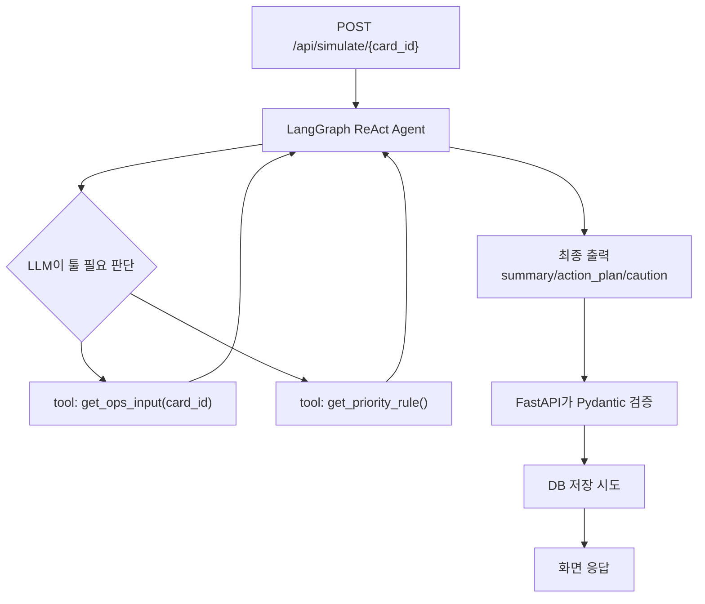

# v1_langgraph_react_ops

이 버전의 목표는 `card_id` 1개를 기준으로 LLM이 직접 읽는 v1 입력 JSON을 만들고, LangGraph 기반 agent가 tool 호출 후 운영 메모를 생성하는 것이다.

## Flow



## Input

`contracts/ops_agent_llm_input.schema.json`

```text
input_version
event_context
- raw_context
- priority_context
- internal_context
- decision_trace

control_context
- policy_context
- action_context
- output_contract

handoff_context
- escalation_context
- audit_context
```

LLM 입력에는 로컬 파일 경로, 개인 문서 경로, Obsidian 경로를 넣지 않는다.

## Tools

```text
get_ops_input(card_id)
- 카드 1건의 v1 LLM 입력 JSON을 반환한다.

get_priority_rule()
- 운영 메모 작성 규칙과 summary/action_plan/caution 출력 계약을 반환한다.
```

## Output

`contracts/ops_agent_output.schema.json`

```text
summary
action_plan
caution
```

## Fallback

`OPENAI_API_KEY`가 없으면 LangGraph/OpenAI 호출 대신 로컬 규칙 출력으로 대체한다. 이 fallback은 데모와 테스트가 키 없이도 동작하게 하기 위한 것이다.

## Excluded In v1

```text
weather API
운영 문서 RAG
원본 raw sensor 시계열 전체 적재
멀티턴 대화 상태 저장
```
