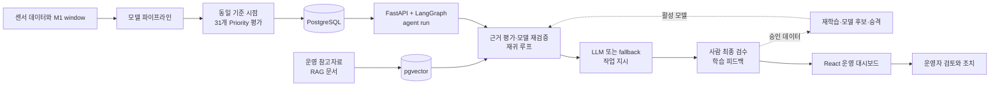
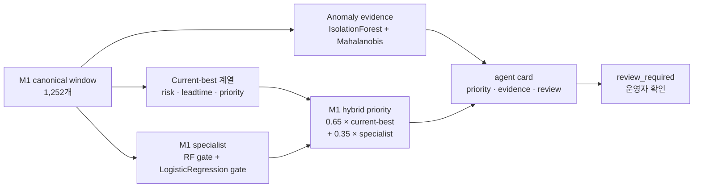
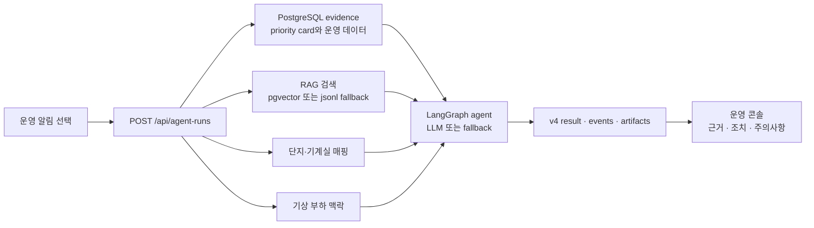

# HeatGrid 운영 의사결정 보조 에이전트

지역난방 설비의 M1 데이터를 바탕으로 점검 우선순위를 정리하고, 운영자가 알림을 검토할 때 근거와 권장 조치를 함께 보여주는 운영 보조 시스템이다.

> [!WARNING]
> **알파 데모 버전입니다.** 현재 검증 범위는 M1이며, 결과는 운영자의 점검 순서를 돕는 의사결정 보조 신호입니다. 자동 제어·자동 정비 지시·고장 시각 확정에 사용하지 않습니다.

## 한눈에 보기

| 항목 | 현재 범위 |
|---|---|
| 대상 | manufacturer 1(M1) 설비 데이터 |
| 최종 모델 산출물 | M1 hybrid agent card 1,252행 · 55개 컬럼 |
| 데이터 정합성 | canonical window와 agent card 간 key 누락 0건 |
| 운영 화면 | 지도 관제, 알림 큐, agent run, v4 작업 지시 결과 |
| 실행 환경 | PostgreSQL/pgvector, FastAPI, LangGraph, React/Vite |

검증 수치와 산출물 근거는 [최종 검증 보고서](output/reports/final_validation_report.md)에서 확인할 수 있다.

## 프로젝트 흐름



현재 알파 데모의 운영 경로는 저장된 `priority card`에서 시작한다. 모델 재학습·card 재생성은 별도 파이프라인으로 제공하며, 대시보드 요청마다 원천 센서 데이터로 모델을 다시 추론하지 않는다.

## ML 모델 흐름



- anomaly는 정상 분포에서 벗어난 정도를 보는 evidence이며 단독 고장 분류기가 아니다.
- leadtime은 정확한 고장 시각이 아니라 priority 계산에 쓰는 보조 신호다.
- M1 specialist는 current-best risk/leadtime을 대체하지 않고, M1 전용 상태·사전 이벤트 근거를 priority에 반영한다.

모델 설계와 범위는 [모델 설계](docs/03_MODEL_DESIGN.md), [M1 범위](docs/model/M1_SCOPE.md), [최종 결과](docs/06_FINAL_RESULTS.md)를 기준으로 한다.

## Agent 흐름



Agent는 `headline`, `situation`, `evidence`, `actions`, `cautions`, `report`를 담은 v4 결과를 반환한다. 기상 정보는 고장 원인 확정이 아닌 운영 부하 맥락으로만 사용한다. 자세한 인터페이스는 [v4 결과 계약](docs/contracts/ops_agent_result_v4.md)을 따른다.

## 기술 스택

| 영역 | 사용 기술 |
|---|---|
| 모델·파이프라인 | Python 3.12, uv, pandas, scikit-learn, LightGBM, joblib |
| API·계약 | FastAPI, Pydantic, SQLAlchemy, asyncpg, Uvicorn, orjson |
| Agent·검색 | LangGraph, LangChain, OpenAI API, pgvector, JSONL fallback |
| 데이터 저장 | PostgreSQL 16, Docker Compose |
| 운영 화면 | React 19, TypeScript, Vite, TanStack Query, MapLibre GL, Recharts |

## 빠른 실행

### 1. 사전 준비

- Python 3.12와 [uv](https://docs.astral.sh/uv/)를 설치한다.
- Node.js LTS와 Docker Desktop을 설치한다.
- 실 LLM과 기상 맥락까지 확인할 때는 루트 `.env`에 키를 넣고, 실제 키는 커밋하지 않는다.

```dotenv
OPENAI_API_KEY=
KMA_SERVICE_KEY=
```

### 2. 데이터베이스와 백엔드 실행

```bash
docker compose up -d --wait
uv sync
# 로컬 DB 테이블을 초기화하고, 저장된 agent card와 urgent/high 알림을 적재한다.
uv run python scripts/simulate_predictor_db.py --enqueue-alerts
uv run uvicorn --app-dir simulator/versions/v2_postgres_react_ops/backend server:app --host 127.0.0.1 --port 8003 --loop selector_loop:selector_event_loop_factory
```

`simulate_predictor_db.py`는 기본적으로 로컬 simulation 테이블을 초기화한다. 기존 로컬 데이터를 보존하려면 `--append` 옵션을 사용한다.

### 3. 프론트엔드 실행

새 터미널에서 실행한다.

```bash
cd frontend
cp .env.example .env
npm ci
npm run dev -- --host 127.0.0.1 --port 5173
```

지도 스타일은 기본 CARTO 다크/라이트 지도를 사용한다. 사용자 지정 지도가 필요할 때만 `frontend/.env`의 `VITE_MAP_STYLE_URL`에 전체 MapLibre style JSON URL을 설정한다. 데모 mock이 필요하면 `VITE_USE_MOCK=true`를 설정한다.

### 4. 연결 확인

```bash
curl http://127.0.0.1:8003/health
curl http://127.0.0.1:5173/health
```

정상 예시:

```json
{"input":"postgresql","database":"connected","openai":"configured","rag":"pgvector"}
```

| 서비스 | 주소 | 역할 |
|---|---|---|
| 백엔드 | `http://127.0.0.1:8003` | FastAPI, PostgreSQL, RAG, agent run |
| 프론트 | `http://127.0.0.1:5173` | Vite 운영 대시보드, API 프록시 |

전체 재현·재학습·테스트 명령은 [실행 Runbook](docs/05_RUNBOOK.md)을 참고한다.

### Agent Foundation 운영 경계

- 새 근거는 ML 결과, Substation·시간 구간으로 고정한 날씨, 내부 RAG, 운영자 수동 근거만 허용한다.
- 외부 웹 검색, URL·도메인·검색어 조회, `external_search` 승인·실행 task는 생성하지 않는다.
- 기존 외부 검색 DB row는 historical read-only로만 응답한다.
- base/predictor 스키마는 `001~003` init SQL과 `scripts/predictor_db_schema.py`, agent task·checkpoint·budget 스키마는 `004_agent_execution.sql`이 소유한다.

## 주요 기능과 API

`frontend/`는 Vite + React + TypeScript 앱이다.
프론트는 검수함, 근거 승인, 재학습, 모델 승격, 자동화 정책 API를 사용한다. 반복 이력 계약은 백엔드에 유지하되 현재 운영 화면에는 노출하지 않는다.

| 기능 | 주요 경로 |
|---|---|
| 최신 Priority 평가 | `GET /api/priority-evaluations/latest`, `GET /api/priority-evaluations/latest/alerts` |
| 알림 조회·상태 변경 | `GET /api/alerts`, `POST /api/alerts/{alert_id}/ack`, `POST /api/alerts/{alert_id}/resolve` |
| Agent 실행과 결과 | `POST /api/agent-runs`, `GET /api/agent-runs/{run_id}/result` |
| 실행 이력·산출물 | `GET /api/agent-runs/{run_id}/events`, `GET /api/agent-runs/{run_id}/iterations`, `GET /api/agent-runs/{run_id}/artifacts` |
| 최종 검수·근거 승인 | `GET /api/review-tasks`, `GET /api/evidence-candidates` |
| 자동화 정책 | `GET/PATCH /api/automation-policy` |
| 재학습·모델 승격 | `GET/POST /api/retrain-jobs`, `GET /api/model-candidates`, `GET /api/model-deployments/active` |
| 서비스 상태 | `GET /health` |

운영 화면은 세종 1생활권 31개 단지의 지도 관제와 기계실 상세, 알림 큐, agent run 상태, 토큰·비용, v4 작업 지시 결과를 제공한다.

## 저장소 안내

| 경로 | 역할 |
|---|---|
| `src/third_model/` | M1 모델 파이프라인 |
| `simulator/versions/v2_postgres_react_ops/backend/` | FastAPI 서버와 API route |
| `src/heatgrid_ops/` | LangGraph agent runtime과 보고서 graph |
| `src/heatgrid_rag/`, `src/heatgrid_weather/` | RAG 검색, 단지 매핑, 기상 맥락 |
| `frontend/` | React 운영 대시보드 |
| `output/`, `artifacts/`, `compare/` | 모델 산출물, 메타데이터, 검증 근거 |
| `docs/` | 실행, 계약, 모델, 인계 문서 |

## 문서 지도

- [문서 인덱스](docs/README.md): 전체 문서와 권장 읽기 순서
- [실행 Runbook](docs/05_RUNBOOK.md): 재현, 재학습, 테스트 명령
- [모델 설계](docs/03_MODEL_DESIGN.md): anomaly, risk, leadtime, priority 구성
- [최종 검증 보고서](output/reports/final_validation_report.md): card 정합성, threshold, ablation
- [Agent v4 결과 계약](docs/contracts/ops_agent_result_v4.md): 프론트·백엔드 공유 계약
- [프론트/백엔드 계약 현황](docs/report/01_frontend_backend_contract_status_ko.md): 통합 상태와 작업 기준
- [재귀 자동화 구조](docs/14_AGENT_RECURSIVE_AUTOMATION.md): 근거 보강, 모델 재검증, 사람 검수, 재학습과 승격
- [Priority 평가 스냅샷](docs/15_PRIORITY_EVALUATION_SNAPSHOT.md): 동일 기준 시점의 31개 Substation 평가와 지도·알림 연결

## 알파 버전의 제한

- 현재 검증 범위는 M1이며 M2나 전체 제조사 성능으로 일반화하지 않는다.
- priority는 점검 대상을 정렬하는 신호다. 자동 제어·자동 정비·고장 시각 확정에 사용하지 않는다.
- 세종 단지 매핑은 데모용 가상 매핑이다. 실서비스 전환 전 실제 설비·단지·기계실 매핑 DB로 교체해야 한다.
- OpenAI·기상청 키는 각각 실 LLM과 기상 맥락을 확인할 때 필요하다. OpenAI 키가 없으면 Agent는 로컬 fallback 답변을 사용하고, 기상 키가 없으면 기상 맥락을 제외한다. 지도는 키 없이 CARTO fallback으로 동작한다.
- 실백엔드 Agent 흐름은 운영 콘솔의 알림 → agent run 경로에 연결되어 있다. 기계실 상세의 작업 지시서 버튼은 현재 mock 전용이다.

PR 검토 시에는 이 제한을 전제로, M1 card 정합성·v4 계약·로컬 데모 실행 경로를 함께 확인한다.
