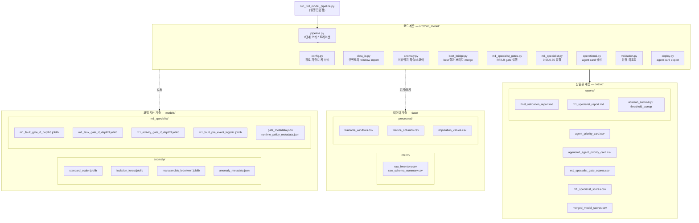

# M1 Specialist 패키지 구성도

## 목적

최종 모델 패키지(`m1_specialist_package`)의 정적 구성을 계층별로 정리한다. 코드·모델 자산·데이터·산출물이 어떤 폴더에 어떤 역할로 배치되어 있는지 한 장으로 파악하는 것이 목표다. 뒤이어 작성하는 흐름도·실행계획도는 이 문서에서 정의한 구성요소 이름을 그대로 사용한다.

## 입력 자료

- `PACKAGE_README_KO.md`, `PACKAGE_MANIFEST.md`, `MODEL_INVENTORY_KO.md` (패키지 안내 문서)
- `src/third_model/config.py` (경로·상수 정의)
- 압축 해제된 실제 파일 목록

수치·파일명은 모두 **패키지 원본 파일 기준**이다.

## 처리 기준

- `PACKAGE_MANIFEST.md`의 "Active Code / Main Outputs / Active Models" 목록을 1차 기준으로 삼는다.
- `config.py`에 실제 경로 상수가 정의된 파일만 구성요소로 포함한다.
- Scope 밖 항목(manufacturer 2 관련)은 구성도에서 제외한다(`PACKAGE_MANIFEST.md` "Excluded From Scope").

## 결과: 구성도

### 전체 계층 구성

### 계층 요약

| 계층 | 폴더 | 핵심 구성요소 | 역할 |
|---|---|---|---|
| 진입점 | 루트 | `run_3rd_model_pipeline.py` | `pipeline.main()` 호출 |
| 코드 | `src/third_model/` | 모듈 10개 | 파이프라인 단계 구현 |
| 모델 자산 | `models/anomaly/`, `models/m1_specialist/` | joblib 7개 + metadata 4개 | 학습된 모델 로드 대상 |
| 데이터 | `data/interim/`, `data/processed/` | window/feature/imputation | 파이프라인 입력 |
| 산출물 | `output/`, `output/agent/`, `output/reports/` | score·agent card·report | 최종 전달 결과 |

### 모델 자산 상세

- **이상탐지 (`models/anomaly/`)**: `standard_scaler` → `isolation_forest` + `mahalanobis_ledoitwolf` 3종 joblib. train split 중 `label == normal`을 정상 기준으로 사용. 가중치는 `config.py`의 `ANOMALY_WEIGHTS = {mahalanobis: 0.53, iforest: 0.47}`, 임계값은 q99(`ANOMALY_THRESHOLD_QUANTILE = 0.99`).
- **M1 specialist gate (`models/m1_specialist/`)**: fault/task/activity RandomForest gate 3종(depth3) + pre-event LogisticRegression 1종. compact13 성격의 M1 전용 feature를 입력받아 gate 확률과 fault group·review flag를 생성.
- **최종 우선순위**: 별도 joblib이 아니라 결합 로직. `priority_score = 0.65 × current_best + 0.35 × m1_specialist`.

## 검증

- 구성도의 모든 노드(모듈·joblib·csv 이름)를 압축 해제된 실제 파일 목록과 대조함.
- `src/third_model/` 모듈 10개, `models/` joblib 7개, `data/processed/` 파일 3개 — `PACKAGE_MANIFEST.md`와 일치 확인.
- 가중치·임계값 수치는 `config.py` 라인 98~106 원본 기준.

## 한계

- 각 joblib의 학습 하이퍼파라미터·성능 수치는 구성도 범위에 포함하지 않는다(검증 문서 `docs/04_VALIDATION_AND_ABLATION.md` 참조).
- `config.py`의 `SOURCE_BEST_ROOT`가 가리키는 외부 best 프로젝트(`C:\Project3\HeatGrid_Agent\best`)는 이 패키지 외부 자산이며 구성도에는 참조 관계로만 표시하지 않았다. 실행 시 해당 경로 존재가 전제된다.
