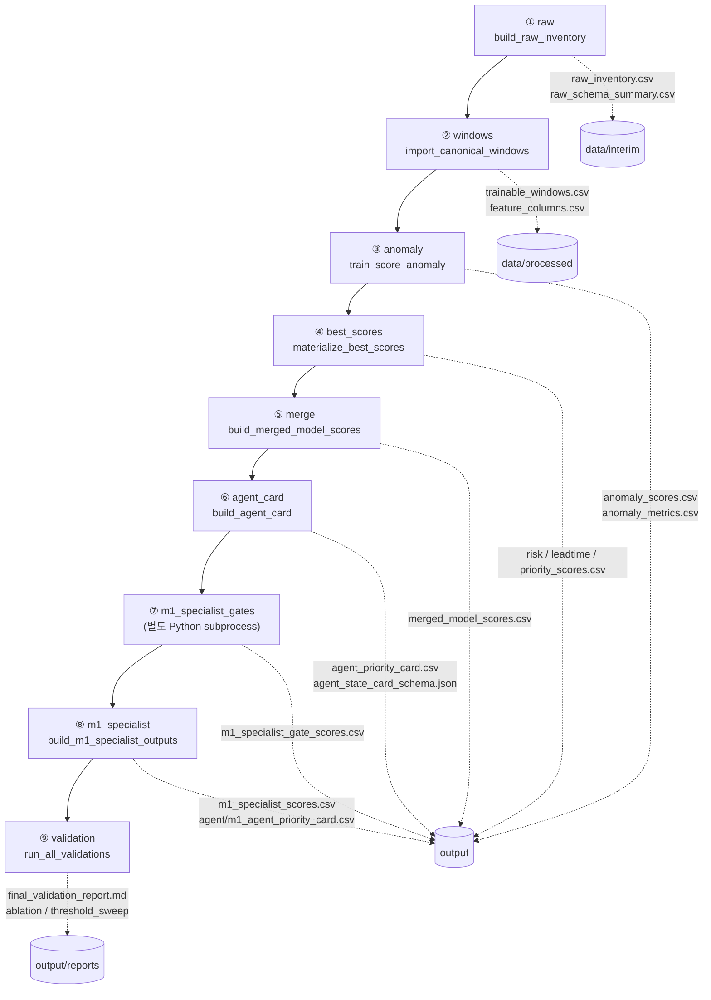
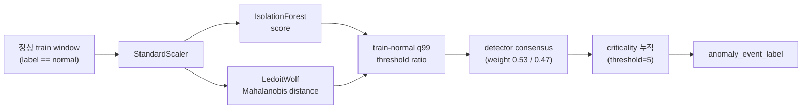
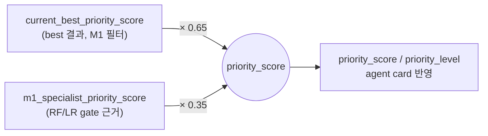

# M1 Specialist 파이프라인 흐름도

## 목적

최종 모델의 데이터 처리 흐름을 9단계 파이프라인 기준으로 그린다. 각 단계가 어떤 입력을 받아 어떤 처리를 하고 어떤 산출 파일을 만드는지 순서대로 파악하는 것이 목표다. 단계 이름은 [구성도](01_구성도_M1_specialist_패키지.md)의 모듈명과 실행계획도의 CLI step 이름에 그대로 대응한다.

## 입력 자료

- `src/third_model/pipeline.py` (`DEFAULT_STEPS`, `STEP_FUNCTIONS`)
- `docs/01_PIPELINE_STEPS.md`, `docs/03_MODEL_DESIGN.md`
- `src/third_model/config.py` (경로·가중치 상수)

## 처리 기준

- 단계 순서는 `pipeline.py`의 `DEFAULT_STEPS` 리스트 순서를 그대로 따른다.
- 산출 파일명은 `config.py`에 정의된 경로 상수 기준이다.
- `m1_specialist_gates` 단계는 별도 Python 인터프리터에서 subprocess로 실행되는 점을 흐름도에 반영한다(`pipeline.run_m1_specialist_gates_subprocess`).

## 결과: 흐름도

### 전체 9단계 파이프라인

### 단계별 입력·처리·산출

| # | step | 입력 | 처리 | 주요 산출 |
|---|---|---|---|---|
| ① | `raw` | raw 폴더 파일 목록 | 인벤토리·schema 요약 (학습 안 함) | `raw_inventory.csv` |
| ② | `windows` | best의 canonical `trainable_windows.csv` | M1 row만 필터 | `data/processed/trainable_windows.csv` |
| ③ | `anomaly` | M1 train-normal window | 표준화 → IF+Mahalanobis → q99 ratio → consensus | `anomaly_scores.csv`, `models/anomaly/` |
| ④ | `best_scores` | best의 risk/leadtime/priority | M1만 브리지로 가져오기 | `risk/leadtime/priority_scores.csv` |
| ⑤ | `merge` | priority + anomaly score | key 기준 결합 | `merged_model_scores.csv` |
| ⑥ | `agent_card` | merged score | 운영 column 구성 | `agent_priority_card.csv` |
| ⑦ | `m1_specialist_gates` | compact13 M1 feature | RF×3 + LR gate 확률 산출 (별도 Python) | `m1_specialist_gate_scores.csv` |
| ⑧ | `m1_specialist` | current-best priority + gate score | **0.65/0.35 결합** | `m1_specialist_scores.csv`, `m1_agent_priority_card.csv` |
| ⑨ | `validation` | 전체 산출물 | reconciliation·sweep·ablation·sensitivity·audit | `final_validation_report.md` 외 |

### 서브 흐름 1 — 이상탐지 스코어링 (③ anomaly)

### 서브 흐름 2 — 최종 우선순위 결합 (⑧ m1_specialist)

M1 specialist는 best의 risk/leadtime을 **대체하지 않는다**. best를 기본축(0.65)으로 유지하고 M1 전용 gate 근거를 보조(0.35)로 반영하며, agent 설명 근거로 함께 제공한다.

## 검증

- 9단계 이름이 `pipeline.py`의 `DEFAULT_STEPS`(`raw, windows, anomaly, best_scores, merge, agent_card, m1_specialist_gates, m1_specialist, validation`)와 정확히 일치함.
- 각 step의 함수명은 `STEP_FUNCTIONS` 매핑과 대조함.
- 결합 가중치 0.65/0.35는 `docs/03_MODEL_DESIGN.md` 및 `MODEL_INVENTORY_KO.md` 기준.
- anomaly 가중치·임계값(0.53/0.47, q99, criticality 5)은 `config.py` 라인 98~100 기준.

## 한계

- 산출 파일은 흐름 이해에 필요한 대표 파일만 표기했다. 전체 산출물 목록은 [구성도](01_구성도_M1_specialist_패키지.md)와 `PACKAGE_MANIFEST.md`를 참조한다.
- ④ `best_scores`, ② `windows`는 외부 best 프로젝트 산출물을 입력으로 전제한다. best 산출물이 없으면 해당 단계가 실패한다(실행 계획은 [실행계획도](03_실행계획도_M1_specialist_런북.md) 참조).
