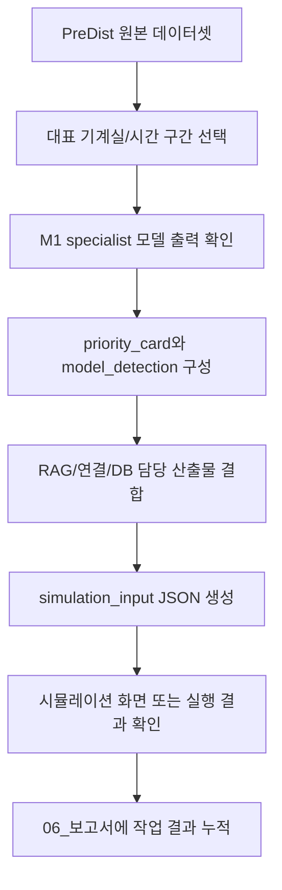

# 실행계획도: M1 specialist 런북

## 목적

`04_최종모델`의 M1 specialist handoff 패키지를 시뮬레이션 입력으로 연결할 때 확인할 실행 순서와 산출물 위치를 정리한다.

## 입력

- 최종 모델 패키지: `04_최종모델/m1_specialist_handoff.zip`
- 확장 패키지: `04_최종모델/m1_specialist_package.zip`
- 원본 데이터셋: `03_데이터셋/PreDist/predist_dataset.zip`
- 시뮬레이션 입력 계약: `05_시뮬레이션/contracts/simulation_input.schema.json`

## 실행 흐름

## 확인할 모델 패키지 문서

zip 내부에서 우선 확인할 문서는 다음 순서다.

1. `README.md`
2. `PACKAGE_MANIFEST.md`
3. `docs/02_AGENT_OUTPUT_CONTRACT.md`
4. `docs/05_RUNBOOK.md`
5. `reports/final_validation_report.md`

## 시뮬레이션 연결 기준

모델 출력은 바로 화면에 붙이지 않고 `05_시뮬레이션/examples/simulation_input.example.json` 구조에 맞춰 변환한다.

- 모델 라벨과 점수: `model_detection`
- 출동 우선순위 판단: `priority_card`
- RAG 설명과 점검 항목: `rag_answer`
- Priority-RAG 연결 확인: `connection_check`
- 현장/설비/센서 매핑: `db_mapping`

## 주의사항

- 원본 데이터 zip과 모델 zip은 Git에 올리지 않는다.
- 시뮬레이션은 모델 성능 재검증보다 운영 흐름 확인이 우선이다.
- 큰 작업을 마치면 결과와 검증 내용을 `06_보고서`에 남긴다.
