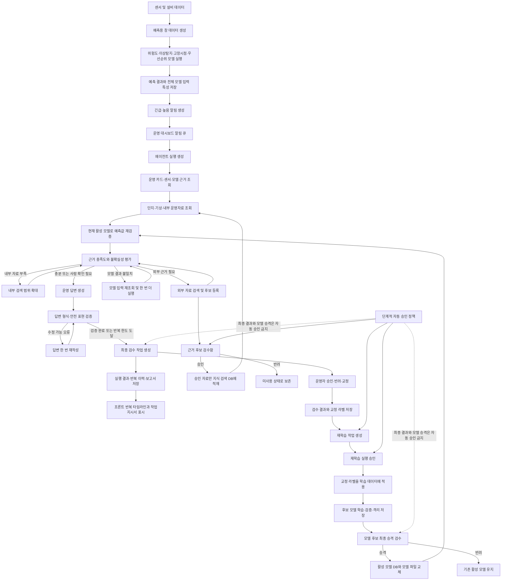

# 에이전트 재귀 자동화 전체 구조

이 문서는 `develop2-loop`에서 구현한 운영 에이전트 반복 판단, 모델 재검증, 사람 검수, 외부 근거 승인, 재학습, 모델 승격의 전체 흐름을 설명한다.

## 전체 구조도



## 두 종류의 반복 루프

### 운영 판단 루프

한 번의 에이전트 실행 안에서 최대 4회까지 돈다.

1. 운영 DB 근거와 내부 운영자료를 조회한다.
2. 저장된 예측값을 현재 활성 모델로 다시 계산한다.
3. 근거 점수, 출처 수, 모델 일치도, 카드의 검수 필요 여부를 평가한다.
4. 부족한 원인에 따라 내부 검색 확대, 외부 후보 검색, 모델 재실행 중 하나를 선택한다.
5. 반복 한도에 도달하거나 불확실성이 남으면 사람 검수로 보낸다.
6. 답변 생성 후 형식과 확정 표현을 검증하고 필요한 경우 한 번 재작성한다.

LLM은 다음 행동과 설명을 제안하지만 다음 규칙을 넘을 수 없다.

- 최대 반복 횟수
- 외부 검색 활성화 여부
- 모델 불일치 시 재검증 우선
- 고위험 항목의 사람 검수
- 최종 결과의 사람 검수

### 모델 개선 루프

여러 에이전트 실행에 걸쳐 장기적으로 돈다.

1. 운영자가 최종 결과를 승인, 반려 또는 교정한다.
2. 교정된 출력과 `normal` 또는 `pre_fault` 라벨을 학습 피드백으로 저장한다.
3. 선택된 피드백으로 재학습 작업을 만든다. 제한 자동 자격과 서버 안전 스위치를 모두 충족하면 이 작업은 자동 생성·승인된다.
4. 승인된 재학습은 교정 라벨을 해당 제조사·설비·시간 창에 적용한다. 교정 라벨이 없으면 재학습 생성을 거부한다.
5. 재학습 결과는 운영 모델을 바로 덮지 않고 후보 디렉터리에 격리한다.
6. 최종 승격 승인 후에만 활성 배포 DB와 실제 모델 파일을 함께 교체한다.
7. 다음 에이전트 실행부터 승격된 모델을 재검증에 사용한다.

## 판단 역할 분리

| 구성 | 책임 |
|---|---|
| 예측 모델 | 위험도, 이상탐지, 고장시점, 우선순위의 수치 계산 |
| LLM | 근거 탐색 방향, 부족한 자료 설명, 운영자용 답변 작성 |
| 고정 규칙 | 반복 한도, 고위험 자동 승인 금지, 최종 검수 강제 |
| 승인 정책 | 충분한 검수 이력이 쌓인 저위험 중간 작업의 자동 승인 |
| 사람 | 최종 운영 결과, 고위험 근거, 모델 승격의 최종 판단 |

## Tool 경계

에이전트 Tool은 총 12개이며, LLM이 선택할 수 있는 읽기 전용 Tool 8개와 LangGraph가 정책 확인 후 실행하는 통제 Tool 4개로 분리한다.

| 구분 | Tool | 역할 |
|---|---|---|
| LLM 선택 | `get_ops_evidence` | 저장된 운영 카드 전체 근거 조회 |
| LLM 선택 | `get_priority_snapshot` | 동일 평가 실행의 Priority 스냅샷 조회 |
| LLM 선택 | `get_substation_context` | Substation, 원시 시간 창, 단지 맥락 조회 |
| LLM 선택 | `get_sensor_evidence` | 선택된 완료 시간 창의 센서 요약 조회 |
| LLM 선택 | `get_model_evidence` | 위험도·이상탐지·고장 임박도·Priority 모델 근거 조회 |
| LLM 선택 | `get_internal_references` | 이미 조회된 내부 RAG 참고자료 조회 |
| LLM 선택 | `get_external_context` | 단지·기상 보조 맥락 조회 |
| LLM 선택 | `get_agent_loop_context` | 모델 재검증·근거 평가·외부 후보 상태 조회 |
| 그래프 통제 | `search_external_evidence` | 정책, 허용 도메인, 호출 횟수, 비용 한도 확인 후 외부 검색 |
| 그래프 통제 | `stage_evidence_candidate` | 외부 근거를 승인 전 후보와 검수 작업으로만 적재 |
| 그래프 통제 | `write_anomaly_report` | 완료 실행의 이상 보고서 산출물 저장 |
| 그래프 통제 | `write_daily_report` | 운영자의 명시적 명령으로 일일 보고서 산출물 저장 |

LLM은 외부 검색, PostgreSQL 쓰기, 보고서 파일 쓰기를 직접 호출할 수 없다. 해당 동작은 그래프 상태와 정책 판단 결과가 `execute`일 때만 통제 Tool을 통해 실행한다.

## 단계적 자동화

자동화 단계는 다음 세 가지다.

| 단계 | 동작 |
|---|---|
| 전면 검수 | 모든 근거 후보와 중간 결정을 사람이 승인한다. |
| 검수 보조 | 에이전트가 추천하지만 승인 권한은 사람에게 있다. |
| 제한 자동 | 누적 검수 기준을 충족한 저위험 중간 항목만 자동 승인한다. |

제한 자동 자격은 최소 검수 건수, 승인 일치율, 판단 신뢰도, 출처 신뢰도, 드리프트 상한을 모두 만족해야 한다. 자동 전환은 정책 화면에서 별도로 허용해야 한다.

교정 라벨 기반 재학습까지 자동 실행하려면 정책이 `제한 자동` 상태여야 하고 서버의 `HEATGRID_RETRAIN_AUTO_EXECUTE_ENABLED=1` 안전 스위치도 켜야 한다. 진행 중인 재학습이나 최종 승격 대기 모델이 있으면 새 재학습은 만들지 않는다.

다음 항목은 자동화 단계와 무관하게 사람 검수를 유지한다.

- 최종 운영 답변
- 긴급·고위험 근거 후보
- 모델 후보 최종 승격
- 물리 설비 제어

## 데이터베이스

| 테이블 | 저장 내용 |
|---|---|
| `model_feature_snapshots` | 창별 전체 모델 입력 특성 |
| `priority_evaluation_runs` | 동일 기준 시각의 31개 평가 실행, 모델 버전, 완료·실패 상태와 최신 활성 여부 |
| `priority_evaluation_results` | 평가 실행별 Substation 결과, 절대 점수·전체 순위·최신성·모델 구성요소 |
| `ops_alert_queue` | 최신 완료 평가에서 생성한 긴급·높음 알림 |
| `agent_runs` | 최종 출력, 반복 요약, 검수 상태 |
| `agent_run_events` | 큐 등록부터 완료까지의 SSE 원본 이벤트와 판단 출처 |
| `agent_run_artifacts` | 실행별 이상 보고서·일일 보고서 산출물 |
| `agent_run_actions` | 비용이 드는 보고서 명령의 중복 실행 방지 claim |
| `agent_loop_iterations` | 회차별 판단, 근거 점수, 모델 재검증 결과 |
| `evidence_candidates` | 외부·수동 근거 후보와 승인·RAG 적재 상태 |
| `human_review_tasks` | 최종 출력, 모델 불일치, 근거, 재학습, 승격 검수 작업 |
| `training_feedback` | 승인·반려·교정 결과와 교정 라벨 |
| `automation_policy` | 자동화 단계와 자격 기준 |
| `retrain_jobs` | 재학습 승인 및 실행 상태 |
| `model_candidates` | 격리된 후보 모델과 검증 요약 |
| `model_deployments` | 현재 활성 모델 배포 |

## API

| 목적 | API |
|---|---|
| 최신 31개 평가 | `GET /api/priority-evaluations/latest` |
| 특정 평가 실행 | `GET /api/priority-evaluations/{evaluation_run_id}` |
| 최신 Substation 상세 | `GET /api/priority-evaluations/latest/substations/{substation_id}` |
| 최신 긴급·높음 결과 | `GET /api/priority-evaluations/latest/alerts` |
| 에이전트 실행 | `POST /api/agent-runs`, `GET /api/agent-runs/{run_id}` |
| 실시간 실행 이벤트 | `GET /api/agent-runs/{run_id}/events` |
| 반복 이력 | `GET /api/agent-runs/{run_id}/iterations` |
| 일일 보고서 명령 | `POST /api/agent-runs/{run_id}/reports/daily` |
| 보고서 파일 | `GET /api/agent-runs/{run_id}/artifacts/{artifact_id}/content` |
| 검수 작업 | `GET /api/review-tasks`, `POST /api/review-tasks/{task_id}/submit` |
| 근거 후보 | `GET /api/evidence-candidates`, `POST /api/evidence-candidates/{candidate_id}/review` |
| 학습 피드백 | `GET /api/training-feedback` |
| 자동화 정책 | `GET /api/automation-policy`, `PATCH /api/automation-policy` |
| 재학습 | `GET/POST /api/retrain-jobs`, `POST /api/retrain-jobs/{job_id}/approve` |
| 모델 후보 | `GET /api/model-candidates`, `POST /api/model-candidates/{candidate_id}/promote` |
| 활성 모델 | `GET /api/model-deployments/active` |

## 외부 검색과 지식 적재

외부 검색은 기본 비활성화다. 다음 환경변수를 설정해야 실행된다.

```text
HEATGRID_EXTERNAL_SEARCH_ENABLED=1
HEATGRID_EXTERNAL_SEARCH_MODEL=gpt-5.4-mini
HEATGRID_EXTERNAL_SEARCH_MAX_RESULTS=5
HEATGRID_EXTERNAL_SEARCH_ALLOWED_DOMAINS=
HEATGRID_EXTERNAL_SEARCH_MAX_CALLS_PER_RUN=1
HEATGRID_EXTERNAL_SEARCH_ESTIMATED_COST_USD=0.01
HEATGRID_EXTERNAL_SEARCH_BUDGET_PER_RUN_USD=0.02
```

검색 전에는 자동화 정책, 허용 도메인, 실행당 호출 횟수, 남은 예상 비용을 모두 검사한다. `전면 검수`와 `검수 보조` 단계에서는 외부 호출을 실행하지 않고 최종 사람 검수로 보낸다. `제한 자동` 자격을 충족한 저위험 실행만 외부 검색을 자동 수행한다.

검색 결과는 즉시 지식 DB에 넣지 않는다. 먼저 `evidence_candidates`에 저장하고, 사람 또는 자격을 충족한 제한 자동 정책이 승인한 자료만 `rag_documents`와 `rag_chunks`에 적재한다.

허용 도메인은 OpenAI 검색 요청 필터와 서버 측 URL 후검증에 모두 적용한다. 정책상 사람 승인이 필요한 검색은 `external_search` 검수 작업으로 저장된다. 운영자가 승인하면 원본 평가 실행과 Substation을 유지한 감사 가능한 새 에이전트 실행을 만들고, 승인된 검색을 한 번 수행한 뒤 재귀 판단을 이어간다.

## 평가 스냅샷과 모델 실행

- 평가 기준 시각 이전의 최신 완료 창을 제조사·Substation별로 정확히 하나 선택한다.
- 31개 입력을 같은 배치에서 위험도, 이상탐지, 고장 임박도, 기존 Priority 공식, M1 specialist/hybrid 순으로 다시 계산한다.
- 저장돼 있던 과거 Priority 점수는 추론값으로 재사용하지 않고 추적용 ID와 비교 정보로만 보존한다.
- 절대 Priority 등급과 동일 실행 안의 전체 순위를 분리한다. `stale`과 `missing`은 순위에서 제외한다.
- 추론 실패 시 트랜잭션을 롤백한 뒤 별도 트랜잭션에 `failed` 평가 실행과 오류를 남긴다. 실패 실행은 최신 활성 스냅샷이 되지 않는다.
- 현재 M1 런타임에는 운영용 고장 유형 분류기가 없으므로 정답 라벨을 참조하지 않는다. 유형은 `unknown_review`로 두고 관련 항목에 검수 필요 상태를 남긴다.

반복 판단 이벤트의 `decision_source`는 `graph`, `deterministic`, `llm_guarded`로 구분한다. 따라서 단순 그래프 이동과 LLM이 근거를 보고 선택한 다음 행동을 감사 로그에서 분리해 확인할 수 있다.

## 실행 중복과 명령 처리

- 동일 알림의 완료 또는 진행 중 에이전트 실행은 새로 만들지 않고 기존 `run_id`를 재사용한다.
- 생성 API는 `queued`를 즉시 반환하고 그래프는 백그라운드에서 실행한다. 이벤트 스트림은 완료 전에도 연결할 수 있으며 이후 생성되는 이벤트를 순서대로 전송한다.
- DB에는 `queued`이지만 현재 서버가 수행 중이지 않은 실행은 다음 생성 요청에서 같은 `run_id`로 복구 실행한다. 현재 프로세스가 이미 수행 중인 실행은 `run_id` 작업 레지스트리로 중복 예약을 막는다.
- 실행 이벤트가 기록될 때마다 실행 시각을 갱신한다. 10분 동안 갱신되지 않은 `queued` 또는 `running` 실행은 실패 처리되어 다시 실행할 수 있다.
- 완료 실행을 의도적으로 다시 수행하려면 `force_new`, `requested_by`, `reason`을 함께 보내며 부모 실행 ID와 사유를 보존한다.
- 운영 콘솔은 실행 상태를 주기적으로 다시 읽으며, 완료 전에는 결과 API와 일일 보고서 명령을 호출하지 않는다.
- 일일 보고서는 운영 콘솔의 명시적 명령으로만 생성한다. 같은 실행의 동시 요청은 잠금과 기존 산출물 조회로 한 번만 비용을 사용하고 이후 요청은 같은 산출물을 재사용한다.

## 자동 재학습 안전 스위치

기본값은 비활성화다. 활성화해도 모델 후보의 최종 승격은 자동화되지 않는다.

```text
HEATGRID_RETRAIN_AUTO_EXECUTE_ENABLED=1
```

## 실행

```powershell
docker compose up -d heatgrid-pgvector
.\.venv\Scripts\python.exe scripts\simulate_predictor_db.py --append --enqueue-alerts
.\.venv\Scripts\python.exe simulator\versions\v2_postgres_react_ops\backend\server.py
cd frontend
npm.cmd run dev -- --host 127.0.0.1
```

- 백엔드: `http://127.0.0.1:8003`
- 프론트: `http://127.0.0.1:5173`

## 운영 제한

- 이 시스템은 점검 우선순위와 운영 판단을 보조하며 설비를 직접 제어하지 않는다.
- 모델 재검증 입력 충족도가 낮으면 결과를 `partial`로 표시하고 사람 검수를 강제한다.
- 승인되지 않은 외부 자료는 결정적 고장 근거로 사용하지 않는다.
- 서버가 `running` 상태에서 비정상 종료된 실행을 노드 단위 체크포인트부터 자동 복원하지는 않는다. 10분 lease 만료 후 감사 사유를 포함해 새 실행으로 다시 수행한다.
- 현재 백그라운드 작업 레지스트리는 로컬 단일 API 프로세스를 기준으로 한다. 다중 worker 배포 전에는 DB 기반 작업 큐와 분산 lease가 추가로 필요하다.
- 재학습 성공은 모델 승격을 의미하지 않는다.
- 모델 승격 실패 시 기존 활성 모델을 유지한다.
