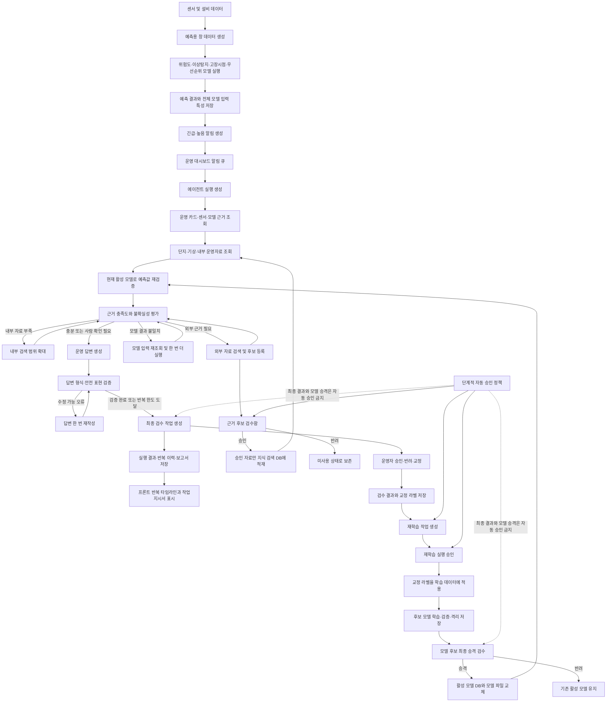

# 에이전트 재귀 자동화 전체 구조

이 문서는 `develop2-loop`에서 구현한 운영 에이전트 반복 판단, 모델 재검증, 사람 검수, 외부 근거 승인, 재학습, 모델 승격의 전체 흐름을 설명한다.

## 전체 구조도



## 두 종류의 반복 루프

### 운영 판단 루프

한 번의 에이전트 실행 안에서 최대 4회까지 돈다.

1. 운영 DB 근거와 내부 운영자료를 조회한다.
2. 저장된 예측값을 현재 활성 모델로 다시 계산한다.
3. 근거 점수, 출처 수, 모델 일치도, 카드의 검수 필요 여부를 평가한다.
4. 부족한 원인에 따라 내부 검색 확대, 외부 후보 검색, 모델 재실행 중 하나를 선택한다.
5. 반복 한도에 도달하거나 불확실성이 남으면 사람 검수로 보낸다.
6. 답변 생성 후 형식과 확정 표현을 검증하고 필요한 경우 한 번 재작성한다.

LLM은 다음 행동과 설명을 제안하지만 다음 규칙을 넘을 수 없다.

- 최대 반복 횟수
- 외부 검색 활성화 여부
- 모델 불일치 시 재검증 우선
- 고위험 항목의 사람 검수
- 최종 결과의 사람 검수

### 모델 개선 루프

여러 에이전트 실행에 걸쳐 장기적으로 돈다.

1. 운영자가 최종 결과를 승인, 반려 또는 교정한다.
2. 교정된 출력과 `normal` 또는 `pre_fault` 라벨을 학습 피드백으로 저장한다.
3. 선택된 피드백으로 재학습 작업을 만든다. 제한 자동 자격과 서버 안전 스위치를 모두 충족하면 이 작업은 자동 생성·승인된다.
4. 승인된 재학습은 교정 라벨을 해당 제조사·설비·시간 창에 적용한다. 교정 라벨이 없으면 재학습 생성을 거부한다.
5. 재학습 결과는 운영 모델을 바로 덮지 않고 후보 디렉터리에 격리한다.
6. 최종 승격 승인 후에만 활성 배포 DB와 실제 모델 파일을 함께 교체한다.
7. 다음 에이전트 실행부터 승격된 모델을 재검증에 사용한다.

## 판단 역할 분리

| 구성 | 책임 |
|---|---|
| 예측 모델 | 위험도, 이상탐지, 고장시점, 우선순위의 수치 계산 |
| LLM | 근거 탐색 방향, 부족한 자료 설명, 운영자용 답변 작성 |
| 고정 규칙 | 반복 한도, 고위험 자동 승인 금지, 최종 검수 강제 |
| 승인 정책 | 충분한 검수 이력이 쌓인 저위험 중간 작업의 자동 승인 |
| 사람 | 최종 운영 결과, 고위험 근거, 모델 승격의 최종 판단 |

## 단계적 자동화

자동화 단계는 다음 세 가지다.

| 단계 | 동작 |
|---|---|
| 전면 검수 | 모든 근거 후보와 중간 결정을 사람이 승인한다. |
| 검수 보조 | 에이전트가 추천하지만 승인 권한은 사람에게 있다. |
| 제한 자동 | 누적 검수 기준을 충족한 저위험 중간 항목만 자동 승인한다. |

제한 자동 자격은 최소 검수 건수, 승인 일치율, 판단 신뢰도, 출처 신뢰도, 드리프트 상한을 모두 만족해야 한다. 자동 전환은 정책 화면에서 별도로 허용해야 한다.

교정 라벨 기반 재학습까지 자동 실행하려면 정책이 `제한 자동` 상태여야 하고 서버의 `HEATGRID_RETRAIN_AUTO_EXECUTE_ENABLED=1` 안전 스위치도 켜야 한다. 진행 중인 재학습이나 최종 승격 대기 모델이 있으면 새 재학습은 만들지 않는다.

다음 항목은 자동화 단계와 무관하게 사람 검수를 유지한다.

- 최종 운영 답변
- 긴급·고위험 근거 후보
- 모델 후보 최종 승격
- 물리 설비 제어

## 데이터베이스

| 테이블 | 저장 내용 |
|---|---|
| `model_feature_snapshots` | 창별 전체 모델 입력 특성 |
| `agent_runs` | 최종 출력, 반복 요약, 검수 상태 |
| `agent_loop_iterations` | 회차별 판단, 근거 점수, 모델 재검증 결과 |
| `evidence_candidates` | 외부·수동 근거 후보와 승인·RAG 적재 상태 |
| `human_review_tasks` | 최종 출력, 모델 불일치, 근거, 재학습, 승격 검수 작업 |
| `training_feedback` | 승인·반려·교정 결과와 교정 라벨 |
| `automation_policy` | 자동화 단계와 자격 기준 |
| `retrain_jobs` | 재학습 승인 및 실행 상태 |
| `model_candidates` | 격리된 후보 모델과 검증 요약 |
| `model_deployments` | 현재 활성 모델 배포 |

## API

| 목적 | API |
|---|---|
| 반복 이력 | `GET /api/agent-runs/{run_id}/iterations` |
| 검수 작업 | `GET /api/review-tasks`, `POST /api/review-tasks/{task_id}/submit` |
| 근거 후보 | `GET /api/evidence-candidates`, `POST /api/evidence-candidates/{candidate_id}/review` |
| 학습 피드백 | `GET /api/training-feedback` |
| 자동화 정책 | `GET /api/automation-policy`, `PATCH /api/automation-policy` |
| 재학습 | `GET/POST /api/retrain-jobs`, `POST /api/retrain-jobs/{job_id}/approve` |
| 모델 후보 | `GET /api/model-candidates`, `POST /api/model-candidates/{candidate_id}/promote` |
| 활성 모델 | `GET /api/model-deployments/active` |

## 외부 검색과 지식 적재

외부 검색은 기본 비활성화다. 다음 환경변수를 설정해야 실행된다.

```text
HEATGRID_EXTERNAL_SEARCH_ENABLED=1
HEATGRID_EXTERNAL_SEARCH_MODEL=gpt-5.4-mini
HEATGRID_EXTERNAL_SEARCH_MAX_RESULTS=5
HEATGRID_EXTERNAL_SEARCH_ALLOWED_DOMAINS=
```

검색 결과는 즉시 지식 DB에 넣지 않는다. 먼저 `evidence_candidates`에 저장하고, 사람 또는 자격을 충족한 제한 자동 정책이 승인한 자료만 `rag_documents`와 `rag_chunks`에 적재한다.

## 자동 재학습 안전 스위치

기본값은 비활성화다. 활성화해도 모델 후보의 최종 승격은 자동화되지 않는다.

```text
HEATGRID_RETRAIN_AUTO_EXECUTE_ENABLED=1
```

## 실행

```powershell
docker compose up -d heatgrid-pgvector
.\.venv\Scripts\python.exe scripts\simulate_predictor_db.py --append --enqueue-alerts
.\.venv\Scripts\python.exe simulator\versions\v2_postgres_react_ops\backend\server.py
cd frontend
npm.cmd run dev -- --host 127.0.0.1
```

- 백엔드: `http://127.0.0.1:8003`
- 프론트: `http://127.0.0.1:5173`

## 운영 제한

- 이 시스템은 점검 우선순위와 운영 판단을 보조하며 설비를 직접 제어하지 않는다.
- 모델 재검증 입력 충족도가 낮으면 결과를 `partial`로 표시하고 사람 검수를 강제한다.
- 승인되지 않은 외부 자료는 결정적 고장 근거로 사용하지 않는다.
- 재학습 성공은 모델 승격을 의미하지 않는다.
- 모델 승격 실패 시 기존 활성 모델을 유지한다.
