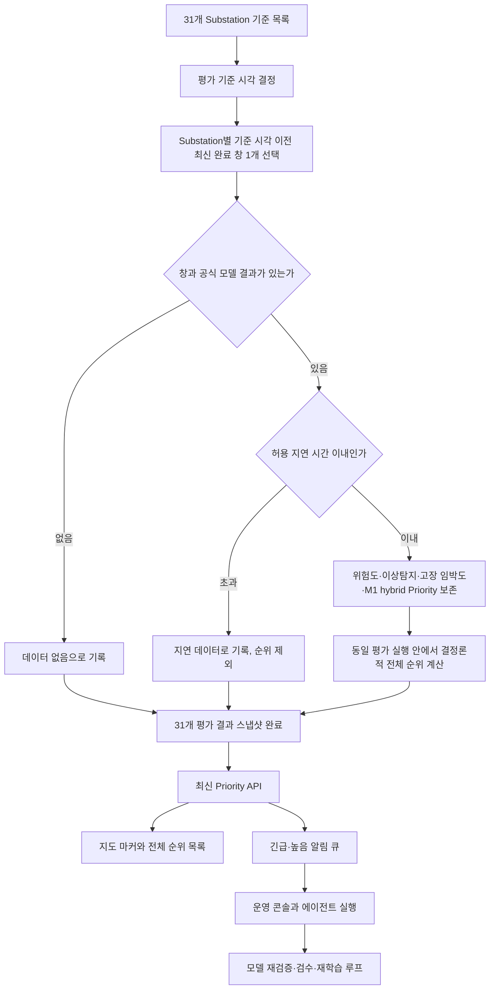

# 31개 Substation Priority 평가 스냅샷

## 목적

지도 관제, 전체 Priority 순위, 긴급·높음 알림, 운영 콘솔, 에이전트가 모두 하나의 `evaluation_run_id`와 `as_of_time`을 사용한다. 과거 1,252개 시간 창 전체를 현재 상태처럼 섞어 조회하지 않는다.

## 전체 흐름



## 평가 실행 방식

1. 기본 `as_of_time`은 DB에 저장된 완료 창 중 가장 큰 `window_end`다.
2. 각 `(manufacturer_id, substation_id)`에서 `window_end <= as_of_time`인 최신 창 하나만 선택한다.
3. 선택 순서는 `window_end`, `window_start`, `window_id` 내림차순으로 고정한다.
4. 선택된 창의 공식 모델 산출물인 risk, anomaly, leadtime, current-best Priority, M1 specialist Priority와 `0.65 / 0.35` hybrid 최종 Priority를 스냅샷에 보존한다.
5. 기본 허용 지연은 720시간이며 `HEATGRID_PRIORITY_STALE_AFTER_HOURS`로 조절한다.
6. 창 또는 공식 Priority 결과가 없으면 `missing`, 허용 지연을 넘으면 `stale`이다.
7. `fresh`이면서 Priority 점수가 있는 결과만 전체 순위와 알림 생성에 포함한다.

스냅샷 계층은 모델을 재학습하지 않는다. 로더가 만든 창별 공식 모델 추론 산출물을 동일 기준 시점으로 묶는다. 모델 파일이나 추론 산출물이 갱신되면 로더를 다시 실행한 뒤 새 평가 스냅샷을 생성해야 한다.

## 순위와 등급

Priority 점수는 Substation 상태의 절대 점수이며 전체 순위에 따라 다시 환산하지 않는다. 순위는 같은 `evaluation_run_id` 안에서 다음 순서로 계산한다.

1. Priority 점수 내림차순
2. 위험도 내림차순
3. 고장 임박도 내림차순
4. 이상탐지 점수 내림차순
5. Substation ID 오름차순

`priority_rank`와 `priority_level`은 서로 독립적이다. 따라서 전체 1위가 `low` 또는 `medium`이어도 원래 모델 등급을 유지한다. `stale`과 `missing`은 `rank_included=false`, `priority_rank=null`이다.

## DB

| 테이블 | 역할 |
|---|---|
| `priority_evaluation_runs` | 평가 ID, 기준 시각, 모델 계약 버전, 허용 지연, 상태와 집계 |
| `priority_evaluation_results` | 31개 Substation의 원시 창, 카드, 점수, 순위, freshness와 모델 구성요소 |
| `ops_alert_queue` | 평가 ID·Substation별 최신 긴급·높음 알림 |
| `agent_runs` | 알림에서 상속한 평가 ID·제조사·Substation 추적 |

`priority_evaluation_results`는 `(evaluation_run_id, manufacturer_id, substation_id)`를 유일하게 보장한다. 완료된 최신 평가 하나는 `is_active=true`로 유지한다.

## API

| API | 역할 |
|---|---|
| `POST /api/priority-evaluations` | 지정 또는 최신 기준 시각으로 새 평가 생성 |
| `GET /api/priority-evaluations/latest` | 지도용 최신 31개 전체 결과 |
| `GET /api/priority-evaluations/{evaluation_run_id}` | 특정 평가 실행 전체 결과 |
| `GET /api/priority-evaluations/latest/substations/{id}` | 특정 Substation 상세 및 모델 구성요소 |
| `GET /api/priority-evaluations/latest/alerts` | 최신 평가의 fresh 긴급·높음 결과 |
| `POST /api/alerts/enqueue` | 최신 평가 결과에서만 알림 생성 |

기존 알림과 agent run 필드는 유지한다. 추가 필드는 `evaluation_run_id`, `as_of_time`, `manufacturer_id`, `substation_id`, `priority_rank`, `freshness_status`다.

## 현재 데이터 상태

현재 로컬 데이터는 31개 Substation과 1,252개 창을 포함하지만 Substation별 마지막 창 시각이 2014년부터 2020년까지 분산되어 있다. 최신 원천 시각 `2020-06-13 06:00 UTC`와 기본 30일 허용 지연을 사용한 결과는 다음과 같다.

- 평가 대상: 31
- fresh 및 순위 포함: 3
- stale 및 순위 제외: 28
- missing: 0

이는 정상 28개가 아니라 데이터가 오래된 28개라는 의미다. 프론트는 이를 회색 `지연` 상태로 표시한다.

## 실행 설정

```text
HEATGRID_PRIORITY_EXPECTED_SUBSTATIONS=31
HEATGRID_PRIORITY_STALE_AFTER_HOURS=720
HEATGRID_PRIORITY_MODEL_VERSION=active-priority-contract-v1
```
