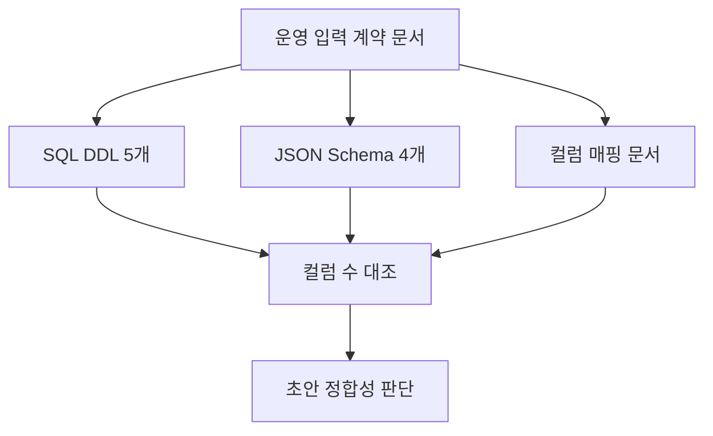

# 운영 입력 계약 초안 검토 보고서

## 개요

`schema/`와 `docs/contracts/03_operational_input_contract.md`에 작성된 운영 입력 데이터 계약 초안을 검토했다. 결론적으로 운영 추론 입력을 4개 테이블로 제한한 방향은 현재 초안 안에서 일관성이 있고, SQL DDL과 JSON Schema의 컬럼 구성도 서로 맞는다.

다만 실제 PostgreSQL/TimescaleDB 실행 검증과 `jsonschema` 기반 Draft 2020-12 검증은 현재 로컬 환경만으로는 완료되지 않았다. 원천 CSV는 로컬에 있으나 약 1.52GB 규모이므로 repo 커밋 대상에서는 제외한다.

## 무엇을 했는지

현재 repo 상태, 브랜치, 미추적 파일, 계약 문서, SQL DDL, JSON Schema, 컬럼 매핑 문서를 확인했다.

| 확인 항목 | 결과 |
| --- | --- |
| 현재 브랜치 | `agent1` |
| Git 상태 | `docs/contracts/`, `docs/report/`, `schema/`, `data/raw/`가 미추적 상태였고, `data/raw/`는 커밋 대상에서 제외 필요 |
| 계약 요약 문서 | `docs/contracts/03_operational_input_contract.md` 존재 |
| 실행 산출물 | SQL 5개, JSON Schema 4개, 컬럼 매핑 1개 |
| 루트 `AGENTS.md` 파일 | 현재 checkout에 존재 |
| 원천 CSV | `data/raw/` 아래 101개, 약 1.52GB |

## 왜 이렇게 봤는지

이번 초안은 구현 코드보다 데이터 계약이 핵심이므로, 사람이 읽는 문서만 보는 대신 산출물끼리 맞는지를 우선 확인했다. 특히 운영 입력 계약은 이후 적재 파이프라인, feature 생성, 예측 도구가 모두 의존하는 경계이기 때문에 SQL DDL과 JSON Schema의 필드 불일치가 가장 큰 초기 위험이다.

또한 프로젝트 지침상 PostgreSQL + TimescaleDB를 우선하고, 원본/가공 데이터 분리를 유지해야 하므로 `sensor_readings`를 hypertable로 두고 예측 결과/피처 테이블을 이번 계약에서 제외한 판단이 문서에 명확히 남아 있는지 확인했다.

## 변경 내용

이번 작업에서 기존 계약 파일은 수정하지 않았다. 검토 결과만 보고서로 추가했다.

| 항목 | 내용 |
| --- | --- |
| 추가 파일 | `docs/report/00_operational_input_contract_review.md` |
| 검토 대상 | `docs/contracts/03_operational_input_contract.md`, `schema/sql/*.sql`, `schema/json/*.schema.json`, `schema/column_name_mapping.md`, `schema/README.md` |
| 영향 | 계약 초안 자체는 그대로 두고, 현재 품질과 남은 검증 항목을 기록 |

## 검토 결과

| 관점 | 판단 | 근거 |
| --- | --- | --- |
| 범위 설정 | 적절함 | 운영 입력을 `substations`, `sensor_readings`, `fault_events`, `maintenance_events` 4종으로 제한하고, 예측/우선순위/윈도우 피처 테이블은 다음 단계로 분리했다. |
| 원본/가공 분리 | 적절함 | 실시간 raw 성격의 `sensor_readings`와 정적/이벤트 원천을 분리했고, `model_predictions`, `priority_scores`, `window_features`를 운영 입력 계약 밖으로 뺐다. |
| TimescaleDB 선택 | 적절함 | 고빈도 시계열인 `sensor_readings`만 hypertable 대상으로 지정해 DB 선택 이유와 테이블 성격이 맞는다. |
| 컬럼 정규화 | 적절함 | raw 컬럼의 `.`, 공백, `-`를 SQL 친화적인 snake_case로 바꾸는 매핑이 별도 문서에 있다. |
| SQL-JSON 정합성 | 양호함 | 4개 테이블 모두 SQL 컬럼 수와 JSON Schema property 수가 일치했다. |
| 문서 완성도 | 보통 | 핵심 why는 충분하지만, 실제 원천 CSV/ML 계약 파일과 대조한 증거는 repo 안에 없다. |

## 검증

실행한 검증은 다음과 같다.

| 검증 | 결과 |
| --- | --- |
| `git status --short --branch` | `agent1...origin/agent1`, `docs/contracts/`, `docs/report/`, `schema/`, `data/raw/` 미추적 확인 |
| JSON 파일 파싱 | 4개 JSON Schema 모두 JSON 문법 정상 |
| SQL 파일 개수 확인 | `schema/sql` 아래 5개 파일 확인 |
| SQL-JSON 컬럼 대조 | `substations` 8:8, `sensor_readings` 30:30, `fault_events` 7:7, `maintenance_events` 5:5로 모두 일치 |
| `sensor_readings` 컬럼 수 확인 | `substation_id` + `ts` + 숫자 17 + 제어 11 = 30컬럼 확인 |
| 원천 CSV 규모 확인 | 101개 CSV, 약 1.52GB 확인 |
| 대표 CSV 헤더 확인 | 제조사 1/2 operational, faults, disturbances 헤더 확인 |

실행하지 못한 검증은 다음과 같다.

| 미실행 검증 | 사유 |
| --- | --- |
| `psql -f schema/sql/*.sql` 실제 DDL 실행 | 현재 PATH에 `psql` 없음 |
| TimescaleDB hypertable 생성 확인 | PostgreSQL/TimescaleDB 연결 환경 없음 |
| `Draft202012Validator.check_schema(...)` | 현재 Python 환경에 `jsonschema` 패키지 없음 |
| `agent_full_data_contract.json` 대조 | 현재 repo에 해당 파일 없음 |
| 전체 원천 CSV header 대조 | 대표 파일 헤더만 확인했고, 101개 전체 헤더 자동 대조는 아직 미실행 |

## 한계와 주의점

현재 브랜치는 프로젝트 지침과 맞는 `agent1`이다. 다만 원천 CSV가 약 1.52GB로 커서 그대로 커밋하면 저장소가 급격히 무거워진다. 따라서 `data/raw/`는 로컬 검증 데이터로 두고 커밋 대상에서 제외해야 한다.

입력 계약 자체는 초안으로서 잘 잡혀 있지만, 아직 "실행 가능한 DB 계약"으로 확정됐다고 보기는 이르다. 최소한 psql 실행, TimescaleDB hypertable 생성, 원천 CSV header 대조, ML 계약 파일 대조가 끝나야 한다.

## 다음에 볼 것

1. `data/raw/`가 커밋 대상에서 제외되는지 최종 확인한다.
2. 전체 원천 CSV header 대조 스크립트 또는 노트북 검증을 추가한다.
3. PostgreSQL + TimescaleDB 환경에서 `schema/sql/000_extensions.sql`부터 `004_maintenance_events.sql`까지 실제 실행한다.
4. `jsonschema`를 개발 의존성으로 추가할지 결정하고, JSON Schema 검증을 자동화한다.
5. 검증이 끝나면 운영 입력 계약을 커밋 가능한 상태로 정리한다.
