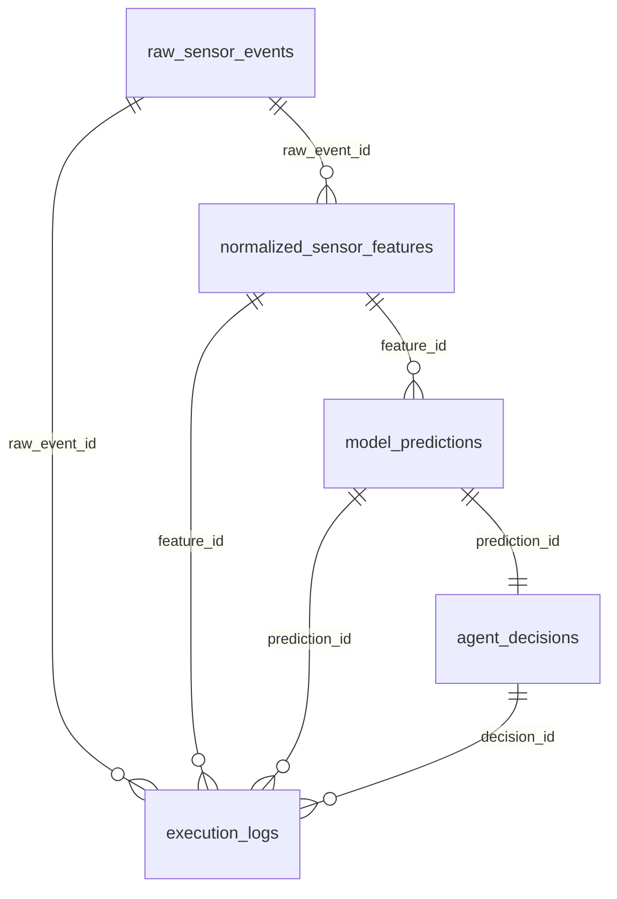
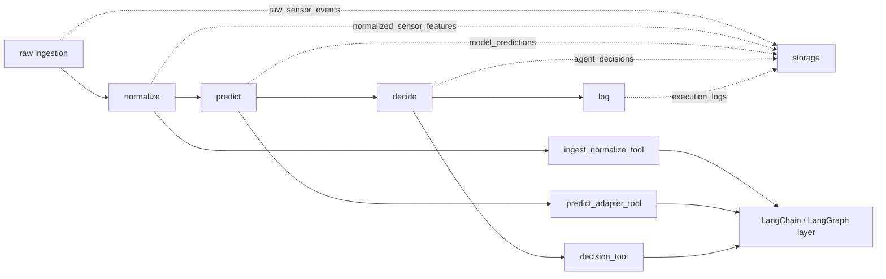

# Agent A foundation 작업 통합 보고서

## 개요

오늘 범위는 Agent A의 foundation 작업까지다.  
구체적으로는 `canonical prediction schema` 고정, `agent/` 작업 규칙 고정, 그리고 `PostgreSQL + TimescaleDB` 기준의 DB 스키마 초안 확정까지 완료했다.

이번 문서는 이전에 나뉘어 있던 schema 보고서와 DB 보고서를 통합한 인수인계 문서다.  
목표는 미래의 나나 팀원이 이 문서 하나만 읽고도 지금 상태, 파일 역할, 오늘 한 일, 다음 결정, 이후 Agent 흐름 연결까지 바로 이해하게 만드는 것이다.

## 오늘 만든 파일과 역할

| 파일 | 무엇인지 | 왜 필요한지 | 아직 안 하는 것 |
| --- | --- | --- | --- |
| `agent/schemas/canonical_prediction.py` | canonical prediction contract 코드 | ML 출력이 바뀌어도 Agent 전체가 흔들리지 않게 공통 코어를 고정하기 위해 | 실제 adapter 구현 |
| `agent/repository/db_schema.py` | DB 5테이블 spec 코드 | 실제 DB 연결 전에 스키마 계약을 먼저 고정하기 위해 | ORM, migration, SQL 실행 |
| `agent/tests/test_canonical_prediction.py` | prediction schema 테스트 | 필수 필드, 구간 예측, 점수 축 규칙이 깨지지 않게 하기 위해 | 실제 모델 출력 adapter 테스트 |
| `agent/tests/test_db_schema.py` | DB schema spec 테스트 | 테이블 수, 관계선, hypertable 대상, 역할 분리가 유지되는지 검증하기 위해 | 실제 DB 연결 테스트 |
| `agent/notebooks/00_agent_db_schema.ipynb` | DB 스키마 검토용 노트북 | 셀 단위로 테이블 구조와 관계를 눈으로 확인하기 위해 | 운영용 파이프라인 실행 |
| `docs/todo/2026-06-23.md` | 오늘 작업 기록 | 오늘 완료/대기 상태를 즉시 추적하기 위해 | 장기 설계 설명 |

## 핵심 결정과 근거

### 1. canonical prediction schema를 먼저 고정한 이유

- 이유: ML 출력 포맷이 변해도 Agent 전체가 다시 흔들리지 않게 하기 위해
- 기준: 정확성, 확장성, 유지보수성
- 결과: `prediction_id`, `source_type`, `schema_version`, `substation_id`, `observed_at`, `prediction_label`, `prediction_type`, 점수 축을 코어로 고정하고 나머지는 확장 필드로 분리했다

### 2. `agent/` 폴더로 작업 위치를 고정한 이유

- 이유: Agent 관련 코드가 초반부터 흩어지면 이후 `repository / service / tool / graph` 분리가 무너질 가능성이 크기 때문
- 기준: 유지보수성, 디버깅 용이성, 기존 프로젝트 규칙과의 정합성
- 결과: schema, repository, tests, notebooks를 모두 `agent/` 아래에 모았다

### 3. `agent` 브랜치를 기준 브랜치로 둔 이유

- 이유: Agent 관련 변경을 `main`과 분리해서 누적하고, 위험을 줄이기 위해
- 기준: 위험 감소, 작업 분리, Git 운영 명확성
- 결과: 이후 Agent 작업은 `agent` 브랜치 기준으로 이어간다

### 4. DB를 5축으로 나눈 이유

- 이유: 원본, 정규화 결과, 예측, 최종 판단, 실행 로그를 섞지 않기 위해
- 기준: 유지보수성, 확장성, 디버깅 용이성
- 결과:
  - `raw_sensor_events`
  - `normalized_sensor_features`
  - `model_predictions`
  - `agent_decisions`
  - `execution_logs`

### 5. hypertable 대상을 3개로 제한한 이유

- 이유: 모든 테이블을 시계열화할 필요는 없고, 실제 시간축이 핵심인 데이터만 Timescale 대상으로 두는 편이 단순하기 때문
- 기준: 구현 비용, 운영 단순성, 성능 대상 집중
- 결과:
  - hypertable 시작 대상: `raw_sensor_events`, `normalized_sensor_features`, `model_predictions`
  - 일반 테이블 시작: `agent_decisions`, `execution_logs`

### 6. `agent_decisions`를 `model_predictions`와 분리한 이유

- 이유: 예측 결과와 최종 권고는 같은 책임이 아니기 때문
- 기준: 책임 분리, 유지보수성, Agent 확장성
- 결과: 설명문, 권고문, 우선순위 판단은 `agent_decisions`에만 둔다

## DB 테이블 설명

| 테이블 | 무엇을 저장하는가 | 핵심 컬럼 | 왜 따로 분리했는가 |
| --- | --- | --- | --- |
| `raw_sensor_events` | 외부에서 들어온 원본 센서 이벤트 | `raw_event_id`, `source_type`, `source_dataset`, `substation_id`, `observed_at`, `raw_payload` | 원본을 남겨야 source별 재처리와 디버깅이 가능하기 때문 |
| `normalized_sensor_features` | raw 이벤트에서 정규화된 공통 feature | `feature_id`, `raw_event_id`, `substation_id`, `observed_at`, `feature_values` | ML과 Agent가 같은 정규화 기준을 보게 하려면 raw와 분리해야 하기 때문 |
| `model_predictions` | canonical prediction contract 기준 예측 결과 | `prediction_id`, `feature_id`, `event_id`, `prediction_label`, `prediction_type`, `prediction_score`, `confidence` | 모델 원본 출력과 Agent가 쓰는 prediction 계약을 고정하려면 prediction 레이어가 따로 있어야 하기 때문 |
| `agent_decisions` | prediction을 바탕으로 만든 최종 판단과 권고 | `decision_id`, `prediction_id`, `decision_status`, `decision_summary`, `recommended_action` | 예측과 권고는 책임이 달라서 분리해야 유지보수와 확장이 쉬움 |
| `execution_logs` | tool/node/error/fallback 실행 이력 | `log_id`, `stage_name`, `status`, `logged_at`, `message` | 운영 중 어떤 단계에서 문제가 났는지 따로 추적하려면 로그가 독립 저장소여야 함 |

### 테이블을 문장으로 풀어 쓰면

- `raw_sensor_events`
  - 가장 바깥쪽 입력 저장소다. 외부 source에서 들어온 값을 거의 그대로 남긴다.
- `normalized_sensor_features`
  - raw 입력을 Agent와 ML이 같이 쓸 수 있는 공통 feature로 정리한 중간 저장소다.
- `model_predictions`
  - 정규화된 feature를 바탕으로 나온 예측 결과를 canonical prediction 형태로 고정해 두는 저장소다.
- `agent_decisions`
  - prediction만으로 끝내지 않고, 실제 운영 판단과 권고를 분리해서 남기는 저장소다.
- `execution_logs`
  - 어느 단계에서 무엇이 실행됐고 실패했는지를 추적하기 위한 운영 로그 저장소다.

## DB 테이블 다이어그램

### ERD



### 해석

- `raw_sensor_events -> normalized_sensor_features`
  - raw 입력을 정규화한 feature가 이어진다.
- `normalized_sensor_features -> model_predictions`
  - 정규화된 feature를 기반으로 예측 결과가 생성된다.
- `model_predictions -> agent_decisions`
  - prediction을 바탕으로 최종 판단과 권고가 만들어진다.
- `execution_logs`
  - 각 단계의 실행 흔적을 옆에서 참조하는 별도 로그 저장소다.

## 오늘 실제로 한 일

### 구현

- canonical prediction schema를 코드로 고정했다.
- DB 5테이블 스키마 초안을 코드로 고정했다.
- `agent/` 폴더 구조와 `agent` 브랜치 기준을 잡았다.

### 테스트

- `python -m unittest discover -s agent/tests`
- 총 12개 테스트 통과
- 검증 내용:
  - prediction schema 필수 규칙
  - 구간/시점 prediction 처리
  - 테이블 수 5개 유지
  - hypertable 대상 3개 유지
  - `raw -> normalized -> prediction -> decision` 관계 유지

### 노트북 검토

- `agent/notebooks/00_agent_db_schema.ipynb`를 만들었다.
- 노트북에서 아래를 셀 단위로 확인할 수 있다.
  - 테이블 5축 요약
  - 각 테이블 컬럼
  - FK 관계
  - hypertable 대상
  - 인덱스 초안

### 문서 갱신

- todo 상태를 갱신했다.
- 기존 분리 보고서 내용을 이번 통합 문서로 재정리한다.

## 실행 및 확인 가이드

### 테스트 실행

```powershell
uv run python -m unittest discover -s agent/tests
```

### VS Code에서 노트북 확인

1. `C:\HeatGridAgent`를 VS Code로 연다.
2. `agent/notebooks/00_agent_db_schema.ipynb`를 연다.
3. `.venv` 커널을 선택한다.
4. 셀을 위에서부터 실행한다.

### 노트북에서 확인할 것

| 셀 범위 | 확인 내용 |
| --- | --- |
| 초반 셀 | 오늘 범위와 DB 5축 요약 |
| 중간 셀 | 각 테이블 컬럼 구조 |
| 관계 셀 | FK 연결과 hypertable 대상 |
| 마지막 셀 | 오늘 결정사항과 미결사항 |

## 다음에 결정할 일

1. `ingest_normalize_tool`, `predict_adapter_tool`, `decision_tool`의 입출력 고정
2. 실제 DB 연결 방식 선정
3. SQL/ORM 표현으로 전환할 시점 결정
4. Timescale retention/compression 정책 결정

## Agent 흐름으로 이어지는 방법

현재까지 고정된 흐름은 아래와 같다.



이 위에 이후 붙을 것은 다음이다.

- `ingest_normalize_tool`
  - raw 입력을 `normalized_sensor_features`까지 연결
- `predict_adapter_tool`
  - 모델 출력을 `model_predictions` canonical schema로 변환
- `decision_tool`
  - prediction을 기반으로 `agent_decisions` 생성
- LangChain
  - tool 호출 순서를 조합
- LangGraph
  - state, node, fallback 흐름을 관리

즉 지금 만든 것은 Agent 흐름의 “기반 저장 구조”이고, 이후 작업은 이 구조를 소비하는 레이어를 위에 쌓는 방향으로 이어지면 된다.

## 현재 한계

- 실제 PostgreSQL/TimescaleDB 연결은 아직 없다.
- migration과 ORM 모델은 아직 없다.
- tool, LangChain, LangGraph 구현은 아직 없다.
- 노트북은 검토용이며 운영 코드가 아니다.

## 한 줄 정리

오늘 한 일은 Agent 전체를 만든 것이 아니라, 이후 Agent가 흔들리지 않게 하기 위한 foundation를 고정한 것이다.  
앞으로의 구현은 이 문서와 `agent/` 코드 구조를 기준으로 위에 tool, orchestration, graph를 붙이면 된다.
