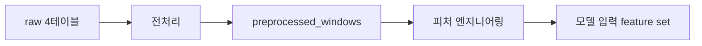

# 전처리 데이터 계약 검토 보고서

## Overview

`preprocessed_data_v1` 계약을 추가했다. 이번 계약은 `raw 4테이블 -> 전처리 -> 전처리 데이터 -> 피처 엔지니어링` 흐름에서 **전처리 데이터까지**를 고정한다.

전처리 데이터는 모델별 feature selection 전에 재사용되는 안정적인 중간층이다. 따라서 피처 엔지니어링은 바뀔 수 있지만, `preprocessed_windows`의 grain과 기본 품질/통계/context 컬럼은 계약으로 고정한다.

## What Changed

| 항목 | 내용 |
|---|---|
| 추가 계약 문서 | `docs/contracts/04_preprocessed_data_contract.md` |
| 추가 SQL DDL | `schema/sql/005_preprocessed_windows.sql` |
| 추가 JSON Schema | `schema/json/preprocessed_windows.schema.json` |
| 추가 전처리 코드 | `agent/preprocessing/*.py` |
| 추가 PreDist 샘플 코드 | `agent/preprocessing/sample_predist_zip.py` |
| 추가 테스트 | `tests/test_preprocessing_build_windows.py`, `tests/test_preprocessing_predist_zip_sample.py` |
| 추가 fixture | `agent/fixtures/preprocessing/predist_sample/raw/*.csv`, `agent/fixtures/preprocessing/predist_sample/output/preprocessed_windows_sample.csv` |
| 추가 Python 설정 | `pyproject.toml`, `uv.lock` |
| 테이블 | `preprocessed_windows` |
| 1행 의미 | 기계실 1개 x 6시간 구간 1개 |
| PK | `(substation_id, window_start, window_end)` |
| 계약 버전 | `preprocessed_data_v1` |

## Why This Approach

전처리 데이터는 raw 센서/이벤트를 모델 실험과 무관한 표준 관측 단위로 정리한다. 이 층을 고정하면 이후 피처 엔지니어링, feature selection, 모델 버전이 바뀌어도 동일한 입력 기반을 재사용할 수 있다.

반대로 one-hot, imputation, selected feature list는 모델 실험과 feature policy에 따라 바뀔 수 있으므로 이번 계약에서 제외했다.

코드는 단순한 함수형 파이프라인으로 뒀다. DB repository/service 계층까지 만들면 아직 확정되지 않은 적재 방식까지 끌고 들어오게 되므로, 이번 단계에서는 dataframe 입력을 받아 계약 컬럼 순서의 `preprocessed_windows` dataframe을 반환하는 데 집중했다.

## Change Details

| 컬럼 그룹 | 산식 | 컬럼 수 |
|---|---:|---:|
| 식별/시간/품질 | 고정 컬럼 | 14 |
| numeric sensor 통계 | 17 x 9 | 153 |
| control/status 요약 | 11 x 3 | 33 |
| 이벤트 context | 고정 컬럼 | 6 |
| 설비 context | 고정 컬럼 | 3 |
| lineage/version | 고정 컬럼 | 2 |
| 합계 | 전체 DDL 컬럼 | 211 |

numeric sensor 17개는 `mean`, `min`, `max`, `std`, `first`, `last`, `delta`, `missing_count`, `missing_rate`를 가진다. control/status 11개는 `dominant`, `nunique`, `change_count`를 가진다.

전처리 public 함수는 `build_preprocessed_windows(substations, sensor_readings, fault_events, maintenance_events, *, window_size="6h")`다. 필수 키가 없으면 실패하고, 그 외 결측/이벤트 없음/설비 정보 없음은 null 또는 `"missing"`으로 처리해 운영 중단 위험을 줄인다.

실제 PreDist ZIP 검증용으로 `run_predist_sample(zip_path, output_dir=None)`도 추가했다. 이 함수는 ZIP을 전체 해제하지 않고 `zipfile.ZipFile`로 지정 CSV만 읽어 raw 4테이블 dataframe을 만든 뒤 동일한 `build_preprocessed_windows` 경로로 통과시킨다. `output_dir`를 지정하면 raw 4테이블 CSV와 전처리 결과 CSV를 함께 저장해 원본 ZIP 없이도 팀원이 재현할 수 있게 했다.

## Verification

실행한 검증은 다음과 같다.

| 검증 | 결과 |
|---|---|
| `uv run pytest` | 5 passed |
| DDL 컬럼 수 산정 | 211개 컬럼 생성 |
| numeric sensor 파생 수 | 17 x 9 = 153 |
| control/status 파생 수 | 11 x 3 = 33 |
| JSON Schema 문법 확인 | `python -m json.tool schema/json/preprocessed_windows.schema.json` 통과 |
| SQL-JSON 컬럼 수 대조 | SQL 211개, JSON Schema property 211개로 일치 |
| 코드 출력 컬럼 검증 | 테스트에서 JSON Schema property 순서와 dataframe 컬럼 순서 일치 확인 |
| fail-soft 동작 검증 | 이벤트 없음, status 결측, invalid timestamp, 필수 키 누락 케이스 확인 |
| 피처 정책 제외 | one-hot, imputation, selected feature list를 테이블 계약에서 제외 |

실제 `C:/Users/Admin/Downloads/predist_dataset.zip` 샘플 검증 결과는 다음과 같다.

| 항목 | 값 |
|---|---:|
| ZIP 전체 entry 수 | 105 |
| operational CSV 수 | 93 |
| 샘플 대상 operational CSV | 2개 |
| 샘플 sensor_readings 행 수 | 300 |
| 샘플 fault_events 행 수 | 2 |
| 샘플 maintenance_events 행 수 | 9 |
| 샘플 substations 행 수 | 2 |
| 생성된 preprocessed_windows 행 수 | 10 |
| 생성된 preprocessed_windows 컬럼 수 | 211 |
| raw sensor_readings fixture 크기 | 62,462 bytes |
| output preprocessed fixture 크기 | 22,819 bytes |

샘플 대상은 `manufacturer 1/operational_data/substation_10.csv`와 `manufacturer 2/operational_data/substation_24.csv`로 고정했다. 각 파일에서 최대 150행씩 읽고, 같은 manufacturer의 `faults.csv`에서 해당 substation의 첫 `Report date`를 찾아 가장 가까운 시점 주변을 샘플링한다. 이벤트 시점이 operational 범위 밖이면 앞쪽 150행으로 fallback한다.

저장 fixture는 `raw/substations.csv`, `raw/sensor_readings.csv`, `raw/fault_events.csv`, `raw/maintenance_events.csv`, `output/preprocessed_windows_sample.csv`로 구성된다. 테스트는 ZIP이 있을 때 실제 ZIP 샘플 생성을 확인하고, ZIP 없이도 저장된 raw fixture 4개만으로 `preprocessed_windows`를 재생성할 수 있는지 확인한다.

`configuration_types.csv`는 ZIP에 없었다. 따라서 설비 context는 실패로 보지 않고 `configuration_type="missing"`, `has_dhw/has_buffer_tank=null` fallback으로 처리했다. 이 fallback은 raw fixture, output fixture, 테스트에서 확인했다.

## Limits and Caveats

현재 환경에서는 PostgreSQL/TimescaleDB 실제 DDL 실행 검증을 하지 않았다. `psql`과 TimescaleDB 연결 환경이 준비되면 `000`부터 `005`까지 순서대로 실행해야 한다.

또한 이 계약은 운영 전처리 데이터까지만 고정한다. 피처 엔지니어링, imputation/category artifact, selected model feature set은 별도 계약으로 다룬다. 현재 구현도 이 원칙에 맞춰 one-hot, imputation, selected feature 생성을 포함하지 않는다.

## Next Steps

1. PostgreSQL + TimescaleDB 환경에서 `schema/sql/005_preprocessed_windows.sql` 실행을 검증한다.
2. PreDist 전체 93개 operational CSV 일괄 처리 여부를 별도 범위로 판단한다.
3. 다음 단계에서 피처 엔지니어링 계약을 분리 작성한다.
