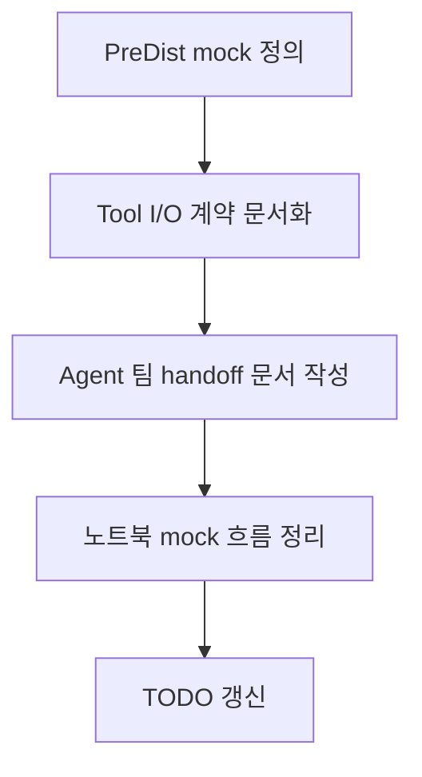

# Tool I/O 계약 및 Agent 팀 handoff 정리

## 개요

이번 단계에서는 Agent A가 Tool 3개의 입출력 계약을 고정하고, LangChain / LangGraph 팀원이 바로 설계를 시작할 수 있는 handoff 문서를 준비했다.

핵심은 rule 자체를 대신 설계하는 것이 아니라, **tool 경계와 DB 매핑을 먼저 고정하는 것**이다.

## 무엇을 했는지

- `docs/plan/04_tool_io_contract.md`에 상세 계약 기준본을 추가했다.
- `docs/send/02_agent_tool_io_handoff.md`에 Agent 팀 전달 문서를 추가했다.
- `agent/notebooks/01_tool_io_mock_flow.ipynb`에 PreDist mock 기준 입출력 흐름 노트북을 추가했다.
- todo 상태를 Tool I/O 완료 기준으로 갱신했다.

## 왜 이렇게 했는지

- LangChain / LangGraph 팀원이 바로 설계하려면, rule보다 먼저 입력/출력 shape와 DB 연결 지점이 명확해야 한다.
- 설계 기준본과 전달본을 분리해야 이후 수정 시 기준 문서와 handoff 문서의 역할이 섞이지 않는다.
- PreDist mock을 먼저 고정하면 KDHC 확장은 adapter 레이어에서 처리할 수 있다.

## 변경 내용

| 항목 | 내용 |
| --- | --- |
| 기준 문서 | `docs/plan/04_tool_io_contract.md` |
| 전달 문서 | `docs/send/02_agent_tool_io_handoff.md` |
| 검토 노트북 | `agent/notebooks/01_tool_io_mock_flow.ipynb` |
| 고정 대상 | tool 3개 I/O, 실패 payload, DB 매핑, State 최소 필드 |

## 검증

- 기준 검증:
  - 각 tool 입력/출력이 현재 DB 스키마와 매핑되는지 확인
  - `decision_tool`의 미구현 경계가 문서에 분명한지 확인
- handoff 검증:
  - Agent 팀이 바로 State, node, orchestration 설계를 시작할 수 있는지 확인

## 한계와 주의점

- `decision_tool` 내부 rule과 priority 산식은 아직 팀원 설계 범위다.
- 실제 DB write나 runtime orchestration은 아직 없다.
- 현재 노트북은 shape 검토용이지, 운영 코드가 아니다.

## 다음에 볼 것

- ML팀 회신 체크리스트 정리
- LangGraph State 초안과 node 분기 조건 정리
- SQL/ORM 표현 전환 여부 결정
