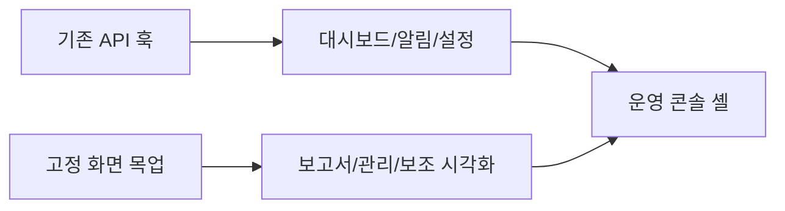

# 운영 콘솔 프런트엔드 전면 개편

## 개요

2026-07-11에 제공된 운영 대시보드 레퍼런스를 기준으로 `develop2` 프런트엔드를 밝은 관리 콘솔 형태로 전면 개편했다. 기존 백엔드 계약을 사용하는 화면은 그대로 연결하고, 계약이 없는 보고서·관리·보조 시각화 영역은 고정 목업 데이터로 구성했다.

## 무엇을 했는지

- 대시보드, 알림, 보고서/작업지시서, 설정, 관리자 콘솔의 5개 화면을 하나의 사이드바 셸로 통합했다.
- 기존 `usePrioritySnapshot`, `useAlerts`, `useHealth`, `useAutomationPolicy` 훅을 새 화면에서 사용하도록 연결했다.
- 실제 API로 제공되지 않는 보고서 보드, 조직/권한, 센서 추이와 위치 정보는 화면 전용 고정 데이터로 분리했다.
- 카드, 상태 배지, 버튼, 빈 상태, 로딩 상태, SVG 아이콘과 토큰 기반 CSS를 공통 요소로 정리했다.

## 왜 이렇게 했는지

기존 API 계약은 유지해야 하므로 프런트 화면만 새로 구성하고 API 클라이언트와 훅 계층은 바꾸지 않았다. 이 방식은 이미 구현된 우선순위·알림·정책 기능을 실데이터로 계속 사용할 수 있게 하며, 아직 서버 계약이 없는 운영 관리 기능은 명확하게 화면 전용 데이터로 구분한다.

## 변경 내용

| 항목 | 내용 |
| --- | --- |
| 화면 셸 | `App.tsx`를 5개 운영 페이지를 전환하는 관리 콘솔 셸로 교체 |
| 디자인 시스템 | 밝은 캔버스, 좌측 네비게이션, 상단 검색/기간 영역, 카드·표·상태 토큰을 `DESIGN.md`와 공통 UI로 정의 |
| 실데이터 연결 | 우선순위 스냅샷, 알림, 상태 점검, 자동화 정책은 기존 React Query 훅 사용 |
| 목업 범위 | 보고서/작업지시서, 관리자 권한, 센서 추이, 위치 모형, API 계약이 없는 설정 세부값 |
| 비주얼 범위 | 반응형 1열 전환과 320px 최소 너비를 추가하고, 아이콘을 인라인 SVG로 통일 |

## 검증

| 검증 | 결과 |
| --- | --- |
| `npm run typecheck` | 통과 |
| `npm run lint` | 경고 및 오류 0건 |
| `npm run build` | Vite 프로덕션 빌드 통과 |
| `http://192.168.219.43:5173/` | 새 Vite 서버에서 200 응답 확인 |
| 브라우저 점검 | 1672×941 뷰포트에서 대시보드와 알림 상세 화면 렌더링, 브라우저 콘솔 오류 없음 확인 |

## 한계와 주의점

- 현재 로컬 `.env`는 `VITE_USE_MOCK=true`이므로 브라우저 점검은 기존 목업 백엔드 경로에서 수행했다.
- 실백엔드 연결은 새 화면에서도 기존 훅을 사용하지만, 점검 시점에 `127.0.0.1:8002` 및 `8003` 헬스 엔드포인트가 응답하지 않아 실서버 런타임 검증은 수행하지 못했다.
- 지도 좌표와 센서 시계열 API 계약이 없으므로 해당 영역은 실제 위치나 실시간 그래프로 오인하지 않도록 모형 및 고정 추이로 표시한다.

## 다음에 볼 것

- 백엔드를 기동한 뒤 `VITE_USE_MOCK=false`로 우선순위·알림·정책 저장 흐름을 통합 점검한다.
- 보고서/작업지시서, 조직/권한, 센서 시계열 API가 추가되면 `mockViewData.ts`의 고정 데이터를 실제 계약으로 교체한다.
