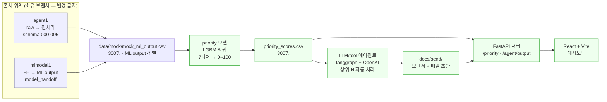
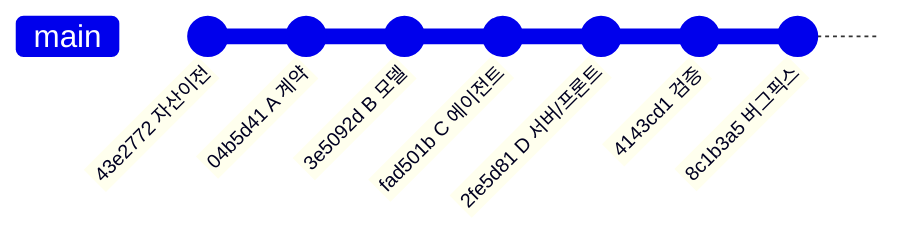
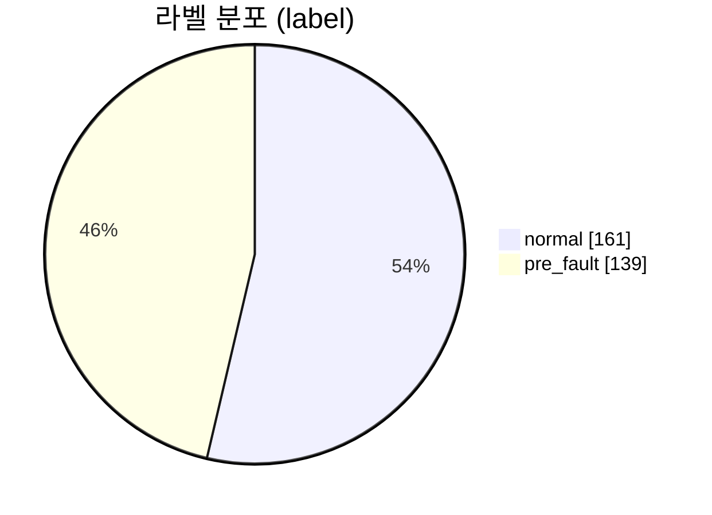
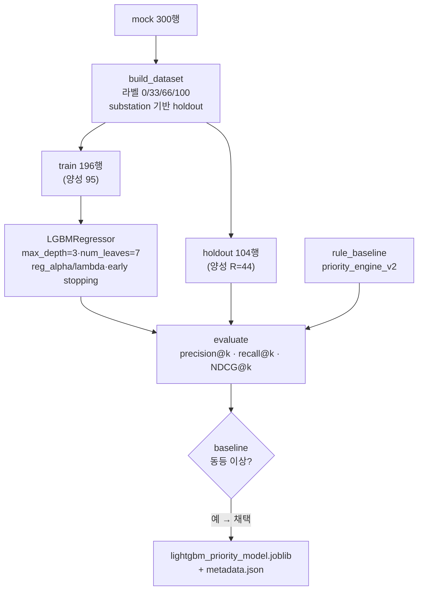
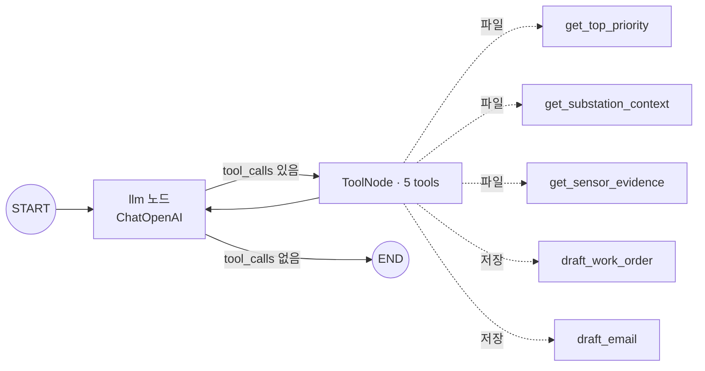
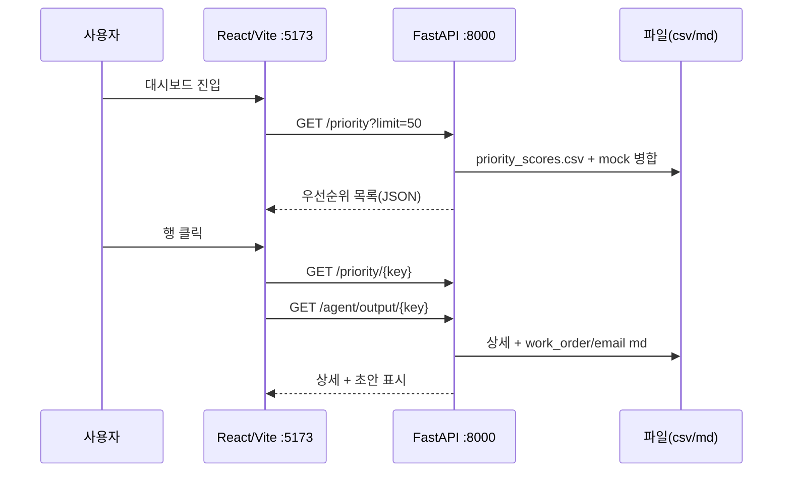
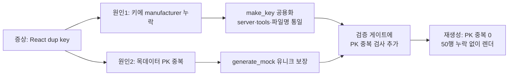

# proto 브랜치 — Priority Model + LLM 에이전트 한 사이클 구현 보고서

> 대상 브랜치: `proto` (origin/proto) · 커밋 7개 · 작성일 2026-06-26
> 목표: `데이터 → 머신러닝 → priority → LLM/tool → 서버 → 프론트` 를 실DB·실 ML output 없이 **목 데이터로 end-to-end 1바퀴** 돌리는 프로토타입.

---

## 0. 한눈에 보기 (Executive Summary)

| 항목 | 결과 |
|---|---|
| 구현 범위 | 자산 이전 → priority 계약 → LGBM 회귀 모델 → LLM 에이전트 → 서버/프론트 |
| 목 데이터 | **300행** (정상 161 / 고장전조 139), 25컬럼, 제조사 2 · 기계실 18 |
| priority 모델 | LightGBM **회귀**, 입력 7피처, 출력 0~100, 버전 `priority_v3_lgbm_reg` |
| 모델 성능(holdout) | precision@10/20/44 = **1.00**, NDCG = **1.00**, rule v2 baseline **동등 이상 → 채택** |
| 산출물 | priority_scores 300행, 운영보고서+메일 초안 **5쌍**, REST 3엔드포인트, 대시보드 |
| 검증 | JSON Schema 6종 + DDL 7종 + PK 유니크 + 전처리 테스트 **6 passed** 통과 |
| 운영 원칙 | 자동 발송 없음 · 운영자 검토 전제 · 고장 단정 금지 |

> ⚠️ 성능이 1.00으로 완벽한 것은 **목 데이터가 의도적으로 잘 분리되어 있기 때문**이다(정성 해석은 §4.3). 실 ML output 전환 시 1.00 미만이 정상이며, 본 사이클의 의의는 "점수 → 우선순위 → 보고서 → 화면"이 **끊김 없이 도는 골격과 검증 게이트**에 있다.

---

## 1. 전체 아키텍처 & 데이터 흐름



**출처 위계 (가장 중요한 설계 원칙)** — 단계마다 진실의 출처를 분리해 충돌을 막는다.

| 구간 | 소유 | proto의 처리 |
|---|---|---|
| raw → 전처리 → 전처리데이터 | `agent1` | 그대로 이전(schema 000-005, contracts 01-04, `agent/preprocessing/`), **변경 금지** |
| 피처엔지니어링 → ML output | `mlmodel1` | 노트북·`model_handoff` 패키지·rule 엔진(`priority_engine_v2_rule_based_tuned`) 따름 |
| AI priority model 이후 | **이번 작업** | 006 계약부터 모델·에이전트·서버·프론트 신규 구현 |

---

## 2. 커밋 타임라인 (단계 = 커밋)



| # | 커밋 | 단계 | 한 줄 |
|---|---|---|---|
| 1 | `43e2772` | S0 자산 이전 | agent1 + mlmodel1 자산을 proto로 가져옴 |
| 2 | `04b5d41` | A 계약 | priority 계약 3종 + 목데이터 + 검증 게이트 |
| 3 | `3e5092d` | B 모델 | LGBM 회귀 학습/평가/추론 + rule v2 비교 |
| 4 | `fad501b` | C 에이전트 | langgraph 에이전트 + 보고서/메일 초안 |
| 5 | `2fe5d81` | D 서버/프론트 | FastAPI + React/Vite 대시보드 |
| 6 | `4143cd1` | V 검증 | 한 사이클 재실행 산출물 갱신 |
| 7 | `8c1b3a5` | F 버그픽스 | 행 키에 manufacturer 포함 + PK 유니크 |

---

## 3. 단계별 보고서

### S0. 자산 이전 — `43e2772`

**정성** — proto를 `main`에서 분기한 뒤, 출처 위계대로 두 브랜치의 자산을 가져왔다. agent1의 전처리 계약/코드는 우리가 만든 게 아니므로 **원형 그대로** 이전했고, mlmodel1의 학습된 모델 패키지(IF/risk/leadtime/priority 메타)는 실학습 전환 대비로 함께 가져왔다. 데모는 목 데이터로 돌기 때문에 이 핸드오프 모델은 당장 로드하지 않는다.

**정량**
| 이전 자산 | 수량 |
|---|---|
| schema DDL (000~005) | 6 (+ 본 작업 006 추가 예정) |
| schema JSON (agent1) | 5 |
| docs/contracts | 4 (01~04) |
| model_handoff 파일 | 13 (IF·scaler·risk·leadtime·priority·docs) |

---

### A. Priority 계약 + 목 데이터 — `04b5d41`

**정성** — priority 단계의 입력/출력/라벨을 기존 schema 패턴(JSON Schema 2020-12 + Postgres DDL)으로 **잠갔다**. 데모 구동을 위해 Codex 대역으로 목 데이터 생성기를 두되, 컬럼명은 mlmodel1 ML output 계약과 1:1로 맞췄다. 모든 계약은 자동 검증 게이트(`validate_contracts`)로 통과를 강제한다.

**핵심 계약**
- 입력 7피처: `anomaly_score, risk_probability, risk_score, leadtime_prob_0-24h, leadtime_prob_1-3d, leadtime_prob_3-7d, predicted_lead_time_confidence`
- 라벨: `정상=0 / 3-7d=33 / 1-3d=66 / 0-24h=100`
- 출력: 키4 + `priority_score(0~100)` + `priority_level(urgent/high/medium/low)` + `model_version` + `created_at`

**정량 — 목 데이터 분포 (300행)**



| 분포 | 값 |
|---|---|
| 고장전조 리드타임 버킷 | 0-24h **65** / 1-3d **39** / 3-7d **35** |
| risk_level_calibrated | low 161 / high 114 / critical 23 / medium 2 |
| 제조사 / 기계실 | 2 / 18 |
| 검증 게이트 | JSON Schema **6종 OK**, DDL **7종 OK**, PK 유니크 OK |

---

### B. Priority 모델 (LGBM 회귀) — `3e5092d`

**정성** — 7피처로 0~100 우선순위를 예측하는 **LightGBM 회귀**. 과적합을 막기 위해 얕은 트리 + 강한 정규화 + early stopping을 쓴다. 평가는 단순 정확도가 아니라 **랭킹 품질**(상위 K개에 진짜 고장전조가 얼마나 들어오나)로 본다. 동일 holdout에서 기존 운영 rule 엔진(`priority_engine_v2_rule_based_tuned`)과 비교해 **동등 이상일 때만 채택**한다.



**정량 — 성능 (holdout, 정답집합 R=44)**

| 지표 | priority_v3 (LGBM) | rule v2 baseline |
|---|---|---|
| precision@10 | **1.00** | 1.00 |
| precision@20 | **1.00** | 1.00 |
| precision@44 (=R) | **1.00** | 1.00 |
| recall@10 | 0.227 | 0.227 |
| recall@20 | 0.455 | 0.455 |
| recall@44 | **1.00** | 1.00 |
| NDCG@10/20/44 | **1.00** | 1.00 |
| **판정** | **채택** (wins 0 / ties 9 / losses 0 → 동등 이상) | — |

- 데이터 분할: train **196** / holdout **104**, 학습 best_iteration 500.
- 라벨 분포(전체): 0→161, 33→35, 66→39, 100→65.

---

### C. LLM/Tool 에이전트 — `fad501b`

**정성** — priority 상위 N건을 자동으로 받아, 파일 기반 도구로 근거를 모으고 **운영자 검토용 보고서/메일 초안**을 만든다. langgraph 표준 패턴(`START→llm→tools→llm→END`)으로 구성하되, 프롬프트 규칙으로 **고장 단정 금지**("위험 가능성/점검 필요"), 근거·원인후보·점검항목·한계 포함, **자동 발송 없음**을 강제한다. OPENAI_API_KEY가 없으면 동일 도구를 결정적 순서로 호출하는 오프라인 경로로 한 사이클을 보장한다.



**정량**
| 항목 | 값 |
|---|---|
| 도구 수 | 5 (조회 3 + 초안 작성 2) |
| 생성 산출물 | 보고서 5 + 메일 5 = **10 md** (`docs/send/`) |
| 트리거 | priority_scores 상위 N (기본 5) |

---

### D. 서버 / 프론트 — `2fe5d81`

**정성** — 모든 산출물을 파일에서 읽어 제공하는 읽기 전용 REST(FastAPI). **발송 엔드포인트는 없다.** 프론트(React+Vite)는 우선순위 표 → 상세(근거 센서) → 보고서/메일 초안 검토의 3단 흐름을 제공한다.



**정량**
| 항목 | 값 |
|---|---|
| 엔드포인트 | 3 (`/priority`, `/priority/{key}`, `/agent/output/{key}`) + health |
| 프론트 렌더 | 우선순위 표 **50행** (검증 시) |
| 발송 기능 | **없음**(운영 원칙) |

---

### V. 검증 스냅샷 — `4143cd1`

**정성** — 전 사이클을 처음부터 재실행해 **재현성**을 확인하고, 타임스탬프가 갱신된 산출물을 정리했다.

**정량 — 한 사이클 재실행 결과**
`mock 300 → 계약검증 통과 → 학습(채택) → priority_scores 300 → 에이전트 5쌍 → pytest 6 passed`

---

### F. 버그픽스 — `8c1b3a5`

**정성** — 프론트를 띄워 검증하던 중 React 중복 key 경고로 **실제 버그**를 발견했다. 근본 원인 두 겹: ① 행 키가 `substation_id+window_start`만 써서 서로 다른 제조사가 같은 기계실·윈도우를 가지면 충돌(라우팅까지 모호), ② `generate_mock`이 PK 유니크를 보장하지 않아 중복 행 생성. 키에 manufacturer를 포함하도록 공용화하고, 생성기에 유니크를 보장했으며, **검증 게이트에 PK 중복 검사를 추가**해 재발을 막았다.



**정량** — 수정 후 priority_scores PK 중복 **0건**, make_key 300개 전부 유니크, 프론트 50행 정상 렌더.

---

## 4. 정량 종합 & 정성 해석

### 4.1 산출물 인벤토리
| 산출물 | 수치 |
|---|---|
| 신규 파이썬 모듈(agent/) | 22 파일 |
| 스키마 계약 | JSON 6 + SQL 7 |
| 목 데이터 | 300행 × 25컬럼 |
| priority_scores | 300행 (urgent 65 / high 38 / medium 36 / low 161) |
| 에이전트 초안 | 보고서 5 + 메일 5 |
| REST 엔드포인트 | 3 |
| 핸드오프 모델 | 13 파일(참조용) |

### 4.2 priority_score 분포 (300행)
| 통계 | 값 |
|---|---|
| 평균 / 중앙값 | 34.4 / 3.0 |
| 최대 / 최소 | 100.0 / 0.0 |
| 밴딩 | urgent 65 · high 38 · medium 36 · low 161 |

> 중앙값 3.0은 정상 윈도우가 다수(161)라 점수가 0 부근에 몰리고, 고장전조만 위로 분리됨을 뜻한다 — 운영 triage에서 바라는 형태(소수 상위에 집중).

### 4.3 정성 해석 — "성능이 왜 1.00인가"
- 목 데이터는 고장전조일수록 anomaly/risk/임박 리드타임 확률이 **단조적으로 높게** 설계돼, 정상과 명확히 분리된다. 그래서 LGBM·rule 둘 다 상위권을 완벽히 맞춰 **동률**이 나온다.
- 즉 1.00은 "모델이 천재"가 아니라 **데이터가 쉽다**는 뜻이다. 본 사이클의 가치는 점수가 아니라 **① 계약→학습→추론→에이전트→화면이 끊김 없이 도는 골격, ② 회귀모델이 운영 rule을 대체할 수 있는 평가 프레임(동일 holdout·precision@k·NDCG), ③ 재발을 막는 검증 게이트**에 있다.
- 실 ML output으로 바꾸면 분리도가 낮아져 1.00 미만이 정상이고, 그때 LGBM이 rule을 **앞서는지**가 진짜 채택 근거가 된다.

---

## 5. 한계 & 다음 단계
| 항목 | 현재(데모) | 다음 |
|---|---|---|
| 데이터 | 목 데이터 300행 | 실 ML output 경로 교체(컬럼 어댑터 이미 구현) |
| LLM | 키 없어 오프라인 결정적 경로 | `OPENAI_API_KEY` 주입 시 ChatOpenAI 자동 활성 |
| 프론트 | 소스 제공(`npm install` 완료, 로컬 구동 확인) | 빌드/배포 파이프라인 |
| 평가 | 분리 쉬운 데이터로 동률 | 실데이터에서 rule 대비 우위 검증, k·임계 튜닝 |
| 모델 | 단일 LGBM 회귀 | 피처 중요도·캘리브레이션·교차검증 추가 |

---

## 부록 A. 실행 순서 (재현)
```bash
# 1) 목데이터 → 계약검증 → 학습 → 추론 → 에이전트
uv run python -m agent.priority.generate_mock
uv run python -m agent.priority.validate_contracts
uv run python -m agent.priority.train_priority_model
uv run python -m agent.priority.run_priority
uv run python -m agent.llm.run_agent --top-n 5
# 2) 서버
uv run uvicorn server.main:app --port 8000
# 3) 프론트
cd frontend && npm install && npm run dev   # http://localhost:5173
```
