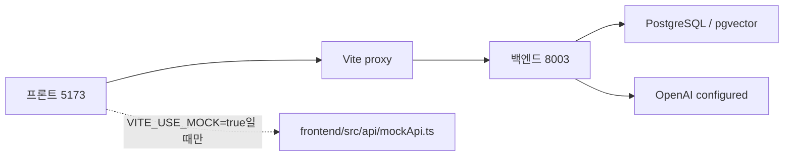

# 프론트-백엔드 연결 현황과 사용 가이드

작성일: 2026-07-14
기준 브랜치: `develop2`
기준 HEAD: `ee0c54d fix(agent-review): harden capture status contracts`

## 개요

현재 프론트는 mock 모드가 아니라 실제 백엔드에 연결되어 있다.

- 프론트: <http://127.0.0.1:5173>
- 백엔드: <http://127.0.0.1:8003>
- 설정: `frontend/.env`의 `VITE_USE_MOCK=false`
- 백엔드 상태 확인 결과: `database=connected`, `openai=configured`, `rag=pgvector`

프론트 API는 `frontend/src/api/backend.ts`에서 `VITE_USE_MOCK` 값에 따라 real client와 mock API를 전환한다. 지금은 `false`이므로 `frontend/src/api/client.ts`의 실제 API 경로를 사용한다.



## 실제 연결된 화면

| 화면 | 실제 백엔드 연결 | 실제로 되는 것 |
|---|---|---|
| 홈 | `/health`, `/api/alerts`, `/api/priority-evaluations/latest` | 시스템 상태, 열린 알림 수, 우선순위 평가 스냅샷 표시 |
| 알림 | `/api/alerts`, `/ack`, `/resolve`, `POST /api/agent-runs` | 알림 조회, 확인/해결, 알림 기반 AI 실행 시작 |
| AI 활동 > 실행 현황 | `/api/agent-runs`, `/api/agent-runs/{id}`, `/review`, `/iterations` | 최근 실행 목록, 선택 실행 상태, v3-01 검토 스냅샷 상태 표시 |
| AI 활동 > AI 보고서 | `/api/agent-runs/{id}/result`, `/artifacts`, `/reports/daily` | 실제 run 결과 기반 보고서 표시, 서버 artifact 생성/열기 |
| AI 활동 > 작업지시서 | `/api/agent-runs/{id}`, `/result`, `/review-tasks/{id}/submit` | 기존 review task 기반 작업지시서 승인 |
| 설정 | `/api/automation-policy` | 임계값 일부를 백엔드 정책 API에 저장 |
| 관리자 | `/health`, `/api/review-tasks` | 시스템 상태와 검토 대기 수 표시 |

## 가짜 또는 로컬 상태인 화면

| 영역 | 현재 상태 |
|---|---|
| 홈 지도 | 실제 좌표 API가 없어서 모형 지도다. 안전 판단용 위치 데이터가 아니다. |
| 홈 위험도 추이 일부 | 차트용 고정 배열이 섞여 있다. |
| 홈 온도/압력/유량 표 일부 | priority snapshot에서 파생한 표시값이며 raw 센서값은 아니다. |
| 설정 알림 채널 | 푸시, 이메일, SMS, 메신저 on/off는 `localStorage`에 저장된다. |
| 설정 화면/업무 기본값 | 대부분 UI 상태만 있고 서버 저장은 아니다. |
| 관리자 사용자/권한/조직 | `mockViewData` 기반 정적 데이터다. |
| 관리자 초대/권한수정/등록 버튼 | 서버 반영 없이 브라우저 `localStorage`에 작업 이력만 기록한다. |
| 상단 검색/날짜/프로필 | 실제 검색, 날짜 필터, 계정 API에 아직 연결되지 않았다. |

## 부분 연결과 주의점

| 항목 | 상태 |
|---|---|
| v3-01 review snapshot | API는 실제 연결됐다. 기존 DB의 과거 실행은 `legacy_unavailable`이 정상이다. |
| v3-02 운영자 검토 append API | 아직 미구현이다. 현재 작업지시서 승인은 기존 `review-tasks` API를 쓴다. |
| 정책 후보/운영 지표 | v3-04, v3-05 범위라 아직 없다. |
| 보고서 PDF | 현재는 서버 artifact/content 경로 중심이다. 실제 PDF 렌더링까지는 아니다. |

## 사용 방법

1. 프론트 접속: <http://127.0.0.1:5173>
2. `알림` 화면으로 이동한다.
3. 실제 알림 행에서 AI 실행을 시작한다.
4. 실행이 생성되면 `AI 활동` 화면으로 이동한다.
5. `실행 현황`에서 최근 실행 목록과 v3-01 검토 캡처 상태를 확인한다.
6. `AI 보고서`에서 실제 run result 기반 보고서를 확인하고 artifact를 생성한다.
7. `작업지시서`에서 기존 review task가 붙은 실행이면 승인한다.

## 다시 띄우는 명령

백엔드:

```powershell
uv run python simulator/versions/v2_postgres_react_ops/backend/server.py
```

프론트:

```powershell
npm --prefix frontend run dev -- --host 127.0.0.1 --port 5173
```

mock 모드로 보고 싶을 때는 `frontend/.env`에서 아래처럼 바꾼 뒤 프론트를 재시작한다.

```env
VITE_USE_MOCK=true
```

실제 백엔드 연결로 되돌릴 때는 다시 아래 값으로 둔다.

```env
VITE_USE_MOCK=false
VITE_BACKEND_URL=http://127.0.0.1:8003
```

## 다음에 볼 것

v3-01은 실행 목록과 검토 스냅샷 조회까지 실제 연결됐다. 다음 단계인 v3-02에서 아래 두 가지를 만들어야 검토 흐름이 v3 방식으로 닫힌다.

1. parent와 diagnostic worker 평가 projection API
2. 운영자 검토·교정 append API

그 다음 v3-03에서 AI 활동 화면의 판단 근거, 검토 이력, 교정 제출 UI를 본격적으로 붙이면 된다.
