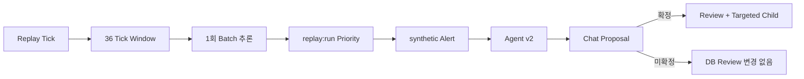

# Agent · Review Chat · Replay 통합 구현 인수인계

## 개요

`00_CODEX_MASTER_EXECUTION.md`의 순서에 따라 Agent v2 관측성, Review Chat 확정 흐름, durable Replay, 운영 안전 경계를 구현했다. 기준 브랜치는 `develop2`이며 `dev2-pg`를 병합하지 않았다.

## 무엇을 했는지

| 작업 | 결과 | 핵심 검증 |
| --- | --- | --- |
| 01 Agent v2 | 명시적 Stage 계약·실행 trace·최종 출력 일치 검증 | Stage 8과 `ops_output` 일치, child report 도구 0회 |
| 02 Review Chat | 제안 생성과 확정 실행을 분리 | 확정 전 `agent_run_reviews` 증가 0건 |
| 03 Replay | ZIP manifest/36 Tick Window/Worker/SSE와 durable 저장소 | 72 Tick에서 추론 2회 |
| 04 안전 경계 | default/replay stream 분리, synthetic Alert, feature flag, runbook | Replay stream 31 synthetic Alert, default stream 불변 |

## 왜 이렇게 했는지

Replay 결과가 운영 기본 평가나 Alert를 바꾸면 재현 실험이 실제 운영 판단을 오염시킬 수 있다. 따라서 Replay 원시 Tick은 전용 테이블에 기록하고, Window·Priority·Alert 투영 데이터에는 replay stream과 synthetic 표식을 유지했다. Chat은 operator가 명시적으로 확정할 때만 review와 후속 rerun을 생성한다.

## 변경 내용

- `009_agent_stage_trace.sql`: Stage/모델·도구 trace와 v2 결과 계약.
- `010_review_chat.sql`: thread/message/proposal/event 및 CAS·idempotency 계약.
- `011_demo_replay.sql`, `012_priority_stream_scope.sql`: Replay durable 상태와 `stream_key` 분리. 적용된 migration은 수정하지 않고 012로 roll-forward했다.
- `replay_repository.py`: 합성 Window·feature·priority·card·evaluation·Alert를 단일 replay stream에 기록한다.
- `REPLAY_RUNBOOK.md`: feature flag, worker lease, SSE 재연결, 복구와 롤백 경계를 정리했다.

## 검증

- `heatgrid-db-migrate verify` 성공.
- 집중 회귀: 31 passed. 포함 조건: child report tool 0회/model 1회 이하, Proposal 확정 전 review 변경 없음, 72 Tick 추론 2회, Replay 31 synthetic Alert, default priority stream 유지.
- `ruff` 및 대상 backend `basedpyright`: 0 오류.
- frontend `typecheck`, `lint`, `build`: 성공.

## 한계와 주의점

- `demo_replay.zip`의 manifest·안전성은 확인했지만 1.5 GiB 전체 파일을 실제 장시간 Worker로 끝까지 재생하지는 않았다.
- Replay API와 import는 기본적으로 꺼져 있다. 운영 사용 전 `HEATGRID_REPLAY_ENABLED=true`를 명시하고 runbook의 저장 공간·SHA 점검을 수행해야 한다.
- Python 정적 분석은 runtime `sys.path`를 사용하는 PostgreSQL 테스트 모듈의 동적 import를 해석하지 못한다. 해당 두 테스트는 실제 PostgreSQL 실행으로 검증했다.

## 다음에 볼 것

- 격리된 장기 환경에서 전체 demo ZIP 1회 재생과 Worker 재시작/lease failover를 수행한다.
- 선택된 Replay run과 Chat 화면을 실제 브라우저 세션에서 시각적으로 재검증한다.
