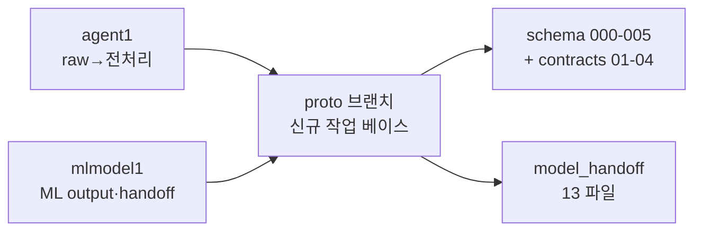

# S0. 자산 이전 — `43e2772`

> 2026-06-25 23:45 커밋 · `main` 기준 `proto` 분기 후, 출처 위계대로 두 브랜치 자산을 가져온 단계.

## 정성 (무엇 / 왜 / 특성)
- **무엇**: `proto`를 `main`에서 분기하고, `agent1`(raw→전처리)과 `mlmodel1`(FE→ML output·학습모델)의 자산을 가져왔다.
- **왜**: 단계마다 "진실의 출처"를 분리해 충돌을 막기 위함. 우리가 만들지 않은 전처리 계약/코드는 **원형 그대로** 이전(변경 금지)하고, 학습된 모델은 실학습 전환 대비로 함께 둔다.
- **특성**: 데모는 목 데이터로 돌기 때문에 핸드오프 모델(IF/risk/leadtime)은 당장 로드하지 않는다. 출처 위계는 이후 모든 단계의 전제다.

## 정량
| 이전 자산 | 출처 | 수량 |
|---|---|---|
| schema DDL `000~005` | agent1 | 6 |
| schema JSON | agent1 | 5 |
| docs/contracts `01~04` | agent1 | 4 |
| `agent/preprocessing/` + fixtures + tests | agent1 | 코드+테스트 |
| `model_handoff/` (IF·scaler·risk·leadtime·priority·docs) | mlmodel1 | 13 파일 |

## 출처 위계
| 구간 | 소유 | proto 처리 |
|---|---|---|
| raw → 전처리 → 전처리데이터 | `agent1` | 그대로 이전, 변경 금지 |
| FE → ML output | `mlmodel1` | 노트북·핸드오프·rule 엔진 따름 |
| AI priority model 이후 | 이번 작업 | 006부터 신규 구현 |
