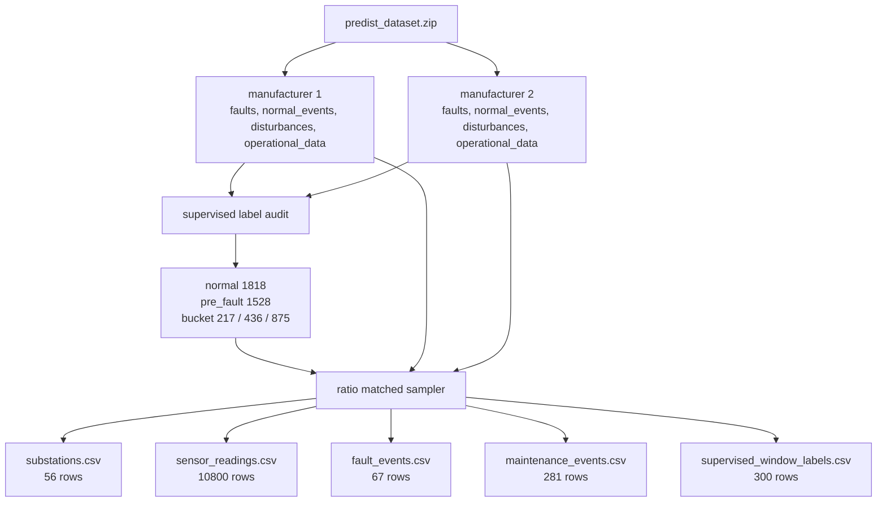

# 01. Raw 데이터와 라벨 감사

## 목적

Raw 단계는 PreDist ZIP에서 운영자가 신뢰할 수 있는 supervised 후보 비율을 확인하고, 같은 비율을 따르는 재현용 fixture raw CSV를 만드는 단계다. 이후 전처리와 모델 체인은 이 fixture를 기준으로 반복 검증된다.

## 입력과 출력

| 구분 | 경로 또는 기준 | 설명 |
|---|---|---|
| 원천 ZIP | `C:\Users\Admin\Downloads\predist_dataset.zip` | full PreDist 원천 |
| 감사 기준 | 6시간 window, `efd_possible=True`, 7일 lead horizon | supervised normal/pre_fault 후보 산출 |
| fixture raw | `agent/fixtures/preprocessing/predist_sample/raw` | 원천 ZIP 없이 전처리 재현 가능한 4개 CSV |
| 라벨 파일 | `agent/fixtures/preprocessing/predist_sample/output/supervised_window_labels.csv` | fixture supervised label 300행 |

## 구현 위치

| 역할 | 파일 |
|---|---|
| full ZIP 라벨 감사 | `agent/preprocessing/audit_predist_labels.py` |
| ratio matched fixture 생성 | `agent/preprocessing/sample_predist_zip.py` |
| fixture 설명 | `agent/fixtures/preprocessing/predist_sample/README.md` |

## 정량 수치

| 항목 | 값 |
|---|---:|
| full PreDist normal windows | 1818 |
| full PreDist pre_fault windows | 1528 |
| full PreDist total supervised windows | 3346 |
| full normal ratio | 54.3% |
| full pre_fault ratio | 45.7% |
| full pre_fault 0-24h | 217 |
| full pre_fault 1-3d | 436 |
| full pre_fault 3-7d | 875 |
| fixture substations | 56 |
| fixture sensor_readings | 10800 |
| fixture fault_events | 67 |
| fixture maintenance_events | 281 |
| fixture labels | 300 |

## 정성 해석

이 단계에서 가장 중요한 판단은 full PreDist의 supervised 후보 비율을 그대로 따르는 것이다. 운영 데이터 전체 행 수가 아니라 학습과 검증에 실제로 쓰일 수 있는 window 기준으로 normal과 pre_fault를 세기 때문에, 이후 모델 검증 수치도 이 기준 위에서 해석해야 한다.

## 다이어그램

## 수정 가이드

Raw 비율 기준을 바꾸려면 먼저 `audit_predist_label_distribution`의 window 크기, fault 필터, horizon 기준을 바꾼다. 이후 `build_ratio_matched_predist_sample`로 fixture를 다시 만들고, README와 label 분포를 다시 계산해야 한다.

Raw 파일 컬럼을 바꾸면 전처리 계약도 같이 바뀐다. 이때는 `agent/preprocessing/contracts.py`와 `build_windows.py`를 같이 확인해야 한다.

## 한계

- supervised 비율은 전체 raw row 비율이 아니라 label 후보 window 비율이다.
- fixture는 full ZIP 전체를 복제하지 않고 300개 supervised window를 재현 가능하게 샘플링한 것이다.
- `configuration_types.csv`가 없어 fixture에서는 `configuration_type="missing"` fallback을 사용한다.
