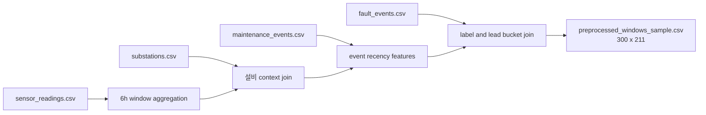

# 02. 전처리와 6시간 Window 계약

## 목적

전처리 단계는 raw 4개 CSV를 운영 모델이 사용할 수 있는 6시간 단위 feature row로 변환한다. 이 단계의 출력은 중간 예측 모델 체인의 유일한 입력이다.

## 입력과 출력

| 구분 | 경로 | 설명 |
|---|---|---|
| raw substations | `agent/fixtures/preprocessing/predist_sample/raw/substations.csv` | 설비 기본 정보 |
| raw sensor_readings | `agent/fixtures/preprocessing/predist_sample/raw/sensor_readings.csv` | 시계열 센서 원천 |
| raw fault_events | `agent/fixtures/preprocessing/predist_sample/raw/fault_events.csv` | 고장 이벤트 |
| raw maintenance_events | `agent/fixtures/preprocessing/predist_sample/raw/maintenance_events.csv` | 정비/이상 이벤트 |
| labels | `output/supervised_window_labels.csv` | supervised label |
| output | `output/preprocessed_windows_sample.csv` | 6시간 window feature |

## 구현 위치

| 역할 | 파일 |
|---|---|
| window 생성 | `agent/preprocessing/build_windows.py` |
| 계약 상수 | `agent/preprocessing/contracts.py` |
| 전처리 검증 | `agent/preprocessing/validate.py` |
| fixture 테스트 | `tests/test_preprocessing_build_windows.py`, `tests/test_preprocessing_predist_zip_sample.py` |

## 정량 수치

| 항목 | 값 |
|---|---:|
| supervised labels | 300 rows |
| label normal | 163 |
| label pre_fault | 137 |
| pre_fault 0-24h | 19 |
| pre_fault 1-3d | 39 |
| pre_fault 3-7d | 79 |
| preprocessed output | 300 rows x 211 columns |
| preprocessing version | `preprocessed_data_v1` |
| window size | 6 hours |

## 정성 해석

전처리는 원천 센서 로그를 모델 입력 계약으로 고정하는 경계다. 이 단계가 안정적이면 downstream 모델은 raw 파일 형식 변화보다 window feature 계약만 보고 개발할 수 있다. 반대로 이 단계의 컬럼 의미가 흔들리면 모델 체인과 priority 결과가 동시에 흔들린다.

## 다이어그램

## 수정 가이드

새 센서 feature를 추가하려면 `build_windows.py`에서 집계 로직을 추가하고, 그 feature가 downstream 모델에 필요한지 `agent/model_chain/feature_adapter.py`에서 매핑을 확인한다. 전처리 출력 컬럼 수가 바뀌면 이 보고서와 테스트 기대값도 함께 갱신해야 한다.

라벨 기준을 바꾸는 수정은 전처리만의 변경이 아니다. `supervised_window_labels.csv`, model chain output, priority output까지 모두 다시 생성해야 한다.

## 한계

- 전처리 계약은 현재 fixture 중심으로 검증된다.
- 일부 설비 context는 원천 부족으로 missing fallback을 사용한다.
- 전처리 출력 211컬럼과 handoff 모델 feature 수는 완전히 같지 않아서 다음 단계에서 adapter가 필요하다.
