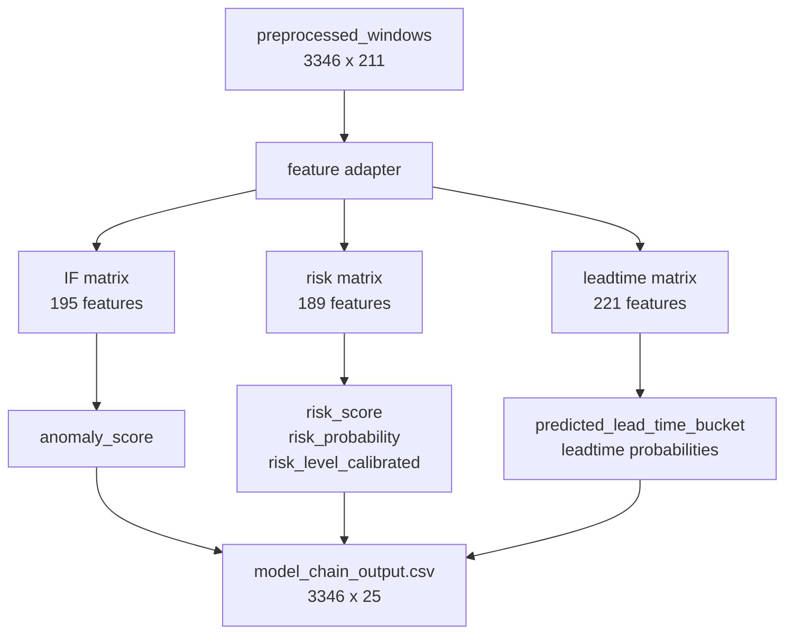

# 03. ML 예측모델 체인

## 목적

ML 예측모델 단계는 전처리 결과를 바로 priority로 보내지 않고, 중간 예측 체인인 Isolation Forest, LGBM risk, LGBM leadtime을 거쳐 운영 판단 신호를 만든다.

## 입력과 출력

| 구분 | 경로 | 설명 |
|---|---|---|
| 입력 | `data/processed/predist_full_supervised/preprocessed_windows.csv` | 3346행 x 211컬럼 |
| feature report | `data/processed/ml_model_chain/feature_adapter_report.json` | 모델별 feature 매핑과 0-fill 기록 |
| 출력 | `data/processed/ml_model_chain/model_chain_output.csv` | risk, leadtime, anomaly 신호 3346행 |

## 구현 위치

| 역할 | 파일 |
|---|---|
| 체인 실행 | `agent/model_chain/run_model_chain.py` |
| feature 정렬/보정 | `agent/model_chain/feature_adapter.py` |
| 모델 산출물 경로 | `agent/io/paths.py` |
| E2E 검증 | `tests/test_model_chain_e2e.py` |

## 정량 수치

| 항목 | 값 |
|---|---:|
| input rows | 3346 |
| output rows | 3346 |
| output columns | 25 |
| Isolation Forest requested features | 195 |
| IF exact or alias matches | 142 |
| IF derived one-hot matches | 40 |
| IF zero-filled features | 13 |
| LGBM risk requested features | 189 |
| risk exact or alias matches | 134 |
| risk derived one-hot matches | 40 |
| risk zero-filled features | 15 |
| LGBM leadtime requested features | 221 |
| leadtime exact or alias matches | 160 |
| leadtime derived one-hot matches | 40 |
| leadtime zero-filled features | 21 |

| 예측 분포 | 값 |
|---|---:|
| risk critical | 471 |
| risk high | 1293 |
| risk medium | 371 |
| risk low | 1211 |
| predicted leadtime 0-24h | 1165 |
| predicted leadtime 1-3d | 2075 |
| predicted leadtime 3-7d | 106 |

## 정성 해석

이 단계는 시스템이 단순 점수 계산기가 아니라 고장 가능성, 이상 정도, 남은 시간 예측을 분리해서 만든다는 점을 보여준다. 운영자는 priority 점수 하나를 보지만, 수정자는 어떤 중간 신호가 점수에 영향을 줬는지 이 파일에서 추적할 수 있어야 한다.

## 다이어그램

## 수정 가이드

모델 파일이나 feature list를 바꾸면 반드시 `feature_adapter_report.json`을 다시 생성하고 zero-filled feature 목록을 확인한다. zero-fill 수가 늘어나면 모델이 실제 신호를 덜 쓰는 방향으로 퇴화할 수 있으므로, 단순히 테스트 통과만 보면 안 된다.

새 중간 모델을 추가하려면 `model_chain_output.csv`에 컬럼을 추가하고, priority 입력 7개 신호 정의도 같이 검토한다.

## 한계

- handoff package에 학습 당시 imputation table과 category map이 완전하게 포함되어 있지 않아 일부 feature는 결정적 0.0으로 보정한다.
- feature adapter는 누락 feature를 숨기지 않고 보고서 JSON에 남긴다.
- 이 단계 출력은 priority와 server가 병합해서 사용하므로 컬럼명 변경은 downstream 영향이 크다.
