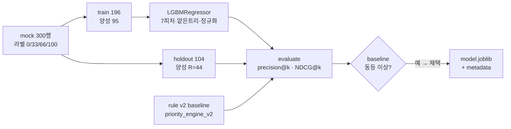

# B. Priority 모델 — LGBM 회귀 — `3e5092d`

> 2026-06-25 23:54 커밋 · 7피처로 0~100 우선순위를 예측하는 LightGBM 회귀를 학습/평가/추론하고, 운영 rule 엔진과 비교한 단계.

## 정성 (무엇 / 왜 / 특성)
- **무엇**: 목 데이터를 라벨(0/33/66/100)과 7피처로 구성하고, 과적합을 막는 얕은 트리 + 강한 정규화 + early stopping의 **LightGBM 회귀**를 학습한다.
- **왜**: 평가는 단순 정확도가 아니라 **랭킹 품질**(상위 K개에 진짜 고장전조가 얼마나 들어오나)로 본다. 운영 triage가 "무엇을 먼저 볼까"이기 때문. 동일 holdout에서 기존 rule 엔진(`priority_engine_v2_rule_based_tuned`)과 비교해 **동등 이상일 때만 채택**한다.
- **특성**: holdout은 substation 기반으로 분리(일반화 평가 근사). 산출물은 `joblib` 모델 + `metadata.json`(피처순서·버전·지표).

## 정량
| 데이터 | 값 |
|---|---|
| 분할 | train 196 / holdout 104 |
| 양성 수 | train 95 / holdout 44 (정답 R=44) |
| best_iteration | 500 |

| 지표 (holdout, R=44) | priority_v3 (LGBM) | rule v2 |
|---|---|---|
| precision@10 | **1.00** | 1.00 |
| precision@20 | **1.00** | 1.00 |
| precision@44 | **1.00** | 1.00 |
| recall@10 / @20 / @44 | 0.227 / 0.455 / **1.00** | 0.227 / 0.455 / 1.00 |
| NDCG@10/20/44 | **1.00** | 1.00 |
| 판정 | **채택** (wins 0 / ties 9 / losses 0 → 동등 이상) | — |

> 1.00은 목 데이터가 잘 분리돼 둘 다 완벽 랭킹을 내기 때문(동률). 의의는 점수가 아니라 "rule을 회귀로 대체 가능한지 검증하는 프레임"에 있다. 실데이터에선 1.00 미만이 정상이며 그때 우위가 진짜 근거가 된다.
