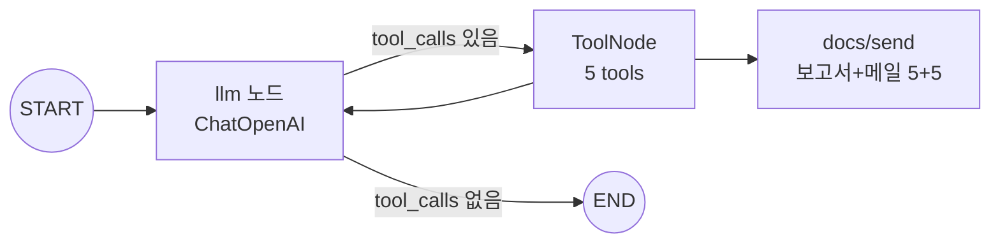

# C. LLM/Tool 에이전트 — langgraph — `fad501b`

> 2026-06-25 23:57 커밋 · priority 상위 N건을 자동으로 받아 운영자 검토용 보고서/메일 초안을 만드는 단계.

## 정성 (무엇 / 왜 / 특성)
- **무엇**: langgraph 표준 패턴(`START→llm→tools→llm→END`)으로, 파일 기반 도구 5종을 호출해 근거를 모으고 보고서/메일 초안을 저장한다.
- **왜**: 운영자가 "바로 검토·전달"할 수 있는 초안이 필요하지만, 안전이 우선이다. 프롬프트로 **고장 단정 금지**("위험 가능성/점검 필요"), 근거·원인후보·점검항목·한계 포함, **자동 발송 없음**을 강제한다.
- **특성**: `OPENAI_API_KEY`가 있으면 ChatOpenAI로 구동, 없으면 동일 도구를 결정적 순서로 호출하는 오프라인 경로로 한 사이클을 보장한다.

## 정량
| 항목 | 값 |
|---|---|
| 도구 수 | 5 (조회 3: top_priority·substation_context·sensor_evidence / 작성 2: work_order·email) |
| 트리거 | priority_scores 상위 N (기본 5) |
| 산출물 | 보고서 5 + 메일 5 = 10 md (`docs/send/`) |
| 운영 원칙 | 고장 단정 금지 · 운영자 검토 전제 · 자동 발송 없음 |

## 보고서 초안 구성
대상/윈도우/우선순위 → 근거(센서·점수) → 원인 후보(확정 아님) → 권고 점검 항목 → 설비 컨텍스트 → 한계.
