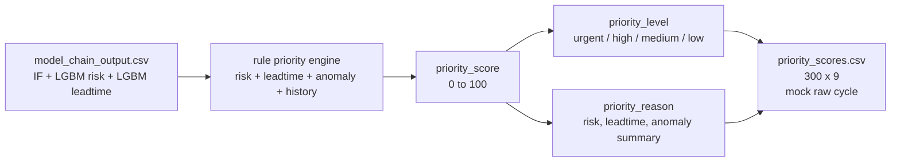

# 04. 규칙 기반 우선순위 엔진

## 목적

우선순위 단계는 중간 모델 체인의 anomaly, risk, leadtime 신호를 운영자가 볼 수 있는 점수와 등급으로 바꾼다. IF + LGBM risk + LGBM leadtime 체인은 그대로 유지하고, 이 단계만 LGBM 회귀에서 규칙 기반 엔진으로 교체했다.

## 입력과 출력

| 구분 | 경로 | 설명 |
|---|---|---|
| 입력 | `data/processed/ml_model_chain/model_chain_output.csv` | 중간 모델 출력 |
| 엔진 | `agent/priority/rule_baseline.py` | `priority_engine_v2_rule_based_tuned` 규칙 |
| legacy 모델 | `agent/priority/models/lightgbm_priority_model.joblib` | 보존만 하며 runtime 미사용 |
| 출력 | `data/processed/ml_priority/priority_scores.csv` | 운영 우선순위 점수 |

## 구현 위치

| 역할 | 파일 |
|---|---|
| priority 실행 | `agent/priority/run_priority.py` |
| 규칙 엔진 | `agent/priority/rule_baseline.py` |
| 계약/등급 기준 | `agent/priority/contracts.py` |
| legacy LGBM 학습 기록 | `agent/priority/train_priority_model.py`, `agent/priority/evaluate.py` |

## 정량 수치

| 항목 | 값 |
|---|---:|
| current priority output rows | 300 |
| priority output columns | 9 |
| score min | 8.76 |
| score max | 78.31 |
| score mean | 39.74 |
| urgent | 28 |
| high | 89 |
| medium | 50 |
| low | 133 |
| model_version | `priority_engine_v2_rule_based_tuned` |
| runtime input | `data/processed/ml_model_chain/model_chain_output.csv` |
| priority 방식 | 규칙 기반 점수화 |

| Top 5 | 대상 | 점수 | 사유 |
|---:|---|---:|---|
| 1 | manufacturer 1 / substation 21 / 2019-01-21 00:00 | 78.31 | risk=critical, leadtime=0-24h, anomaly=0.47 |
| 2 | manufacturer 1 / substation 6 / 2020-06-04 06:00 | 77.20 | risk=critical, leadtime=0-24h, anomaly=0.45 |
| 3 | manufacturer 1 / substation 24 / 2016-10-24 00:00 | 75.92 | risk=critical, leadtime=0-24h, anomaly=0.39 |
| 4 | manufacturer 1 / substation 6 / 2019-04-15 06:00 | 75.04 | risk=critical, leadtime=0-24h, anomaly=0.41 |
| 5 | manufacturer 1 / substation 6 / 2020-06-08 18:00 | 74.27 | risk=critical, leadtime=0-24h, anomaly=0.59 |

## 정성 해석

priority는 모델 체인의 여러 신호를 운영자가 행동할 수 있는 단일 큐로 압축한다. 이번 수정에서 IF + LGBM risk + LGBM leadtime은 고정했고, `model_chain_output.csv -> priority_scores.csv` 변환만 규칙 기반으로 바꿨다.

규칙 엔진은 risk 등급, risk probability, leadtime bucket, leadtime confidence, anomaly score, 최근 작업/이벤트 이력을 합산한다. 최근 작업이나 최근 이벤트가 있으면 중복 출동 가능성을 낮추기 위해 감점하고, 장기간 fault가 없던 high/critical 대상은 소폭 가점한다.

## 다이어그램

## 수정 가이드

우선순위 정책을 바꾸려면 먼저 `rule_baseline.py`의 가중치와 threshold를 확인한다. 규칙을 바꾸면 `contracts.py`의 `MODEL_VERSION`을 올리고, 보고서의 score 분포와 Top 5를 다시 계산해야 한다.

대시보드는 `priority_scores.csv`를 점수순으로 읽기 때문에 점수 범위나 등급명이 바뀌면 프론트 표시 규칙도 같이 확인한다.

## 한계

- priority는 현재 규칙 기반이므로 학습 성능 지표가 아니라 운영 정책 타당성, 분포, 현장 검토 피드백으로 조정해야 한다.
- 현재 검증은 fixture/파일 기반이다.
- `priority_scores.csv`는 목록용 핵심 컬럼만 갖고 있고, 상세 화면의 risk/leadtime/anomaly 근거는 서버에서 `model_chain_output.csv`와 병합한다.
