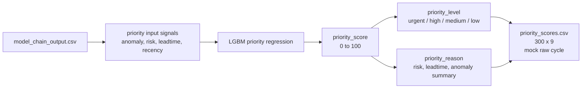

# 04. 우선순위 회귀

## 목적

우선순위 단계는 중간 모델 체인의 anomaly, risk, leadtime 신호를 운영자가 볼 수 있는 점수와 등급으로 바꾼다. 이 출력이 서버 목록과 대시보드 큐의 기준이다.

## 입력과 출력

| 구분 | 경로 | 설명 |
|---|---|---|
| 입력 | `data/processed/ml_model_chain/model_chain_output.csv` | 중간 모델 출력 |
| 모델 | `agent/priority/models/lightgbm_priority_model.joblib` | LGBM 회귀 모델 |
| metadata | `agent/priority/models/priority_model_metadata.json` | 모델 버전과 feature 정의 |
| 출력 | `data/processed/ml_priority/priority_scores.csv` | 운영 우선순위 점수 |

## 구현 위치

| 역할 | 파일 |
|---|---|
| priority 실행 | `agent/priority/run_priority.py` |
| 학습 데이터 구성 | `agent/priority/build_dataset.py` |
| 계약/등급 기준 | `agent/priority/contracts.py` |
| baseline 비교 | `agent/priority/rule_baseline.py` |

## 정량 수치

| 항목 | 값 |
|---|---:|
| current priority output rows | 300 |
| priority output columns | 9 |
| score min | 0.00 |
| score max | 83.38 |
| score mean | 21.34 |
| urgent | 1 |
| high | 31 |
| medium | 112 |
| low | 156 |
| model_version | `priority_v3_lgbm_reg` |
| training_basis | `data/processed/ml_model_chain/model_chain_output.csv` |
| holdout verdict | baseline 동등 이상, 모델 채택 |
| 기존 300행 모델 binary F1 | 0.4615 |
| full 학습 모델 mock raw holdout binary F1 | 0.8511 |
| full 학습 모델 full holdout binary F1 | 0.7956 |
| full 학습 모델 full holdout macro F1 | 0.3750 |
| full 학습 모델 full holdout weighted F1 | 0.4857 |

| Top 5 | 대상 | 점수 | 사유 |
|---:|---|---:|---|
| 1 | manufacturer 1 / substation 21 / 2019-01-21 00:00 | 83.38 | risk=critical, leadtime=0-24h, anomaly=0.47 |
| 2 | manufacturer 1 / substation 21 / 2019-01-20 18:00 | 78.95 | risk=critical, leadtime=0-24h, anomaly=0.43 |
| 3 | manufacturer 1 / substation 21 / 2019-01-16 12:00 | 73.18 | risk=critical, leadtime=0-24h, anomaly=0.41 |
| 4 | manufacturer 2 / substation 10 / 2016-12-01 18:00 | 70.32 | risk=critical, leadtime=0-24h, anomaly=1.00 |
| 5 | manufacturer 1 / substation 8 / 2018-04-24 12:00 | 69.09 | risk=high, leadtime=0-24h, anomaly=0.25 |

## 정성 해석

priority는 모델 체인의 여러 신호를 운영자가 행동할 수 있는 단일 큐로 압축한다. 모델 학습은 full PreDist 3346 supervised window로 수행했고, 현재 serving 산출물은 이 모델을 mock raw fixture 300행 1사이클에 적용한 결과다.

F1 관점에서는 기존 300행 학습 모델보다 full 학습 모델이 확실히 개선됐다. mock raw holdout 기준 binary F1은 `0.4615 -> 0.8511`로 상승했고, 4단계 priority 등급의 weighted F1은 `0.1482 -> 0.5424`로 상승했다. full PreDist holdout에서는 rule baseline이 recall 중심 binary F1에서 약간 높지만, 모델은 precision, accuracy, macro F1, weighted F1과 ranking 지표에서 더 나은 운영 큐 품질을 보인다. 상세 비교는 [10_proto_completion.md](10_proto_completion.md)에 둔다.

## 다이어그램

## 수정 가이드

우선순위 정책을 바꾸려면 먼저 `contracts.py`의 등급 기준과 `run_priority.py`의 입력 feature 구성을 확인한다. 점수 산출 모델을 재학습하면 metadata의 `model_version`을 올리고, 보고서의 score 분포와 Top 5를 다시 계산해야 한다.

대시보드는 `priority_scores.csv`를 점수순으로 읽기 때문에 점수 범위나 등급명이 바뀌면 프론트 표시 규칙도 같이 확인한다.

## 한계

- priority 모델은 full PreDist chain output 기준으로는 baseline 이상이지만, 아직 fixture/파일 기반 검증이다.
- `priority_score=100` top row가 여러 개 있으므로 운영 UI에서는 동점 처리나 보조 정렬 기준을 검토할 수 있다.
- `priority_scores.csv`는 목록용 핵심 컬럼만 갖고 있고, 상세 화면의 risk/leadtime/anomaly 근거는 서버에서 `model_chain_output.csv`와 병합한다.
