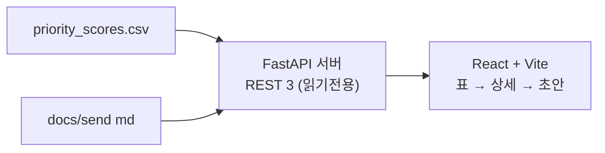
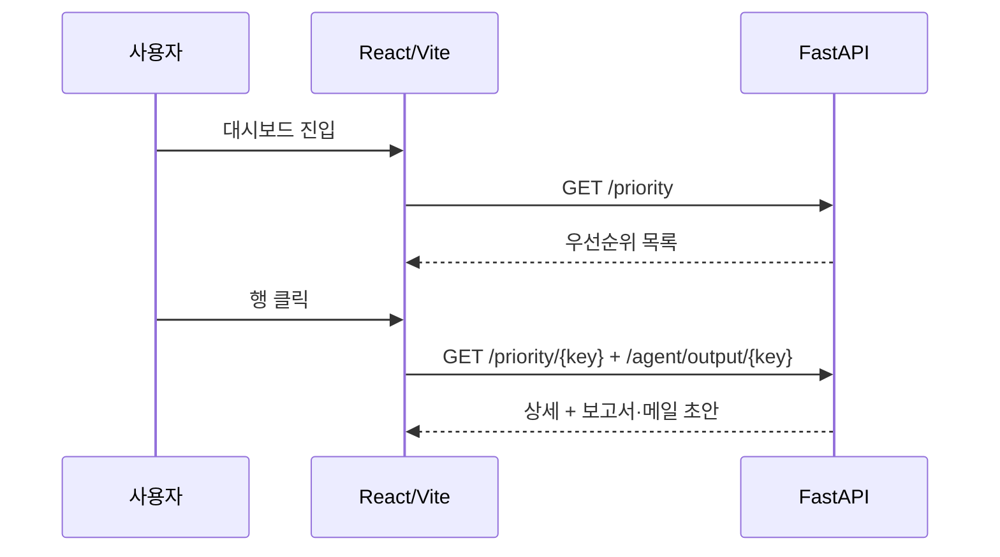

# D. 서버 / 프론트 — `2fe5d81`

> 2026-06-26 00:00 커밋 · 산출물을 읽기 전용 REST로 제공하고, 대시보드로 시각화한 단계.

## 정성 (무엇 / 왜 / 특성)
- **무엇**: FastAPI가 `priority_scores.csv`와 `docs/send/*.md`를 읽어 3개 엔드포인트로 제공하고, React+Vite가 우선순위 표 → 상세(근거 센서) → 보고서/메일 초안 검토의 3단 흐름을 그린다.
- **왜**: 운영자는 화면에서 "어디를 먼저 볼지"와 "근거/초안"을 한 번에 확인해야 한다.
- **특성**: **발송 엔드포인트는 없다**(운영 원칙). 전부 파일 읽기라 실데이터 전환 시 경로만 바뀐다.

## 정량
| 항목 | 값 |
|---|---|
| 엔드포인트 | 3 (`/priority`, `/priority/{key}`, `/agent/output/{key}`) + health |
| 응답 | 우선순위 목록 / 단건 상세(+ML 근거) / 보고서·메일 md |
| 프론트 렌더 | 우선순위 표 50행 (검증 시) |
| 발송 기능 | 없음 |
