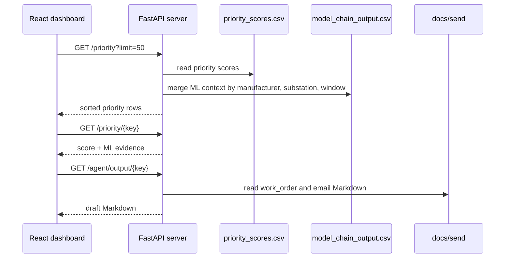

# 05. 서버 API

## 목적

서버는 파일 기반 산출물을 운영 대시보드가 읽을 수 있는 REST API로 제공한다. 이 서버는 발송 기능을 갖지 않고, priority 목록과 상세 근거, 작업지시/메일 초안 원문을 읽기 전용으로 반환한다.

## 입력과 출력

| 구분 | 경로 또는 엔드포인트 | 설명 |
|---|---|---|
| priority 입력 | `data/processed/ml_priority/priority_scores.csv` | 목록과 점수 기준 |
| ML context 입력 | `data/processed/ml_model_chain/model_chain_output.csv` | 상세 근거 병합 |
| draft 입력 | `docs/send/*.md` | 작업지시/메일 Markdown |
| API | `/priority` | 점수순 목록 |
| API | `/priority/{key}` | 단건 상세 |
| API | `/agent/output/{key}` | 초안 원문 |
| API | `/` | health 응답 |

## 구현 위치

| 역할 | 파일 |
|---|---|
| FastAPI app | `server/main.py` |
| 경로와 key 생성 | `agent/io/paths.py` |
| 프론트 proxy | `frontend/vite.config.js` |

## 정량 수치

| 항목 | 값 |
|---|---:|
| API 엔드포인트 | 4 |
| `/priority` 기본 limit | 50 |
| priority source columns | 9 |
| ML context 병합 후보 columns | 12 |
| docs/send Markdown files | 40 |
| work_order files | 20 |
| email files | 20 |

## 정성 해석

서버는 아직 운영용 저장소가 아니라 파일 산출물을 UI에 연결하는 얇은 조회 계층이다. 이 구조는 프로토타입 검증에는 단순하고 디버깅이 쉽지만, 운영 전환 시에는 DB와 권한, 캐시, 감사 로그를 붙여야 한다.

## 다이어그램

## 수정 가이드

상세 화면에 근거 컬럼을 추가하려면 `server/main.py`의 `CTX_COLS`에 컬럼을 추가하고, 그 컬럼이 `model_chain_output.csv`에 실제 존재하는지 확인한다. key 규칙을 바꾸면 `paths.make_key`, `docs/send` 파일명, 프론트 fetch 경로가 모두 영향을 받는다.

새 API를 추가하기 전에는 기존 `/priority`, `/priority/{key}`, `/agent/output/{key}`로 해결 가능한지 먼저 확인한다. 현재 대시보드 요구에는 이 3개 조회 API와 health면 충분하다.

## 한계

- 서버는 CSV를 요청마다 읽는 단순 구조다. 운영 규모가 커지면 캐시나 DB 전환이 필요하다.
- 자동 발송 기능은 없다. 초안은 검토용 Markdown으로만 제공된다.
- CORS는 개발 편의를 위해 넓게 열려 있다.
