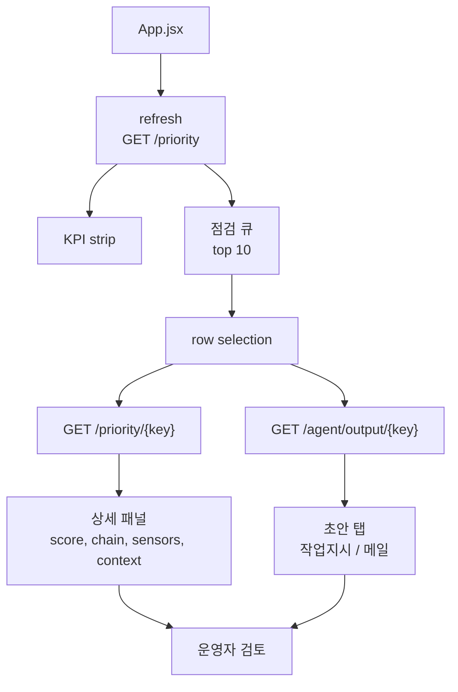

# 06. 프론트엔드 운영 대시보드

## 목적

프론트엔드는 운영자가 우선 점검 대상을 빠르게 보고, 상세 모델 근거와 작업지시/메일 초안을 한 화면에서 검토하도록 만든 대시보드다. 마케팅 화면이 아니라 반복 운영용 화면이므로 밀도, 스캔성, 한 화면 적합성을 우선한다.

## 입력과 출력

| 구분 | 경로 또는 API | 설명 |
|---|---|---|
| 목록 API | `/priority?limit=50` | 우선순위 row |
| 상세 API | `/priority/{key}` | 모델 근거 포함 단건 |
| 초안 API | `/agent/output/{key}` | 작업지시/메일 Markdown |
| UI entry | `frontend/src/App.jsx` | dashboard state와 rendering |
| style | `frontend/src/App.css` | 운영자용 레이아웃과 노트북 화면 압축 |

## 화면 구성

| 영역 | 내용 | 수치 |
|---|---|---:|
| Header | 시스템명, 모델 체인 기준, 새로고침 | 1 |
| KPI strip | 점검 후보, 긴급/높음, 평균 점수, 0-24h | 4 |
| 점검 큐 | priority 상위 row | 10 rows 표시 |
| 상세 score | priority, risk probability, anomaly, lead confidence | 4 |
| 모델 체인 근거 | IF, risk, leadtime, priority | 4 steps |
| 설비 context | 구성, DHW, buffer, 고장/정비 recency | 5 chips |
| 초안 | 작업지시/메일 탭 | 2 tabs |

## 정량 수치

| 항목 | 값 |
|---|---:|
| 대시보드 표시 큐 | 상위 10 / API 50 |
| KPI card | 4 |
| 상세 metric | 4 |
| 초안 tab | 2 |
| 검증 뷰포트 | 944 x 912 |
| page scroll | 없음 |
| queue scroll | 없음 |
| detail scroll | 없음 |
| draft scroll | 없음 |

## 정성 해석

프론트엔드는 분석 리포트 화면이 아니라 운영자 작업 화면이다. 그래서 많은 설명보다 한 화면에서 점검 후보, 근거, 초안을 동시에 보는 것이 중요하다. 작업지시와 메일은 탭으로 분리해 화면 밀도를 유지했다.

## 다이어그램

## 수정 가이드

표시 데이터 구조를 바꾸려면 먼저 서버 응답 필드를 확인한 뒤 `App.jsx`의 row rendering, detail metric, draft preview helper를 수정한다. 화면 밀도를 바꾸는 작업은 `App.css`의 `dashboard-shell`, `workspace`, `detail-panel`, `queue-table-wrap` 높이 계산과 함께 검증해야 한다.

노트북 화면 적합성은 중요한 요구사항이다. 대시보드에 새 카드를 추가하면 944 x 912 수준의 뷰포트에서 page/detail/queue/draft overflow를 다시 확인해야 한다.

## 한계

- 현재 UI는 local dev dashboard다. 인증, 권한, 감사 로그는 없다.
- 초안은 전체 원문이 아니라 운영 검토용 핵심 미리보기로 표시한다.
- 더 많은 row 탐색이 필요하면 별도 pagination이나 필터 UI가 필요하다.
