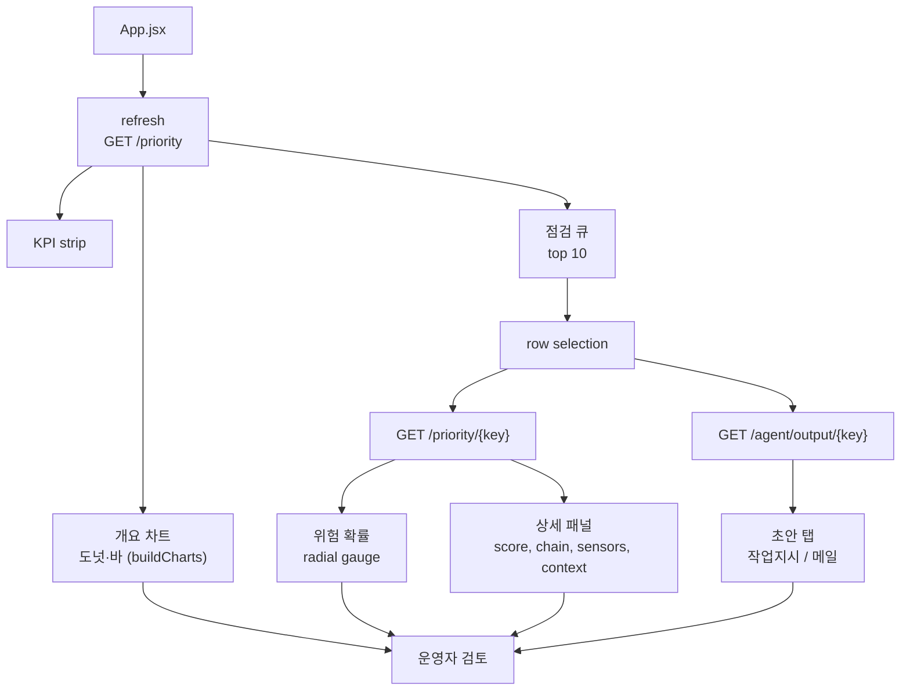

# 06. 프론트엔드 운영 대시보드

## 목적

프론트엔드는 운영자가 우선 점검 대상을 빠르게 보고, 상세 모델 근거와 작업지시/메일 초안을 함께 검토하도록 만든 대시보드다. 마케팅 화면이 아니라 반복 운영용 화면이므로 밀도, 스캔성, 가독성을 우선한다.

> 변경 이력(2026-06-26): 직전의 "노트북 화면 압축" 방식(전체 `100vh` + `overflow:hidden` 강제)은 노트북 세로 해상도에서 설비 컨텍스트·초안·테이블을 잘라내 접근 불가 상태를 만들었다. 이를 **자연 스크롤 + 디자인 토큰 기반 모던 리디자인**으로 교체했다. 이어 표/숫자 위주라 "한눈에 안 들어온다"는 피드백에 따라 **Recharts 기반 개요 차트 레이어(도넛·바·게이지)**를 상단에 추가했다. 자세한 why는 아래 "정성 해석"과 "변경 근거" 참고.

## 입력과 출력

| 구분 | 경로 또는 API | 설명 |
|---|---|---|
| 목록 API | `/priority?limit=50` | 우선순위 row (차트 분포의 소스) |
| 상세 API | `/priority/{key}` | 모델 근거 포함 단건 |
| 초안 API | `/agent/output/{key}` | 작업지시/메일 Markdown |
| UI entry | `frontend/src/App.jsx` | dashboard state, 차트, rendering |
| style | `frontend/src/App.css` | 디자인 토큰 + 자연 스크롤 + 차트 카드 |
| 차트 lib | `recharts` | 도넛/바/게이지 (의존성 1개 추가) |

## 화면 구성

| 영역 | 내용 | 수치 |
|---|---|---:|
| Header | 시스템명, 모델 체인 기준, 새로고침 | 1 |
| KPI strip | 점검 후보, 긴급/높음, 평균 점수, 0-24h | 4 |
| 개요 차트 | 우선도 도넛, 위험 도넛, 리드타임 바, 점수분포 바 | 4 charts |
| 점검 큐 | priority 상위 row | 10 rows 표시 |
| 상세 게이지 | 위험 확률 radial gauge | 1 |
| 상세 score | priority, risk probability, anomaly, lead confidence | 4 |
| 모델 체인 근거 | IF, risk, leadtime, priority | 4 steps |
| 설비 context | 구성, DHW, buffer, 고장/정비 recency | 5 chips |
| 초안 | 작업지시/메일 탭, 전문 표시 | 2 tabs |

## 정량 수치

| 항목 | 값 |
|---|---:|
| 대시보드 표시 큐 | 상위 10 / API 50 |
| KPI card | 4 |
| 개요 차트 | 4 (도넛 2 + 바 2) |
| 상세 게이지 | 1 (위험 확률 radial) |
| 상세 metric | 4 |
| 초안 tab | 2 |
| 본문 / h1 폰트 | 14px / 24px (이전 13px / 19px) |
| 초안 pre 폰트 | 12.5px (이전 10px) |
| shell max-width | 1440px (중앙 정렬) |
| 검증 뷰포트 | 1440 x 900, 1024, 375 |
| page scroll | 있음(자연 스크롤) |
| queue scroll | 있음(`overflow:auto` + sticky thead) |
| detail scroll | 있음(`overflow-y:auto`, 데스크톱 `sticky`) |
| draft scroll | 있음(`max-height:320px` + 전문) |

## 정성 해석

프론트엔드는 분석 리포트 화면이 아니라 운영자 작업 화면이다. 점검 후보, 근거, 초안을 빠르게 스캔하는 것이 중요하다. 작업지시와 메일은 탭으로 분리해 밀도를 유지하되, 한 화면 강제 대신 **자연 스크롤**을 택해 어떤 노트북 세로 해상도에서도 모든 섹션에 도달할 수 있게 했다. 데스크톱에서 상세 패널은 `sticky`로 고정해 큐를 스크롤하는 동안에도 선택 대상의 근거가 함께 보인다.

표·숫자만으로는 현장 작업자·관계자가 "지금 전체 상황이 어떤지"를 즉시 파악하기 어렵다는 피드백이 있었다. 그래서 상단에 **개요 차트 레이어**를 추가했다: 우선도·위험 등급은 도넛으로 분포를, 리드타임·점수는 바 차트로 건수를 한눈에 보여준다. 상세 패널에는 선택 대상의 위험 확률을 **radial gauge(%)**로 시각화해 숫자(`0.850`)보다 직관적인 위험 수준 인지를 돕는다. 차트는 표를 대체하지 않고 보완한다 — 개요(차트)로 상황을 잡고, 큐(표)에서 실제 점검 대상을 고른다.

## 변경 근거 (why)

| 항목 | 이전 | 변경 | 근거 |
|---|---|---|---|
| 레이아웃 | `100vh` + `overflow:hidden` 강제 | 자연 스크롤(`min-height:100vh`, 중앙 정렬 max-width) | 정확성/위험 감소 — 압축이 콘텐츠를 잘라 정보 접근 자체를 막던 결함 제거 |
| 큐/상세/초안 | `overflow:hidden`(잘림) | `overflow:auto`(+ sticky) | 위험 감소 — 잘려서 못 읽던 설비 컨텍스트·초안 전부 도달 |
| 초안 표시 | 10px·핵심 5~6줄 미리보기 컷 | 12.5px·전문 스크롤 | 정확성 — 운영자가 작업지시/메일 전문을 검토 가능 |
| 색·간격 | 하드코딩 hex 반복 | `:root` 디자인 토큰(색/간격/라운드/그림자) | 유지보수성/확장성 — 일관성 확보, 테마 변경 비용 절감 |
| 반응형 | 1100px에서 위험 컬럼 숨김 | 좁은 화면은 윈도우만 숨기고 가로 스크롤 | 정확성 — 핵심 정보(위험)를 숨겨 발생하던 정보 손실 제거 |
| 데이터 표현 | 표·숫자 only | 개요 차트(도넛/바) + 위험 게이지 추가 | 스캔성 — 전체 분포·위험 수준을 즉시 파악, 현장 가독성 |
| 차트 구현 | 없음 | Recharts 도입 | 구현 비용 — 직접 SVG 대비 적은 코드로 레퍼런스 수준 차트, 의존성 1개 trade-off 수용 |

## 다이어그램

## 수정 가이드

표시 데이터 구조를 바꾸려면 먼저 서버 응답 필드를 확인한 뒤 `App.jsx`의 row rendering, detail metric, `DraftBlock`(초안 전문 렌더)을 수정한다. 차트 분포는 `buildCharts(rows)`에서 계산하며, 새 차트는 `DonutCard`/`BarCard`/`RiskGauge` 컴포넌트를 재사용한다. 차트 색은 `App.jsx` 상단 `CHART` 상수(토큰 hex 미러)에서 관리한다 — recharts가 CSS 변수를 직접 못 읽기 때문이다. 색/간격/라운드 변경은 `App.css` 상단 `:root` 디자인 토큰을 먼저 손대면 전역에 일관되게 반영된다(차트는 `CHART` 상수도 함께 맞춘다). 레이아웃 변경은 `dashboard-shell`, `workspace`, `detail-panel`, `queue-table-wrap`의 스크롤/`max-height`/`sticky` 동작과 함께 검증한다.

새 카드를 추가해도 자연 스크롤이라 잘림은 발생하지 않지만, 데스크톱 `detail-panel`의 `sticky` 동작과 1024px / 375px 반응형에서 레이아웃을 다시 확인한다.

## 한계

- 현재 UI는 local dev dashboard다. 인증, 권한, 감사 로그는 없다.
- 개요 차트 분포는 API 상위 50건 기준으로 클라이언트에서 계산한다. 전체 모집단 통계가 필요하면 서버 집계 엔드포인트가 필요하다.
- 다크 모드 토큰은 아직 없다(라이트 단일 테마). 토큰화는 되어 있어 추가 비용은 낮다.
- 더 많은 row 탐색이 필요하면 별도 pagination이나 필터 UI가 필요하다.
