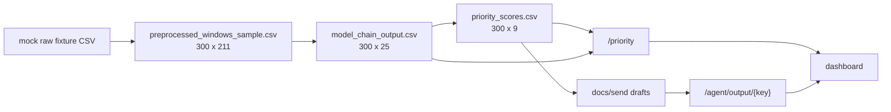
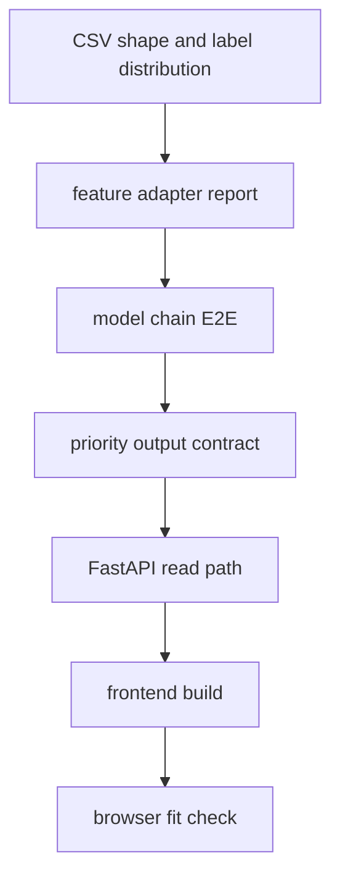

# 07. 검증과 재현 절차

## 목적

검증 단계는 raw fixture부터 프론트엔드 표시까지 파일과 테스트로 추적 가능한지 확인한다. 이 문서는 다음 수정자가 같은 명령으로 현재 상태를 재현할 수 있게 하는 실행 가이드다.

## 재현 명령

| 목적 | 명령 |
|---|---|
| 전체 테스트 | `uv run pytest` |
| 프론트 빌드 | `cd frontend; npm run build` |
| 모델 체인 실행 | `uv run python -m agent.model_chain.run_model_chain` |
| priority 실행 | `uv run python -m agent.priority.run_priority` |
| agent 초안 생성 | `uv run python -m agent.llm.run_agent --top-n 5` |
| 서버 실행 | `uv run uvicorn server.main:app --port 8000` |
| 프론트 실행 | `cd frontend; npm run dev` |

## 검증된 결과

| 항목 | 결과 |
|---|---:|
| pytest | 13 passed |
| frontend build | passed |
| current mock raw preprocessing | 300 rows x 211 columns |
| current model chain output | 300 rows x 25 columns |
| current priority output | 300 rows x 9 columns |
| E2E row 보존 | 300 -> 300 -> 300 |
| IF feature count | 195 |
| risk feature count | 189 |
| leadtime feature count | 221 |
| priority level set | urgent, high, medium, low |
| priority training basis | `model_chain_output.csv` |
| priority holdout verdict | baseline 동등 이상, 모델 채택 |
| old 300 model binary F1 | 0.4615 |
| full model mock raw binary F1 | 0.8511 |
| full model full holdout binary F1 | 0.7956 |
| full model full holdout macro F1 | 0.3750 |
| full model full holdout weighted F1 | 0.4857 |

## 정성 해석

검증의 핵심은 "파일이 존재한다"가 아니라 각 단계의 row 수와 계약이 끊기지 않는다는 점이다. 이 문서의 테스트 게이트는 수정자가 어느 지점에서 계약을 깨뜨렸는지 빠르게 좁히기 위한 최소 안전망이다.

## 산출물 추적

## 테스트 게이트

## 수정 가이드

전처리, 모델 체인, priority 중 하나라도 수정하면 `tests/test_model_chain_e2e.py`를 먼저 확인한다. 이 테스트는 full PreDist 감사값, fixture label 분포, 모델별 feature 수, chain/priority row 수를 한 번에 확인하는 핵심 회귀 방지 장치다.

프론트만 수정한 경우에도 `npm run build`는 반드시 실행한다. 데이터 shape가 바뀐 경우에는 프론트 build만으로 충분하지 않고, `/priority/{key}`와 `/agent/output/{key}` 응답까지 확인해야 한다.

## 한계와 다음 단계

- 현재 검증은 fixture와 파일 기반 프로토타입 중심이다.
- priority 회귀 모델은 full PreDist chain output으로 재학습되어 프로토 완성본에 반영됐지만, 운영 전에는 운영 라벨과 최신 chain output으로 반복 재학습/검증해야 한다.
- 서버는 CSV 파일을 직접 읽는 구조라 운영 환경에서는 DB, 캐시, 권한, 감사 로그 설계가 추가되어야 한다.
- dashboard는 검토용이며 자동 발송, 승인 workflow, 담당자 배정 기능은 아직 없다.

## 최근 proto 안정성 보강(2026-06-26) 요약

### 무엇을 변경했는가

- `agent/preprocessing/sample_predist_zip.py`
  - `faults.csv`의 `efd_possible` 값을 문자열/숫자 혼재 타입에서 일관된 bool-like 값으로 정규화
- `agent/model_chain/run_model_chain.py`
  - `manufacturer` 추출을 고정 패턴(`manufacturer [12]`)에서 정규화 기반으로 완화
  - `window_start/window_end` 조인 키를 `int64` 강제 캐스팅에서 datetime 기반 비교로 전환
  - 라벨 병합 키를 라벨 스키마 유무에 따라 동적으로 구성
- `agent/priority/run_priority.py`
  - priority 스키마 검증 범위를 `head(25)`에서 전체 출력으로 확대
- 테스트 추가
  - `tests/test_preprocessing_predist_zip_sample.py`
    - `efd_possible` 파싱 변형 값 테스트
  - `tests/test_model_chain_context.py` 신규
    - 제조사 정규화/타임스탬프 형식 편차 시 라벨 병합 동작 검증

### 왜 변경했는가

- 운영 입력은 `efd_possible`, 제조사 표기, 타임스탬프 포맷이 고정되지 않는 특성이 있어
  기존 하드코딩 로직은 조인 실패·오분류·샘플러 중단을 유발할 수 있음.
- 기존 `run_priority`의 부분 스키마 검증은 일부 행의 결함을 놓치게 되어 운영 산출물 신뢰도가 떨어질 수 있어 전체 행 검증으로 교체.

### 변경 전/후 정량 비교

| 항목 | 변경 전 | 변경 후 |
|---|---:|---:|
| pytest 통과 수 | 8 | 11 |
| efd_possible 기반 `ratio-matched` 샘플 후보 필터 | 문자열값 변형 미정규화 | 문자열/숫자 혼재 안전 정규화 |
| 제조사 추출 | `manufacturer [12]` 고정 정규식 | `manufacturer` 접두 + 숫자 추출 일반화 |
| 라벨 조인 키 | `to_datetime(...).astype("int64")` (파싱 실패 시 충돌 가능) | `datetime` 직접 결합, 유효성 기반 병합 |
| priority 스키마 검증 범위 | 샘플 25행 | 전체 출력 행 |

### 남은 위험/한계

- 현재도 전체 검증은 fixture 중심이며, 운영 데이터의 제조사/스키마 변경이 추가되면 별도 호환 테스트가 필요함.
- 본 수정은 조인/파싱/검증 강건성 강화가 주 목적이라, 모델 성능 자체의 수치(예: 재현율/정확도)에는 변경 없음.
