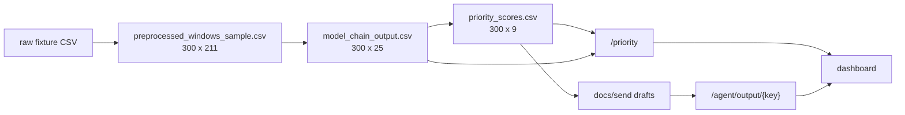
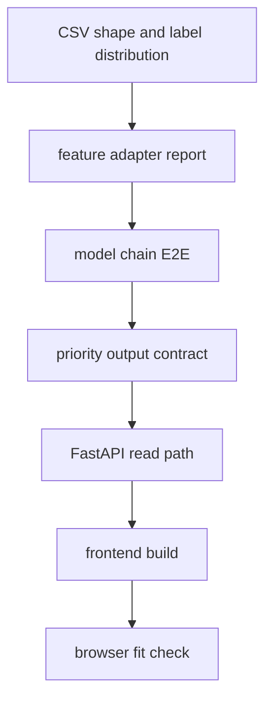

# 07. 검증과 재현 절차

## 목적

검증 단계는 raw fixture부터 프론트엔드 표시까지 파일과 테스트로 추적 가능한지 확인한다. 이 문서는 다음 수정자가 같은 명령으로 현재 상태를 재현할 수 있게 하는 실행 가이드다.

## 재현 명령

| 목적 | 명령 |
|---|---|
| 전체 테스트 | `uv run pytest` |
| 프론트 빌드 | `cd frontend; npm run build` |
| 모델 체인 실행 | `uv run python -m agent.model_chain.run_model_chain` |
| priority 실행 | `uv run python -m agent.priority.run_priority` |
| agent 초안 생성 | `uv run python -m agent.llm.run_agent --top-n 5` |
| 서버 실행 | `uv run uvicorn server.main:app --port 8000` |
| 프론트 실행 | `cd frontend; npm run dev` |

## 검증된 결과

| 항목 | 결과 |
|---|---:|
| pytest | 8 passed |
| frontend build | passed |
| preprocessing fixture | 300 rows x 211 columns |
| model chain output | 300 rows x 25 columns |
| priority output | 300 rows x 9 columns |
| E2E row 보존 | 300 -> 300 -> 300 |
| IF feature count | 195 |
| risk feature count | 189 |
| leadtime feature count | 221 |
| priority level set | urgent, high, medium, low |

## 정성 해석

검증의 핵심은 "파일이 존재한다"가 아니라 각 단계의 row 수와 계약이 끊기지 않는다는 점이다. 이 문서의 테스트 게이트는 수정자가 어느 지점에서 계약을 깨뜨렸는지 빠르게 좁히기 위한 최소 안전망이다.

## 산출물 추적

## 테스트 게이트

## 수정 가이드

전처리, 모델 체인, priority 중 하나라도 수정하면 `tests/test_model_chain_e2e.py`를 먼저 확인한다. 이 테스트는 full PreDist 감사값, fixture label 분포, 모델별 feature 수, chain/priority row 수를 한 번에 확인하는 핵심 회귀 방지 장치다.

프론트만 수정한 경우에도 `npm run build`는 반드시 실행한다. 데이터 shape가 바뀐 경우에는 프론트 build만으로 충분하지 않고, `/priority/{key}`와 `/agent/output/{key}` 응답까지 확인해야 한다.

## 한계와 다음 단계

- 현재 검증은 fixture와 파일 기반 프로토타입 중심이다.
- priority 회귀 모델은 운영 라벨과 최신 chain output으로 재학습하는 후속 작업이 필요하다.
- 서버는 CSV 파일을 직접 읽는 구조라 운영 환경에서는 DB, 캐시, 권한, 감사 로그 설계가 추가되어야 한다.
- dashboard는 검토용이며 자동 발송, 승인 workflow, 담당자 배정 기능은 아직 없다.
