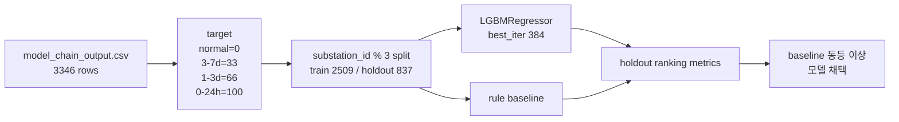

# 08. Priority 회귀모델 실제 Chain Output 재학습

> 현재 runtime 기준 주의: 이 문서는 priority LGBM 회귀모델 재학습의 legacy 기록이다. 2026-06-26 현재 proto runtime은 IF + LGBM risk + LGBM leadtime까지는 유지하고, priority 단계만 `priority_engine_v2_rule_based_tuned` 규칙 기반 엔진으로 실행한다.

## 목적

기존 priority 회귀모델은 실제 추론 입력은 `model_chain_output.csv`를 쓰면서도 학습 metadata는 `data/mock/mock_ml_output.csv`를 가리키고 있었다. 이 보고서는 mock 학습 흔적을 제거하고, full PreDist supervised 3346 window를 `raw -> preprocessing -> IF/risk/leadtime` 체인까지 통과시킨 출력으로 priority 회귀모델을 다시 학습한 결과를 기록한다.

## 무엇을 변경했는가

| 항목 | 변경 전 | 변경 후 |
|---|---|---|
| 학습 입력 기본값 | `data/mock/mock_ml_output.csv` | `data/processed/ml_model_chain/model_chain_output.csv` |
| target 생성 | label + lead bucket | 동일, 실제 chain output의 label + lead bucket 사용 |
| 모델 저장 | 기존 joblib | 실제 chain 기준 재학습 joblib |
| metadata | mock training_basis | chain output training_basis, target 분포, feature importance 기록 |
| priority_scores | 기존 mock 학습 모델 기반 | 실제 chain 재학습 모델 기반 |

## 학습 구성

| 항목 | 값 |
|---|---:|
| 전체 row | 3346 |
| train row | 2509 |
| holdout row | 837 |
| train target 0 | 1509 |
| train target 33 | 575 |
| train target 66 | 284 |
| train target 100 | 141 |
| holdout target 0 | 309 |
| holdout target 33 | 300 |
| holdout target 66 | 152 |
| holdout target 100 | 76 |
| best iteration | 384 |

## Feature Importance

| 순위 | feature | importance |
|---:|---|---:|
| 1 | `risk_probability` | 506 |
| 2 | `anomaly_score` | 505 |
| 3 | `leadtime_prob_3-7d` | 320 |
| 4 | `leadtime_prob_0-24h` | 293 |
| 5 | `predicted_lead_time_confidence` | 255 |
| 6 | `leadtime_prob_1-3d` | 174 |
| 7 | `risk_score` | 77 |

## Holdout 평가

| ranking metric | priority model | rule baseline |
|---|---:|---:|
| precision@10 | 1.0000 | 0.5000 |
| recall@10 | 0.0189 | 0.0095 |
| ndcg@10 | 0.7131 | 0.3755 |
| precision@20 | 1.0000 | 0.7500 |
| recall@20 | 0.0379 | 0.0284 |
| ndcg@20 | 0.6846 | 0.4475 |
| precision@528 | 0.7879 | 0.7102 |
| recall@528 | 0.7879 | 0.7102 |
| ndcg@528 | 0.7553 | 0.6631 |

판정은 `priority 모델 채택 (wins=9, ties=0, losses=0; baseline 동등 이상)`이다.

### F1 관점 보충

ranking 지표는 운영 큐의 상위 선별 품질을 본다. F1 지표는 같은 holdout을 priority level 경계값(`16.5 / 49.5 / 83.0`)으로 등급화해 분류 관점에서 다시 본 값이다.

| classification metric | priority model | rule baseline | 해석 |
|---|---:|---:|---|
| binary precision | 0.7776 | 0.7145 | 모델이 전조라고 표시한 항목의 적중률이 더 높음 |
| binary recall | 0.8144 | 0.9432 | rule이 더 많이 잡음 |
| binary F1 | 0.7956 | 0.8131 | recall 우위 때문에 rule이 근소하게 높음 |
| multiclass accuracy | 0.5173 | 0.3859 | 모델이 4단계 등급을 더 잘 맞춤 |
| multiclass macro F1 | 0.3750 | 0.3068 | 등급별 균형 성능은 모델 우위 |
| multiclass weighted F1 | 0.4857 | 0.3900 | 실제 분포 가중 성능도 모델 우위 |

따라서 "모델이 전 지표에서 rule을 이긴다"가 아니라, 정확한 판정은 "ranking 지표와 4단계 priority 분류 성능은 모델 우위, binary F1만 rule이 근소 우위"다. 운영 큐 목적은 단순 전조 탐지보다 상위 우선순위 정렬과 등급 품질이 중요하므로 priority 모델을 채택한다.

## 새 Priority 출력

| 항목 | 값 |
|---|---:|
| output rows | 3346 |
| output columns | 9 |
| score min | 0.00 |
| score max | 100.00 |
| score mean | 21.90 |
| urgent | 17 |
| high | 324 |
| medium | 1436 |
| low | 1569 |

새 top 5 기준 `docs/send` 초안도 offline mode로 재생성했다. 현재 `docs/send`는 work order 24개, email 24개, 총 48개다.

## 해석

mock 제거는 완료됐고, full PreDist chain output 기준 LGBM 회귀모델은 ranking 지표와 4단계 priority 분류 지표에서 rule baseline보다 낫다. 300행 fixture 학습 모델은 데이터가 부족해 실패했지만, 3346개 supervised window로 학습한 모델은 운영 큐 목적에 맞는 priority 회귀모델로 구성된다.

## 다음 수정 가이드

- 다음 단계에서는 fault event 단위 group split으로 leakage 위험을 더 줄인다.
- `priority_score=100` 동점이 여러 개이므로 동점 보조 정렬 기준을 검토한다.
- 운영 DB 전환 전에는 full ZIP이 아닌 지속 가능한 raw 저장소 기준으로 같은 재학습을 반복 검증한다.
