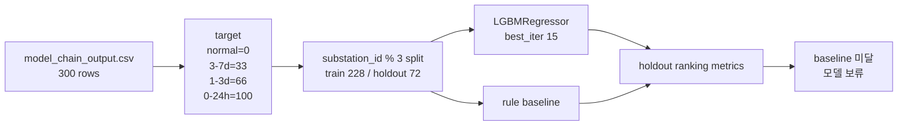

# 08. Priority 회귀모델 실제 Chain Output 재학습

## 목적

기존 priority 회귀모델은 실제 추론 입력은 `model_chain_output.csv`를 쓰면서도 학습 metadata는 `data/mock/mock_ml_output.csv`를 가리키고 있었다. 이 보고서는 mock 학습 흔적을 제거하고, 실제 `raw -> preprocessing -> IF/risk/leadtime` 체인 출력으로 priority 회귀모델을 다시 학습한 결과를 기록한다.

## 무엇을 변경했는가

| 항목 | 변경 전 | 변경 후 |
|---|---|---|
| 학습 입력 기본값 | `data/mock/mock_ml_output.csv` | `data/processed/ml_model_chain/model_chain_output.csv` |
| target 생성 | label + lead bucket | 동일, 실제 chain output의 label + lead bucket 사용 |
| 모델 저장 | 기존 joblib | 실제 chain 기준 재학습 joblib |
| metadata | mock training_basis | chain output training_basis, target 분포, feature importance 기록 |
| priority_scores | 기존 mock 학습 모델 기반 | 실제 chain 재학습 모델 기반 |

## 학습 구성

| 항목 | 값 |
|---|---:|
| 전체 row | 300 |
| train row | 228 |
| holdout row | 72 |
| train target 0 | 139 |
| train target 33 | 50 |
| train target 66 | 30 |
| train target 100 | 9 |
| holdout target 0 | 24 |
| holdout target 33 | 29 |
| holdout target 66 | 9 |
| holdout target 100 | 10 |
| best iteration | 15 |

## Feature Importance

| 순위 | feature | importance |
|---:|---|---:|
| 1 | `leadtime_prob_3-7d` | 14 |
| 2 | `risk_probability` | 12 |
| 3 | `predicted_lead_time_confidence` | 7 |
| 4 | `leadtime_prob_0-24h` | 6 |
| 5 | `leadtime_prob_1-3d` | 6 |
| 6 | `anomaly_score` | 3 |
| 7 | `risk_score` | 2 |

## Holdout 평가

| metric | priority model | rule baseline |
|---|---:|---:|
| precision@10 | 0.5000 | 0.6000 |
| recall@10 | 0.1042 | 0.1250 |
| ndcg@10 | 0.1975 | 0.3807 |
| precision@20 | 0.5500 | 0.6500 |
| recall@20 | 0.2292 | 0.2708 |
| ndcg@20 | 0.3098 | 0.4393 |
| precision@48 | 0.5417 | 0.7083 |
| recall@48 | 0.5417 | 0.7083 |
| ndcg@48 | 0.4433 | 0.5951 |

판정은 `priority 모델 보류 (wins=0, ties=0, losses=9; baseline 미달)`이다.

## 새 Priority 출력

| 항목 | 값 |
|---|---:|
| output rows | 300 |
| output columns | 9 |
| score min | 10.61 |
| score max | 31.98 |
| score mean | 20.11 |
| medium | 180 |
| low | 120 |
| urgent/high | 0 |

새 top 5 기준 `docs/send` 초안도 offline mode로 재생성했다. 현재 `docs/send`는 work order 15개, email 15개, 총 30개다.

## 해석

mock 제거는 완료됐다. 그러나 실제 chain output으로 학습한 LGBM 회귀모델은 현재 baseline보다 낮고, 점수도 10.61~31.98 범위에 몰려 있다. 따라서 이 모델을 운영 priority 엔진으로 채택하기보다는, 다음 단계에서 target 설계와 feature 품질을 재검토해야 한다.

## 다음 수정 가이드

- priority 모델을 바로 운영 채택하지 말고 rule baseline 또는 hybrid 기준을 검토한다.
- `0-24h` target이 train 9건으로 적어 임박 고장 학습이 약하다. rare bucket 보강 또는 stratified split 재설계가 필요하다.
- feature importance가 `leadtime_prob_3-7d`에 치우쳤으므로, leadtime 모델 calibration과 target alignment를 같이 확인해야 한다.
- 튜닝 후에는 이 보고서의 feature importance, holdout metric, priority level 분포를 다시 갱신한다.

