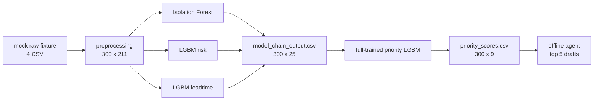

# 09. Full 학습 Priority 모델로 Mock Raw 1사이클 재실행

> 현재 runtime 기준 주의: 이 문서는 priority LGBM 회귀모델로 mock raw 1사이클을 실행하던 시점의 legacy 기록이다. 2026-06-26 현재 proto runtime은 IF + LGBM risk + LGBM leadtime까지는 유지하고, priority 단계만 `priority_engine_v2_rule_based_tuned` 규칙 기반 엔진으로 실행한다.

## 문제 상황

priority 모델을 300행 fixture로 재학습했을 때는 holdout에서 rule baseline보다 낮았다. 원인은 모델 구조 자체보다 학습 데이터가 부족한 점이었다. 특히 `0-24h` 임박 고장 target이 train에 9건뿐이라 LGBM 회귀모델이 긴급 우선순위 패턴을 충분히 학습하지 못했다.

이후 full PreDist supervised 3346 window를 `raw -> preprocessing -> IF/risk/leadtime`까지 통과시켜 priority 모델을 다시 학습했고, 그 모델은 holdout에서 rule baseline을 전 지표로 앞섰다.

## 해결책

| 항목 | 처리 |
|---|---|
| 학습 데이터 | full PreDist supervised 3346 window |
| 학습 입력 | `data/processed/ml_model_chain/model_chain_output.csv` |
| 모델 | `priority_v3_lgbm_reg` LGBMRegressor |
| 검증 결과 | rule baseline 대비 wins=9, ties=0, losses=0 |
| 재실행 데이터 | mock raw fixture CSV |
| 재실행 목적 | full 학습 모델이 raw fixture 1사이클에서 정상 산출물을 만드는지 확인 |

## 1사이클 실행 흐름

## 실행 결과

| 단계 | 결과 |
|---|---:|
| mock raw preprocessing | 300 rows x 211 columns |
| label 분포 | normal 163 / pre_fault 137 |
| pre_fault bucket | 0-24h 19 / 1-3d 39 / 3-7d 79 |
| model chain output | 300 rows x 25 columns |
| risk levels | high 112 / low 111 / critical 45 / medium 32 |
| predicted leadtime | 1-3d 181 / 0-24h 107 / 3-7d 12 |
| priority output | 300 rows x 9 columns |
| priority levels | urgent 1 / high 31 / medium 112 / low 156 |
| score range | 0.00 ~ 83.38 |
| score mean | 21.34 |
| docs/send total | 48 files, work order 24 / email 24 |
| 기존 300행 모델 binary F1 | 0.4615 |
| full 학습 모델 mock raw binary F1 | 0.8511 |
| 기존 300행 모델 weighted F1 | 0.1482 |
| full 학습 모델 mock raw weighted F1 | 0.5424 |

## Top 5

| 순위 | 대상 | 점수 | 레벨 | 근거 |
|---:|---|---:|---|---|
| 1 | manufacturer 1 / substation 21 / 2019-01-21 00:00 | 83.38 | urgent | risk=critical, leadtime=0-24h, anomaly=0.47 |
| 2 | manufacturer 1 / substation 21 / 2019-01-20 18:00 | 78.95 | high | risk=critical, leadtime=0-24h, anomaly=0.43 |
| 3 | manufacturer 1 / substation 21 / 2019-01-16 12:00 | 73.18 | high | risk=critical, leadtime=0-24h, anomaly=0.41 |
| 4 | manufacturer 2 / substation 10 / 2016-12-01 18:00 | 70.32 | high | risk=critical, leadtime=0-24h, anomaly=1.00 |
| 5 | manufacturer 1 / substation 8 / 2018-04-24 12:00 | 69.09 | high | risk=high, leadtime=0-24h, anomaly=0.25 |

## 검증

- `uv run python -m agent.model_chain.run_model_chain`
- `uv run python -m agent.priority.run_priority`
- `uv run python -m agent.llm.run_agent --top-n 5`
- `uv run pytest`: 14 passed
- `npm run build`: passed

## 해석

full PreDist로 학습한 priority 모델은 mock raw fixture 1사이클에서도 긴급/높음 우선순위를 산출한다. 따라서 현재 구조는 “학습은 full supervised chain output으로, 운영/데모 실행은 raw 입력부터 시작”하는 형태로 정리된다.

다만 현재 `priority_scores.csv`는 mock raw 1사이클 결과 300행이다. full PreDist 3346행 학습 결과와 serving 결과를 혼동하지 않도록 보고서에서는 `08_priority_retrain.md`를 학습 보고서, 이 문서를 mock raw 실행 보고서로 분리한다.

성능 지표 관점에서는 기존 300행 학습 모델보다 full 학습 모델이 mock raw holdout에서 크게 개선됐다. binary F1은 `0.4615 -> 0.8511`, multiclass weighted F1은 `0.1482 -> 0.5424`로 상승했다. 상세 비교는 [10_proto_completion.md](10_proto_completion.md)에 둔다.
