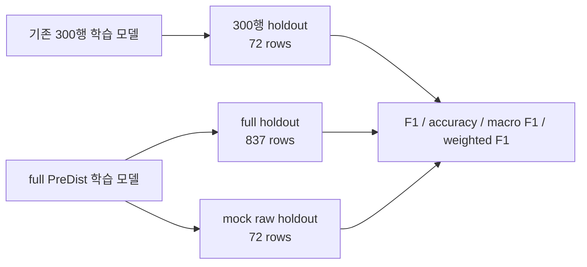

# 10. Proto 완성본 마감 성능 검토

## 개요

이 보고서는 `proto` 완성본을 닫기 전에 priority 회귀모델의 성능 지표를 F1 관점까지 보충해 기록한다. 이전 보고서의 ranking metric은 운영 큐 상위 선별 품질을 설명하고, 이 문서의 F1 지표는 같은 출력이 `normal / pre_fault` 또는 `low / medium / high / urgent` 등급을 얼마나 잘 맞히는지 설명한다.

## 무엇을 확인했는가

| 항목 | 기준 |
|---|---|
| 기존 모델 | 300행 fixture chain output으로 학습한 priority LGBM |
| 현재 모델 | full PreDist 3346 supervised chain output으로 학습한 priority LGBM |
| serving 확인 | full 학습 모델을 mock raw fixture 300행 1사이클에 적용 |
| holdout split | `substation_id % 3 == 0` |
| binary positive | `target > 0`, 즉 `pre_fault` |
| binary threshold | `priority_score >= 16.5` |
| multiclass target | `0 / 33 / 66 / 100` |
| multiclass threshold | `16.5 / 49.5 / 83.0` |

## 성능 비교 요약

### 기존 300행 모델 대비 현재 모델

mock raw holdout 72행 기준으로 비교하면 현재 full 학습 모델은 기존 300행 학습 모델보다 모든 주요 F1 지표가 좋아졌다.

| metric | 기존 300행 모델 | 현재 full 학습 모델 | 개선폭 |
|---|---:|---:|---:|
| binary precision | 0.4884 | 0.8696 | +0.3812 |
| binary recall | 0.4375 | 0.8333 | +0.3958 |
| binary F1 | 0.4615 | 0.8511 | +0.3896 |
| multiclass accuracy | 0.1806 | 0.5694 | +0.3888 |
| multiclass macro F1 | 0.0953 | 0.4549 | +0.3596 |
| multiclass weighted F1 | 0.1482 | 0.5424 | +0.3942 |

## Rule Baseline 대비 현재 모델

### Full PreDist holdout

full PreDist holdout 837행 기준이다. positive는 528행이며, target 분포는 `0=309 / 33=300 / 66=152 / 100=76`이다.

| metric | 현재 full 학습 모델 | rule baseline | 판정 |
|---|---:|---:|---|
| binary precision | 0.7776 | 0.7145 | 모델 우위 |
| binary recall | 0.8144 | 0.9432 | rule 우위 |
| binary F1 | 0.7956 | 0.8131 | rule 근소 우위 |
| multiclass accuracy | 0.5173 | 0.3859 | 모델 우위 |
| multiclass macro F1 | 0.3750 | 0.3068 | 모델 우위 |
| multiclass weighted F1 | 0.4857 | 0.3900 | 모델 우위 |

해석은 명확하다. rule은 recall을 강하게 밀어 전조 후보를 더 많이 잡는다. 그래서 binary F1은 rule이 `0.0175` 높다. 반면 모델은 precision과 4단계 priority 등급 품질에서 더 좋다. 운영 대시보드의 목적은 단순 전조 탐지보다 "어떤 후보를 먼저 볼 것인가"이므로 ranking metric과 multiclass F1을 함께 보고 모델을 채택한다.

### Current Mock Raw Holdout

현재 serving 산출물인 mock raw 1사이클 300행 중 holdout 72행 기준이다. positive는 48행이며, target 분포는 `0=24 / 33=29 / 66=9 / 100=10`이다.

| metric | 현재 full 학습 모델 | rule baseline | 판정 |
|---|---:|---:|---|
| binary precision | 0.8696 | 0.7966 | 모델 우위 |
| binary recall | 0.8333 | 0.9792 | rule 우위 |
| binary F1 | 0.8511 | 0.8785 | rule 근소 우위 |
| multiclass accuracy | 0.5694 | 0.4444 | 모델 우위 |
| multiclass macro F1 | 0.4549 | 0.3649 | 모델 우위 |
| multiclass weighted F1 | 0.5424 | 0.4565 | 모델 우위 |

mock raw holdout에서도 같은 패턴이다. rule은 recall이 높고, 모델은 precision과 priority 등급 품질이 높다.

## Ranking Metric과 함께 본 최종 판정

| ranking metric | 현재 full 학습 모델 | rule baseline |
|---|---:|---:|
| precision@10 | 1.0000 | 0.5000 |
| recall@10 | 0.0189 | 0.0095 |
| ndcg@10 | 0.7131 | 0.3755 |
| precision@20 | 1.0000 | 0.7500 |
| recall@20 | 0.0379 | 0.0284 |
| ndcg@20 | 0.6846 | 0.4475 |
| precision@528 | 0.7879 | 0.7102 |
| recall@528 | 0.7879 | 0.7102 |
| ndcg@528 | 0.7553 | 0.6631 |

최종 판정은 다음과 같다.

- 기존 300행 학습 모델은 성능 부족으로 보류가 맞다.
- full PreDist chain output으로 학습한 현재 모델은 기존 모델 대비 F1 기준으로 크게 개선됐다.
- rule baseline은 recall 중심 binary F1에서 근소 우위다.
- 현재 모델은 precision, multiclass accuracy, macro F1, weighted F1, ranking metric에서 우위다.
- 따라서 `proto` 완성본의 priority 모델은 운영 큐 정렬 목적에 맞는 모델로 채택한다.

## 마감 기준 산출물

| 산출물 | 상태 |
|---|---|
| raw fixture | 4 CSV |
| preprocessing output | 300 rows x 211 columns |
| model chain output | 300 rows x 25 columns |
| priority output | 300 rows x 9 columns |
| priority model training basis | full PreDist chain output 3346 rows |
| agent drafts | 48 files, work order 24 / email 24 |
| dashboard | `http://127.0.0.1:5173/` |
| API | `http://127.0.0.1:8000/priority` |

## 남은 한계

- F1 계산은 현재 프로토의 supervised label과 deterministic holdout 기준이다.
- 운영 환경에서는 fault event 단위 group split과 시간 기준 forward validation을 추가하는 편이 더 안전하다.
- 현재 서버는 파일 기반 read-only API이며, 운영 DB/권한/감사 로그/승인 workflow는 아직 범위 밖이다.
- priority 모델은 운영 라벨이 확보되면 같은 `raw -> preprocessing -> IF/LGBM2 -> priority` 흐름으로 반복 재학습해야 한다.
