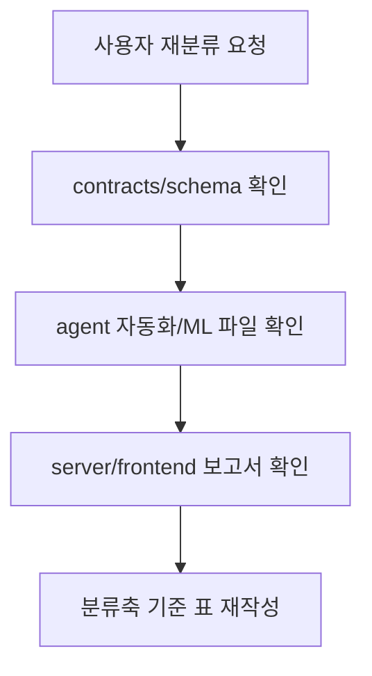

# 11. Proto 완성본과 Alpha 전환 항목 표 정리

## 개요

이 문서는 `proto` 완성본 기준 구현 상태를 계약, DB 스키마, 자동화 로직, ML 모델, 서버, 프론트로 나눠 표로 정리한다. 기준은 기존 정본 보고서 `01_raw.md`부터 `10_proto_completion.md`, `docs/contracts`, `schema`, `agent`, `server`, `frontend`의 현재 파일 확인 결과다.

## 전체 판정

| 구분 | 현재 상태 | 판단 |
|---|---|---|
| 프로토 목표 | `raw -> preprocessing -> IF + LGBM risk + LGBM leadtime -> rule priority engine -> server -> frontend` 체인 연결 | 완료 |
| 구현 축 | raw 계약 / 전처리 계약 / 전처리 자동화 계약 / DB 스키마 / 자동화 로직 / ML 모델 / 서버 / 프론트 | 프로토 기준 정리 가능 |
| 검증 기준 | PreDist ZIP 라벨 감사, mock raw 1사이클, pytest/build 기록 | 프로토 검증 완료 |
| 운영 전환 수준 | CSV 파일 기반 read-only API와 검토용 dashboard | 운영 시스템 전 단계 |
| alpha 핵심 과제 | DB 저장소 실사용, job 상태관리, 승인 workflow, 운영 검증 split, 모델 모니터링 | 필수 보강 필요 |

## 구현된 것: 계약/구조/기능별 정리

| 구분 | 구현된 것 | 산출물/파일 | 정량 결과 | 현재 의미 |
|---|---|---|---:|---|
| raw 데이터 계약 | 운영 입력 raw 4테이블 계약 | `docs/contracts/03_operational_input_contract.md` | 4 tables | 운영 추론 입력의 최소 raw 경계 고정 |
| raw 데이터 계약 | raw DDL/JSON Schema | `schema/sql/001_substations.sql` ~ `004_maintenance_events.sql`, `schema/json/*` | SQL 4개 + JSON 4개 | PostgreSQL/TimescaleDB 전환 기준선 |
| raw 데이터 계약 | raw 컬럼 매핑 | `schema/column_name_mapping.md` | sensor base 29개 중심 | PreDist raw 컬럼을 운영 컬럼명으로 정규화 |
| 전처리 데이터 계약 | `preprocessed_windows` 계약 | `docs/contracts/04_preprocessed_data_contract.md` | 211 columns | 모델 실험과 분리된 6시간 window 중간층 |
| 전처리 데이터 계약 | 전처리 DDL/JSON Schema | `schema/sql/005_preprocessed_windows.sql`, `schema/json/preprocessed_windows.schema.json` | 1 table / 211 columns | raw 4테이블에서 나온 표준 중간 산출물 |
| 전처리 자동화 로직 계약 | 전처리 상수/컬럼 계약 | `agent/preprocessing/contracts.py` | numeric 17 x 9, control 11 x 3 | 자동화 로직이 따라야 할 컬럼 생성 규칙 |
| 전처리 자동화 로직 계약 | 전처리 입력/출력 검증 | `agent/preprocessing/validate.py` | required column 검증 | raw 누락과 전처리 schema 이탈을 조기 차단 |
| DB 스키마 | 확장/운영/전처리/model chain/priority DDL | `schema/sql/000_extensions.sql` ~ `007_priority_scores.sql` | SQL 8개 | 운영 저장소로 갈 때의 테이블 초안 |
| DB 스키마 | model chain output schema | `schema/json/model_chain_output.schema.json` | 25 columns | IF/risk/leadtime 중간 예측 산출물의 저장/검증 계약 |
| DB 스키마 | priority score schema | `schema/json/priority_scores.schema.json` | 9 columns | priority 산출물의 저장/검증 계약 |
| 전처리 자동화 로직 | raw 4테이블 -> window 생성 | `agent/preprocessing/build_windows.py` | 3346 x 211, mock 300 x 211 | 전처리 자동 생성 가능 |
| 전처리 자동화 로직 | PreDist ZIP 라벨 감사 | `agent/preprocessing/audit_predist_labels.py` | 3346 labels | full supervised label 분포 감사 |
| 전처리 자동화 로직 | PreDist fixture 생성 | `agent/preprocessing/sample_predist_zip.py` | raw fixture 4 CSV | mock raw 1사이클 재현 기반 |
| 전처리 자동화 로직 | full supervised 전처리 생성 | `agent/preprocessing/build_full_predist_supervised.py` | 3346 x 211 | priority 재학습용 full window 생성 |
| ML 모델 | 중간 예측 체인 | `agent/model_chain/run_model_chain.py` | current 300 x 25 | IF + risk LGBM + leadtime LGBM 연결 |
| ML 모델 | feature adapter | `agent/model_chain/feature_adapter.py` | IF 195 / risk 189 / leadtime 221 | 모델별 feature 수 차이를 흡수 |
| ML 모델 | priority 규칙 엔진 | `agent/priority/rule_baseline.py`, `agent/priority/run_priority.py` | current 300 x 9 | IF+LGBM2 출력에서 priority score/level 생성 |
| ML 모델 | legacy priority LGBM 기록 | `agent/priority/train_priority_model.py`, `agent/priority/models/*`, `evaluate.py` | legacy | 현재 runtime 미사용, 과거 실험 재현용 |
| ML 모델 | offline agent draft | `agent/llm/run_agent.py`, `tools.py`, `prompts.py` | 48 files | 작업지시 24개, email 24개 생성 |
| 서버 | read-only FastAPI | `server/main.py` | 4 endpoints | CSV와 Markdown 산출물을 dashboard에 제공 |
| 서버 | priority/detail/draft API | `/priority`, `/priority/{key}`, `/agent/output/{key}` | limit 기본 50 | 운영자 검토용 조회 API |
| 프론트 | 운영자 dashboard | `frontend/src/App.jsx`, `frontend/src/App.css` | queue 10 rows / API 50 rows | 우선순위 큐, 상세 근거, 초안 검토 |
| 프론트 | KPI/차트/상세 UI | Recharts, dashboard components | KPI 4 / charts 4 / tabs 2 | 표만 있는 화면에서 검토용 화면으로 확장 |

## 데이터와 산출물 수치

| 영역 | 값 | 근거 |
|---|---:|---|
| full supervised labels | 3346 rows x 9 columns | 현재 CSV 확인 |
| full label 분포 | normal 1818 / pre_fault 1528 | `01_raw.md` |
| full pre_fault bucket | 0-24h 217 / 1-3d 436 / 3-7d 875 | `01_raw.md` |
| full preprocessed windows | 3346 rows x 211 columns | 현재 CSV 확인 |
| current mock model chain output | 300 rows x 25 columns | 현재 `data/processed/ml_model_chain/model_chain_output.csv` 확인 |
| current mock priority output | 300 rows x 9 columns | 현재 `data/processed/ml_priority/priority_scores.csv` 확인 |
| docs/send draft | 48 files | work order 24 / email 24 |
| pytest | 17 passed | priority rule engine 테스트 추가 후 재실행 |
| frontend build | passed | `07_validation.md`, `09_mock_raw_cycle.md` |

## ML 모델 연결과 성능

| 항목 | 현재 값 | 해석 |
|---|---:|---|
| IF 입력 feature | 195 | anomaly score 생성용 |
| risk LGBM 입력 feature | 189 | pre_fault risk 예측용 |
| leadtime LGBM 입력 feature | 221 | leadtime bucket 예측용 |
| priority 입력 | anomaly/risk/leadtime/history | IF+LGBM2 출력과 최근 이벤트 이력 기반 |
| priority engine | `priority_engine_v2_rule_based_tuned` | LGBM 회귀 대신 규칙 기반 runtime |
| priority score range | 8.76 ~ 78.31 | current mock priority 300행 기준 |
| priority level 분포 | urgent 28 / high 89 / medium 50 / low 133 | current mock priority 300행 기준 |
| legacy priority LGBM | 보존 | 현재 runtime 미사용, 과거 실험 기록으로만 유지 |

## 서버/프론트 현재 범위

| 구분 | 구현된 기능 | 현재 한계 |
|---|---|---|
| 서버 | `/` health | 상태 상세/DB health 없음 |
| 서버 | `/priority` | CSV 파일 기반 read-only |
| 서버 | `/priority/{key}` | 권한/감사 로그 없음 |
| 서버 | `/agent/output/{key}` | Markdown 초안 조회 중심 |
| 프론트 | 우선순위 큐 | 상태 변경 저장 없음 |
| 프론트 | KPI와 분포 차트 | 운영 DB 기반 전체 통계 아님 |
| 프론트 | 상세 근거 | 운영 승인 근거로는 row-level 설명 보강 필요 |
| 프론트 | 작업지시/메일 초안 탭 | 수정/승인/발송 workflow 없음 |

## 아직 안 된 것: 같은 축으로 재정리

| 구분 | 아직 안 된 것 | 현재 상태 | alpha에서 필요한 이유 |
|---|---|---|---|
| raw 데이터 계약 | 실제 운영 ingestion 계약 미완성 | PreDist ZIP/mock raw fixture 중심 | 현장 센서/API 입력을 안정적으로 받기 위해 필요 |
| raw 데이터 계약 | 실패 row quarantine 미구현 | 파싱 실패 처리만 일부 존재 | 운영 데이터 품질 문제 격리 필요 |
| 전처리 데이터 계약 | 전처리 결과 DB 적재 미구현 | CSV 산출물 중심 | window 이력과 재처리 추적 필요 |
| 전처리 자동화 로직 계약 | 주기 실행/job 상태 없음 | 수동 batch 명령 | 실패/재실행/증분 처리를 운영자가 볼 수 없음 |
| DB 스키마 | DB 실제 운영 없음 | DDL/JSON Schema 파일만 존재 | 조회/상태/감사/이력 저장 필요 |
| DB 스키마 | 승인/피드백/감사 테이블 없음 | priority 중심 초안 schema까지 | 운영 업무 이력 관리 불가 |
| 자동화 로직 | end-to-end orchestration 없음 | 각 스크립트 개별 실행 | preprocessing/model/priority/draft job 연결 필요 |
| 자동화 로직 | 실시간/증분 처리 없음 | batch 파일 재생성 | 새 데이터 반영 지연과 중복 실행 위험 |
| ML 모델 | fault event group split 미완성 | `substation_id % 3 == 0` holdout | event leakage 위험 감소 필요 |
| ML 모델 | time forward validation 미완성 | 시간 기준 외삽 검증 없음 | 운영 미래 데이터 성능 확인 필요 |
| ML 모델 | 모델 모니터링 없음 | drift, 성능 저하, 재학습 트리거 없음 | 운영 중 품질 하락 감지 필요 |
| 서버 | 인증/권한/API auth 없음 | 개발용 read-only API | 역할별 접근 제어 필요 |
| 서버 | 상태 변경 API 없음 | 조회만 가능 | 검토/승인/보류/완료 workflow 필요 |
| 프론트 | 운영 상태관리 없음 | 검토 UI 수준 | 담당자 배정, 댓글, 히스토리 필요 |
| 프론트 | 운영자 피드백 저장 없음 | 화면 표시만 가능 | 실제 문제 여부를 다음 학습 라벨로 써야 함 |

## Alpha 필수 보강 항목

| 우선순위 | 구분 | 해야 할 일 | 산출물 | 선택 이유 |
|---:|---|---|---|---|
| 1 | DB 스키마 | CSV 직접 읽기에서 PostgreSQL/TimescaleDB repository 계층으로 전환 | raw, preprocessed, model output, priority, draft 테이블 | 운영 상태관리의 기반 |
| 2 | raw 데이터 계약 | 운영 sensor/event 파일 또는 API 입력 계약 확정 | ingestion contract, manufacturer/substation/window key 표준 | 실제 운영 데이터 연결 |
| 3 | raw 데이터 계약 | 실패 row quarantine 설계 | quarantine table 또는 파일 | 데이터 품질 문제 확산 방지 |
| 4 | 전처리 자동화 로직 계약 | preprocessing job 단위 정의 | job input/output/status/error contract | 재실행과 장애 위치 추적 |
| 5 | 자동화 로직 | model chain, priority, agent draft job orchestration | `/jobs` 또는 run log | batch 흐름을 운영 단위로 분리 |
| 6 | ML 모델 | fault event group split과 time forward validation 추가 | split별 F1/confusion matrix 리포트 | 운영 성능 과대평가 위험 감소 |
| 7 | ML 모델 | manufacturer별 성능 분리 | 제조사별 metric report | 제조사/스키마 차이 감지 |
| 8 | ML 모델 | priority 운영 정책 확정 | urgent/high threshold 정책 | recall vs 상위 큐 precision 비용 조정 |
| 9 | 서버 | API auth, role policy, audit log 추가 | auth middleware, audit table | 운영 접근 통제와 추적 |
| 10 | 서버/프론트 | 상태 변경 workflow 추가 | 신규/검토중/승인/보류/완료 API와 UI | 실제 업무 처리 가능화 |
| 11 | 프론트 | 담당자, 코멘트, 히스토리, 필터 추가 | 운영 queue 화면 | 반복 운영과 인계 가능화 |
| 12 | 자동화 로직 | `.env`, 서비스 실행 스크립트, health check, 로그 경로 표준화 | alpha run package | 재현 가능한 실행 |
| 13 | 문서 | runbook, 장애 대응, 재학습, 데이터 계약 변경 절차 작성 | docs/plan 또는 docs/report | 인수인계와 반복 운영 |

## Alpha에서 추가하면 좋은 것

| 구분 | 항목 | 설명 | 기대 효과 |
|---|---|---|---|
| 자동화 로직 | `/runs` 또는 `/jobs` 화면 | 최근 실행 상태와 실패 원인 확인 | 운영자가 장애를 바로 파악 |
| ML 모델 | `/model/metrics` API | 모델 버전, feature 수, F1, ranking metric 노출 | 배포된 모델 상태 확인 |
| ML 모델/프론트 | priority 상세 설명 강화 | feature importance와 row-level 근거 표시 | 왜 1순위인지 설명 가능 |
| 프론트 | 작업지시 다운로드 | Markdown/PDF export | 현장 전달용 산출물 생성 |
| 프론트/ML | 운영자 피드백 저장 | 실제 문제였음/아니었음 기록 | 다음 priority 재학습 라벨로 활용 |
| DB/프론트 | 데이터 품질 dashboard | missing rate, 이상치, 제조사별 row 수, window 실패 수 표시 | ingestion 품질 감시 |

## Proto와 Alpha 경계

| 구분 | Proto | Alpha |
|---|---|---|
| raw 데이터 계약 | PreDist ZIP과 mock raw fixture 기준 계약 | 운영 source별 ingestion 계약 |
| 전처리 데이터 계약 | `preprocessed_windows` 211컬럼 계약 | DB 적재와 versioned lineage |
| 전처리 자동화 로직 계약 | 함수/스크립트 단위 자동 생성 | job 단위 상태/실패/재실행 계약 |
| DB 스키마 | DDL/JSON Schema 파일 | 실제 PostgreSQL/TimescaleDB 저장소 |
| 자동화 로직 | 수동 batch 실행 | scheduler 또는 job runner |
| ML 모델 | IF+LGBM2 체인과 규칙 priority 연결 증명 | 운영 split, drift monitoring, priority 정책 피드백 |
| 서버 | read-only CSV 조회 | 인증, 권한, 상태 변경, 감사 로그 |
| 프론트 | 운영자 검토 화면 | 배정, 승인, 보류, 완료, 이력 관리 |
| agent draft | offline 초안 생성 | 수정/승인/반려/발송 전 승인 workflow |

## 검증

| 확인 항목 | 결과 |
|---|---|
| raw 계약 문서 | `docs/contracts/03_operational_input_contract.md` 확인 |
| 전처리 계약 문서 | `docs/contracts/04_preprocessed_data_contract.md` 확인 |
| schema 파일 | SQL 8개, JSON Schema 7개 확인 |
| 자동화/ML 파일 | `agent/preprocessing`, `agent/model_chain`, `agent/priority`, `agent/llm` 확인 |
| 서버 문서 | `docs/report/proto/05_server.md` 확인 |
| 프론트 문서 | `docs/report/proto/06_frontend.md` 확인 |
| full supervised label CSV | 3346 rows x 9 columns |
| full preprocessed CSV | 3346 rows x 211 columns |
| 현재 mock model chain CSV | 300 rows x 25 columns |
| 현재 mock priority CSV | 300 rows x 9 columns |
| `docs/send` 파일 수 | work order 24 / email 24 / total 48 |
| 계약 검증 | `uv run python -m agent.priority.validate_contracts` 통과 |
| 테스트 재실행 | `uv run pytest` 통과, 17 passed |

## 한계와 주의점

- 현재 작업트리의 `data/processed/ml_model_chain/model_chain_output.csv`는 mock raw 1사이클 산출물인 `300 x 25`다. full 3346 기준은 priority 재학습 당시의 기준과 보고서/메타데이터에 남은 학습 기준으로 구분해서 읽어야 한다.
- legacy `priority_model_metadata.json`은 priority LGBM 실험 기록이다. 현재 runtime은 이 metadata나 joblib을 사용하지 않고 규칙 기반 priority engine을 사용한다.
- DB 스키마는 파일 계약과 DDL 초안으로 존재하고, 현재 문서 작업에서는 `pglast` 파싱과 JSON Schema 검증까지 수행했다. 실제 PostgreSQL/TimescaleDB `psql` 실행 검증은 아직 별도다.
- 이 문서는 기존 수치와 현재 파일 shape를 표로 재정리한 것이며, 새 모델 학습 결과는 아니다. 다만 `model_chain_output` 계약 추가 후 전체 테스트는 재실행했다.

## 다음에 볼 것

| 순서 | 다음 작업 | 이유 |
|---:|---|---|
| 1 | legacy priority LGBM 기록과 current rule runtime 문서 분리 유지 | 재현성 혼동 방지 |
| 2 | DB repository 계층과 실제 적재 흐름 설계 | 파일 기반 프로토에서 alpha 상태관리로 전환 |
| 3 | preprocessing/model/priority/draft job 상태 테이블 설계 | batch 흐름을 운영 가능한 실행 단위로 분리 |
| 4 | fault event group split/time forward validation 추가 | 운영 보증에 가까운 모델 검증 확보 |
| 5 | 승인 workflow와 감사 로그 설계 | 운영자 검토 화면을 업무 시스템으로 확장 |
