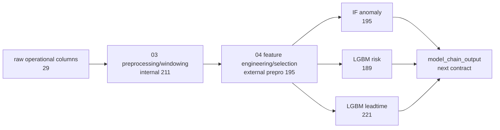

# 13. Alpha 계약 경계 정리

## 개요

이번 보고서는 `proto`에서 알파 단계로 넘길 데이터 계약 경계를 정리하고, 예측모델 출력 직전까지의 JSON Schema / 테스트 잠금 상태를 기록한다.

결론은 다음과 같다.

| 구분 | 고정값 | 외부 계약 여부 | 설명 |
|---|---:|---|---|
| raw contract | 29 | 예 | 전처리에 필요한 최소 operational column |
| 03 internal `preprocessed_windows` | 211 | 아니오 | 내부 전처리/windowing 재현 및 회귀검증 기준 |
| external prepro contract | 195 | 예 | feature engineering/selection 이후 Agent/모델에 넘길 base feature |
| IF model input | 195 | 예 | Isolation Forest 입력 matrix |
| LGBM risk model input | 189 | 예 | LightGBM risk 입력 matrix |
| LGBM leadtime model input | 221 | 예 | LightGBM leadtime 입력 matrix |

즉, `211`은 버리지 않는다. 다만 알파/Agent가 대표 계약값으로 받아야 할 값은 `211`이 아니라 `raw 29`와 `prepro 195`다.

## 무엇을 했는지

- raw, 03 전처리 산출물, feature selection, 모델 입력의 계약 경계를 다시 분리했다.
- `211 preprocessed_windows`를 외부 계약 대표값에서 내리고 내부 산출물로 정의했다.
- 알파 단계에서 우선 잠글 외부 계약을 `raw 29`, `prepro 195`로 정리했다.
- `prepro 195`, `IF 195`, `risk 189`, `leadtime 221` JSON Schema를 추가했다.
- 모델별 입력 feature 수를 테스트로 고정했다.

## 왜 이렇게 했는지

`preprocessed_windows` 211컬럼은 현재 `proto` 코드와 테스트에서 실제로 사용된다. 이를 제거하면 전처리 함수, JSON Schema, SQL DDL, 테스트, 모델 체인 입력까지 동시에 바뀐다.

하지만 알파/Agent 입장에서 211컬럼 전체를 직접 소비하는 구조로 고정하면 계약이 불필요하게 커진다. Agent가 안정적으로 받아야 하는 외부 기준은 raw 최소 입력과 모델 base feature 계약이다.

따라서 다음처럼 나누는 것이 가장 안전하다.



## 변경 내용

이번 작업은 계약 schema와 테스트를 추가한다. 런타임 코드, 기존 211 schema, 모델 파일, 데이터 파일은 수정하지 않는다.

| 항목 | 처리 |
|---|---|
| `211 preprocessed_windows` | 유지 |
| 외부 prepro 대표값 | 195로 정리 |
| raw 대표값 | 29로 정리 |
| 모델 입력 feature 수 | IF 195 / risk 189 / leadtime 221로 schema 고정 |
| model_chain_output | alpha에서 새로 설계 |

추가한 schema는 다음과 같다.

| 파일 | 의미 | properties |
|---|---|---:|
| `schema/json/prepro_model_features.schema.json` | 외부 prepro/base feature 계약 | 195 |
| `schema/json/model_input_if.schema.json` | IF 입력 matrix 계약 | 195 |
| `schema/json/model_input_lgbm_risk.schema.json` | LGBM risk 입력 matrix 계약 | 189 |
| `schema/json/model_input_lgbm_leadtime.schema.json` | LGBM leadtime 입력 matrix 계약 | 221 |

## 확인한 수치

현재 `proto` 작업 트리의 실제 파일을 기준으로 확인한 값이다.

| 기준 파일 | 항목 | 값 |
|---|---|---:|
| `data/processed/ml_features/agent_required_raw_columns.json` | raw operational union | 50 |
| `data/processed/ml_features/agent_required_raw_columns.json` | required raw operational columns | 29 |
| `data/processed/ml_features/agent_required_raw_columns.json` | excluded raw operational columns | 21 |
| `schema/json/preprocessed_windows.schema.json` | `preprocessed_windows` properties | 211 |
| `data/processed/ml_features/agent_feature_contract.json` | selected feature count | 195 |
| `data/processed/ml_features/agent_feature_contract.json` | metadata column count | 37 |
| `data/processed/ml_features/agent_feature_contract.json` | all feature catalog rows | 259 |
| `model_handoff/heatgrid_ml_models_2026-06-25/anomaly/baseline_model_metadata.json` | IF input features | 195 |
| `model_handoff/heatgrid_ml_models_2026-06-25/risk/risk_model_metadata.json` | LGBM risk input features | 189 |
| `model_handoff/heatgrid_ml_models_2026-06-25/leadtime/leadtime_bucket_model_promoted_metadata.json` | LGBM leadtime input features | 221 |
| `schema/json/prepro_model_features.schema.json` | external prepro properties | 195 |
| `schema/json/model_input_if.schema.json` | IF input properties | 195 |
| `schema/json/model_input_lgbm_risk.schema.json` | LGBM risk input properties | 189 |
| `schema/json/model_input_lgbm_leadtime.schema.json` | LGBM leadtime input properties | 221 |

## 계약 경계

알파/Agent에 넘기는 외부 계약은 아래 두 개를 우선 고정한다.

```text
raw contract = 29 operational columns
prepro contract = 195 selected base features
```

211컬럼 산출물은 아래 용도로만 유지한다.

- raw 29에서 feature 195로 넘어가기 전의 내부 중간층
- `build_preprocessed_windows` 재현성 검증
- `preprocessed_windows` JSON Schema / SQL DDL 검증
- 전처리 회귀 테스트 기준

예측모델 입력 계약은 이번 작업에서 아래처럼 고정했다.

```text
IF input = 195
LGBM risk input = 189
LGBM leadtime input = 221
model_chain_output = 다음 단계 계약
```

`schema/json/model_chain_output.schema.json`과 `schema/sql/006_model_chain_output.sql`은 alpha로 이식하지 않는다. 예측모델 출력 계약은 alpha에서 Priority 입력 계약과 함께 새로 정의한다.

## 검증

| 검증 | 결과 |
|---|---|
| 실제 JSON/metadata 수치 재확인 | 통과 |
| `preprocessed_windows.schema.json` properties count | 211 확인 |
| raw required count | 29 확인 |
| selected feature count | 195 확인 |
| 모델별 input feature count | IF 195 / risk 189 / leadtime 221 확인 |
| `uv run pytest tests/test_alpha_contract_schemas.py` | 5 passed |
| `uv run pytest tests/test_preprocessing_build_windows.py tests/test_preprocessing_predist_zip_sample.py` | 8 passed |
| `uv run pytest tests/test_model_chain_e2e.py` | 3 passed |

## 한계와 주의점

- 이 보고서는 계약 경계 정리와 schema/test 잠금 결과를 기록한다. 런타임 코드는 변경하지 않았다.
- 211컬럼 산출물은 당장 제거하면 안 된다. 현재 schema, test, preprocessing runtime이 이 산출물을 기준으로 맞춰져 있다.
- `model_chain_output`, priority input/output 계약은 이번 보고서의 확정 범위가 아니며 alpha에서 새로 설계한다.
- LGBM risk와 leadtime은 195 공통 base feature를 그대로 쓰는 것이 아니라 모델별 feature set을 가진다.

## 다음에 볼 것

1. `model_chain_output` 필수 13필드와 DB 저장 26컬럼 계약을 별도 문서/테스트로 잠근다.
2. Priority Engine 입력/출력 계약을 `model_chain_output -> priority_scores` 기준으로 확정한다.
3. 알파 단계에서는 외부 입력 문서에서 `211`을 대표 prepro 계약값으로 부르지 않도록 유지한다.
