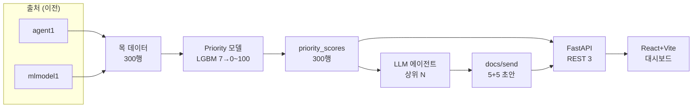
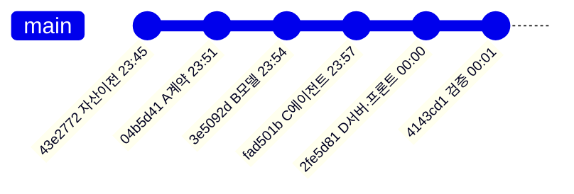

# proto 한 사이클 — 단계별 보고서 (9시 이전 커밋)

`proto` 브랜치에서 `데이터 → 머신러닝 → priority → LLM/tool → 서버 → 프론트` 를 실DB·실 ML output 없이 **목 데이터로 end-to-end 1바퀴** 돌린 프로토타입의 보고서다.
**깃그래프 기준 2026-06-26 09:00 이전에 커밋된 6단계**만 다루며, **커밋(=단계) 하나당 보고서 1개**, 다이어그램은 **보고서 안에 인라인(Mermaid)** 으로 들어간다(별도 이미지 파일 없음).

> 제외: `8c1b3a5` 버그픽스(09:12)와 보고서 커밋(09:53·10:03)은 9시 이후라 대상에서 뺐다.

## 전체 개요

## 커밋 타임라인 (9시 이전 6개)

## 단계별 보고서

| 단계 | 커밋 | 시각 | 보고서 |
|---|---|---|---|
| S0 자산 이전 | `43e2772` | 06-25 23:45 | [01_asset_transfer.md](01_asset_transfer.md) |
| A 계약 | `04b5d41` | 06-25 23:51 | [02_contract.md](02_contract.md) |
| B 모델 | `3e5092d` | 06-25 23:54 | [03_model.md](03_model.md) |
| C 에이전트 | `fad501b` | 06-25 23:57 | [04_agent.md](04_agent.md) |
| D 서버/프론트 | `2fe5d81` | 06-26 00:00 | [05_serve.md](05_serve.md) |
| V 검증 | `4143cd1` | 06-26 00:01 | [06_validate.md](06_validate.md) |

## 정량 종합
| 항목 | 값 |
|---|---|
| 목 데이터 | 300행 × 25컬럼 (정상 161 / 고장전조 139) |
| 학습 분할 | train 196 / holdout 104 (정답 R=44) |
| 모델 | LightGBM 회귀, 7피처 → 0~100, `priority_v3_lgbm_reg` |
| 성능(holdout) | precision@10/20/44 = 1.00, NDCG = 1.00 → rule v2 동등 이상 채택 |
| priority_scores | 300행 (urgent 65 / high 38 / medium 36 / low 161) |
| 에이전트 산출 | 보고서 5 + 메일 5 |
| 서버 | REST 3 엔드포인트(읽기 전용) |
| 검증 | JSON Schema 6 · DDL 7 · PK 유니크 · pytest 6 passed |

## 1.00 성능 해석 (중요)
목 데이터는 고장전조일수록 위험/이상/임박 신호가 단조적으로 높게 설계돼 정상과 명확히 분리된다. 그래서 LGBM·rule 둘 다 상위권을 완벽히 맞춰 **동률(1.00)** 이 나온다. 즉 1.00은 "데이터가 쉽다"는 뜻이며, 본 사이클의 가치는 **① 끊김 없는 파이프라인 골격, ② 회귀모델이 운영 rule을 대체할 수 있는 평가 프레임, ③ 재발을 막는 검증 게이트**에 있다. 실 ML output 전환 시 1.00 미만이 정상이며 그때 LGBM이 rule을 앞서는지가 진짜 채택 근거가 된다.

> 다이어그램은 GitHub에서 자동 렌더된다(Mermaid 인라인). 9시 이후 추가된 버그픽스(키 충돌·PK 유니크)는 본 보고서 범위 밖이다.
