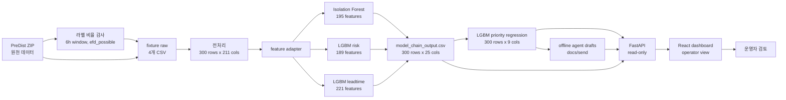
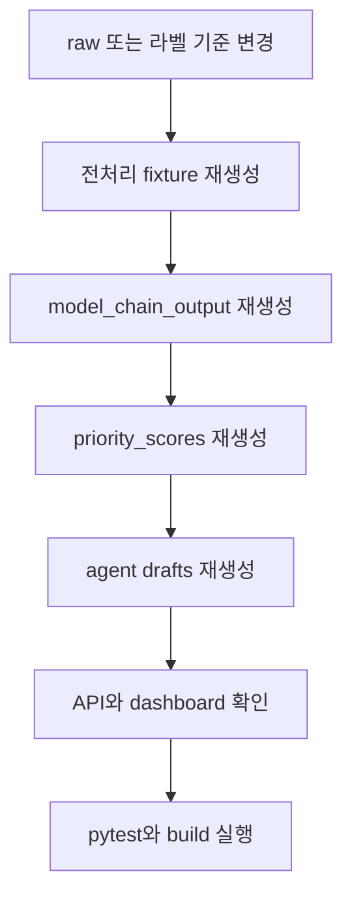

# proto 정본 보고서

이 문서는 `proto` 브랜치의 현재 운영 프로토타입을 처음 읽는 사람과 이후 수정할 사람이 같은 그림으로 이해하도록 만든 정본 보고서다. 기준 흐름은 `raw -> preprocessing -> IF + LGBM risk + LGBM leadtime -> LGBM priority regression -> server -> frontend -> validation`이다.

작성 기준 커밋은 `f4bad63`이며, 이후 보고서 재작성 커밋은 이 문서 묶음만 갱신한다. 현재 정본 보고서는 이 폴더 하나로 통일한다.

## 전체 시스템 지도

## 먼저 읽는 순서

| 순서 | 보고서 | 읽는 목적 |
|---:|---|---|
| 1 | [01_raw.md](01_raw.md) | 원천 ZIP과 fixture raw가 무엇인지 이해 |
| 2 | [02_preprocessing.md](02_preprocessing.md) | raw가 6시간 supervised window로 바뀌는 방식 이해 |
| 3 | [03_ml_prediction_model.md](03_ml_prediction_model.md) | IF, risk, leadtime 중간 예측 체인 이해 |
| 4 | [04_priority.md](04_priority.md) | 모델 체인 출력이 우선순위 점수로 바뀌는 방식 이해 |
| 5 | [05_server.md](05_server.md) | API가 CSV와 Markdown 산출물을 어떻게 제공하는지 이해 |
| 6 | [06_frontend.md](06_frontend.md) | 운영자가 보는 대시보드 화면 구조 이해 |
| 7 | [07_validation.md](07_validation.md) | 재현 명령, 테스트, 남은 한계 확인 |
| 8 | [08_priority_retrain.md](08_priority_retrain.md) | mock 학습 제거와 실제 chain output 재학습 결과 확인 |

## 핵심 정량 요약

| 영역 | 값 |
|---|---:|
| full PreDist supervised normal windows | 1818 |
| full PreDist supervised pre_fault windows | 1528 |
| full PreDist pre_fault bucket | 0-24h 217 / 1-3d 436 / 3-7d 875 |
| fixture labels | 300 rows |
| fixture label 분포 | normal 163 / pre_fault 137 |
| fixture pre_fault bucket | 0-24h 19 / 1-3d 39 / 3-7d 79 |
| raw sensor readings | 10800 rows |
| raw fault events | 67 rows |
| raw maintenance events | 281 rows |
| preprocessed windows | 300 rows x 211 columns |
| model chain output | 300 rows x 25 columns |
| priority scores | 300 rows x 9 columns |
| priority level | medium 180 / low 120 |
| priority score range | 10.61 ~ 31.98, mean 20.11 |
| priority training basis | `data/processed/ml_model_chain/model_chain_output.csv` |
| priority verdict | baseline 미달, 모델 보류 |
| agent draft files | 30 files, work order 15 / email 15 |
| tests | 11 passed |

## 수정 순서 가이드

| 수정하려는 것 | 먼저 볼 위치 | 같이 확인할 산출물 |
|---|---|---|
| 원천/라벨 기준 | `agent/preprocessing/audit_predist_labels.py` | `data/processed/preprocessing_audit` |
| fixture 생성 | `agent/preprocessing/sample_predist_zip.py` | `agent/fixtures/preprocessing/predist_sample` |
| window 전처리 | `agent/preprocessing/build_windows.py` | `preprocessed_windows_sample.csv` |
| 중간 예측 모델 체인 | `agent/model_chain` | `model_chain_output.csv`, `feature_adapter_report.json` |
| priority 회귀 | `agent/priority` | `priority_scores.csv` |
| 초안 생성 | `agent/llm` | `docs/send/work_order_*.md`, `email_*.md` |
| API | `server/main.py` | `/priority`, `/priority/{key}`, `/agent/output/{key}` |
| 대시보드 | `frontend/src/App.jsx`, `frontend/src/App.css` | `http://127.0.0.1:5173/` |
| 검증 | `tests/test_model_chain_e2e.py` | `uv run pytest` |

## 운영 해석

이 프로토타입의 목적은 최종 정확도 주장보다 산출물 연결을 검증하는 것이다. 현재 priority 모델은 실제 중간 모델 출력으로 점수를 계산하지만, priority 회귀 모델 자체는 향후 실제 운영 라벨과 chain output으로 재학습해야 한다. 따라서 현재 보고서의 정량값은 "재현 가능한 시스템 상태"를 설명하는 값이며, 운영 성능 보증값으로 해석하면 안 된다.
