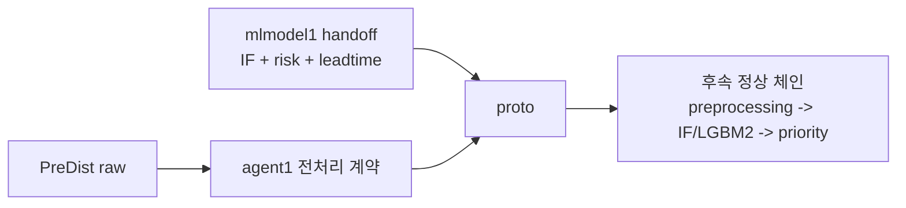

# S0. 자산 이전 - `43e2772`

> 2026-06-25 23:45 커밋. `agent1`의 raw -> 전처리 자산과 `mlmodel1`의 모델 handoff 자산을 `proto`에 모은 단계.

## 무엇을 했는지

- `schema 000~005`, `docs/contracts 01~04`, `agent/preprocessing`, fixture/test를 이전했다.
- `model_handoff/heatgrid_ml_models_2026-06-25` 아래에 IF 195개, risk LGBM 189개, leadtime LGBM 221개 모델 자산을 포함했다.
- 이 커밋 자체에서는 모델을 아직 실행하지 않았고, 후속 커밋에서 실제 체인에 연결했다.

## 왜 이렇게 했는지

- raw/전처리 출처와 ML 모델 출처를 분리해야 이후 priority/agent/server가 같은 계약을 기준으로 붙는다.
- handoff 모델을 먼저 보존해 둬야 mock 대역을 제거하고 실제 `IF + LGBM2` 중간 단계를 복원할 수 있다.

## 정량

| 항목 | 값 |
|---|---:|
| 이전 schema DDL | 6 |
| 이전 schema JSON | 5 |
| 이전 contracts 문서 | 4 |
| IF 입력 feature | 195 |
| risk LGBM 입력 feature | 189 |
| leadtime LGBM 입력 feature | 221 |

## 현재 보정 사항

- 기존 설명의 “handoff 모델은 당장 로드하지 않는다”는 당시 상태 설명이다.
- 현재 proto는 후속 커밋에서 `raw -> preprocessing -> IF/risk/leadtime -> priority` 체인을 실제로 실행한다.
