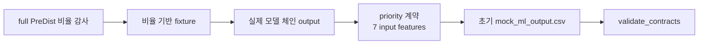

# A. Priority 계약 + 목 데이터 - `04b5d41`

> 2026-06-25 23:51 커밋. priority 입력/출력/라벨 계약과 초기 demo용 mock ML output을 만든 단계.

## 무엇을 했는지

- `priority_scores` JSON Schema/DDL과 priority 입력 7피처 계약을 추가했다.
- 초기에는 `data/mock/mock_ml_output.csv`로 priority 계약과 학습 루프를 검증했다.
- 이후 정상화 커밋에서 mock 기본 경로를 제거하고 실제 모델 체인 output을 priority 기본 입력으로 바꿨다.

## 왜 이렇게 했는지

- priority 단계는 IF/risk/leadtime 출력 7개를 소비하므로, 입력 컬럼 순서와 출력 schema가 먼저 고정돼야 한다.
- mock은 계약 검증용 임시 대역이었고, 최종 운영 흐름의 데이터 출처로 두면 안 된다.

## 정량

| 항목 | 값 |
|---|---:|
| priority 입력 feature | 7 |
| full PreDist supervised normal windows | 1818 |
| full PreDist supervised pre_fault windows | 1528 |
| full PreDist normal/pre_fault 비율 | 54.3% / 45.7% |
| 비율 기반 fixture label | normal 163 / pre_fault 137 |
| fixture pre_fault bucket | 0-24h 19 / 1-3d 39 / 3-7d 79 |

## 현재 보정 사항

- `1:1` 가정은 폐기했다.
- 현재 fixture는 full PreDist supervised 후보 비율을 따른다.
- 현재 priority 기본 입력은 `data/processed/ml_model_chain/model_chain_output.csv`다.
