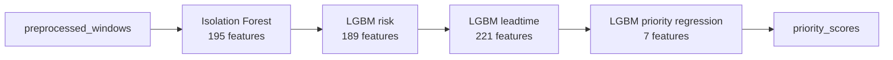

# B. Priority 모델 - LGBM 회귀 - `3e5092d`

> 2026-06-25 23:54 커밋. priority 7피처로 0~100 우선순위 점수를 예측하는 LightGBM 회귀 모델을 만든 단계.

## 무엇을 했는지

- priority LGBM regressor는 7개 feature를 받아 0~100 priority score를 예측한다.
- 초기 학습/평가는 mock ML output으로 수행했다.
- 정상화 후에는 priority 추론 입력을 실제 IF/risk/leadtime 모델 체인 출력으로 교체했다.

## 왜 이렇게 했는지

- priority 모델은 raw 센서값을 직접 먹는 모델이 아니라, 중간 ML 모델의 판단 결과를 받아 출동 우선순위를 정하는 모델이다.
- 따라서 정상 구조는 `전처리 -> IF + LGBM risk + LGBM leadtime -> priority regression`이어야 한다.

## 정량

| 항목 | 값 |
|---|---:|
| priority 입력 feature | 7 |
| priority output rows | 300 |
| priority level 분포 | high 168 / medium 103 / urgent 25 / low 4 |
| IF feature adapter 0-fill | 13 / 195 |
| risk feature adapter 0-fill | 15 / 189 |
| leadtime feature adapter 0-fill | 21 / 221 |

## 현재 보정 사항

- “mock에서 완벽 랭킹”이라는 기존 평가는 초기 모델 학습 프레임 검증으로만 해석한다.
- 현재 검증 기준은 실제 handoff 모델 3개를 거친 output이 priority 회귀로 들어가는지다.
