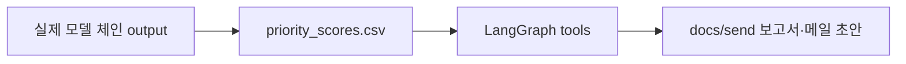

# C. LLM/Tool 에이전트 - `fad501b`

> 2026-06-25 23:57 커밋. priority 상위 N건을 읽어 운영자 검토용 보고서/메일 초안을 만드는 단계.

## 무엇을 했는지

- LangGraph tool agent가 `priority_scores.csv` 상위 건을 읽고 점검 보고서/메일 초안을 만든다.
- 자동 발송은 없고, 운영자 검토 전제의 Markdown 초안만 생성한다.

## 왜 이렇게 했는지

- Agent는 모델을 직접 판단하는 계층이 아니라, 이미 계산된 priority 결과를 운영자에게 설명 가능한 형태로 넘기는 계층이다.
- 따라서 priority 산출물이 실제 모델 체인 기반으로 바뀌면 agent도 같은 파일을 통해 자연스럽게 최신 결과를 소비한다.

## 정량

| 항목 | 값 |
|---|---:|
| tool 수 | 5 |
| 기본 top N | 5 |
| 생성 초안 | 보고서 5 + 메일 5 |
| 현재 priority 입력 rows | 300 |

## 현재 보정 사항

- 기존 agent 구조 자체는 유지한다.
- 바뀐 것은 agent 앞단의 `priority_scores.csv`가 mock 기반이 아니라 실제 모델 체인 기반으로 갱신된 점이다.
