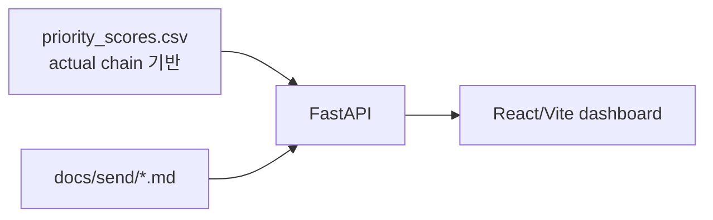

# D. 서버 / 프론트 - `2fe5d81`

> 2026-06-26 00:00 커밋. priority와 agent 산출물을 읽기 전용 API/대시보드로 보여주는 단계.

## 무엇을 했는지

- FastAPI가 priority 목록, 단건 상세, agent output Markdown을 읽기 전용으로 제공한다.
- React/Vite 프론트는 우선순위 표와 상세, 보고서/메일 초안을 보여준다.

## 왜 이렇게 했는지

- 운영 UI는 모델을 다시 계산하지 않고 검증된 파일 산출물을 읽는 편이 단순하고 재현 가능하다.
- 실제 모델 체인으로 priority 파일만 갱신되면 서버/프론트 코드는 그대로 최신 결과를 보여준다.

## 정량

| 항목 | 값 |
|---|---:|
| API 엔드포인트 | `/priority`, `/priority/{key}`, `/agent/output/{key}`, `/health` |
| 현재 priority rows | 300 |
| priority top score | 99.83 |
| 발송 기능 | 없음 |

## 현재 보정 사항

- 서버/프론트 구조는 유지한다.
- 표시 데이터는 `raw -> preprocessing -> IF/LGBM2 -> priority`로 갱신된 `priority_scores.csv`를 기준으로 한다.
