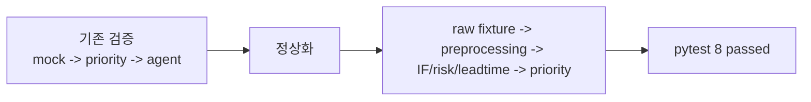

# V. 검증 스냅샷 - `4143cd1`

> 2026-06-26 00:01 커밋. 당시 mock 기반 한 사이클을 재실행해 재현성을 확인한 단계. 이후 정상화 커밋에서 실제 모델 체인 검증으로 갱신했다.

## 무엇을 했는지

- 기존 깨진 heading(`kr #`)을 정상 Markdown heading으로 수정했다.
- 검증 기준을 mock 한 사이클이 아니라 실제 모델 체인 end-to-end 기준으로 갱신했다.

## 왜 이렇게 했는지

- 사용자가 지적한 대로 중간 `IF + LGBM2` 모델을 거치지 않으면 정상 구조가 아니다.
- 검증 문서는 현재 실행 경로를 기준으로 해야 한다.

## 정량

| 검증 항목 | 결과 |
|---|---:|
| full PreDist audit | normal 1818 / pre_fault 1528 |
| ratio fixture | 300 labels, 300 preprocessed windows |
| model chain output | 300 rows |
| priority output | 300 rows |
| pytest | 8 passed |

## 현재 보정 사항

- 기존 “pytest 6 passed”는 이전 상태다.
- 현재 기준은 `uv run pytest` 결과 `8 passed`다.
