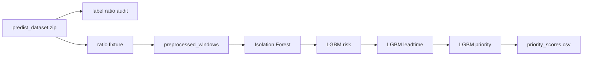

# 07. 실제 모델 체인 정상화 검증

> 2026-06-26 정상화 작업. `1:1` 가정과 mock 기본 경로를 제거하고 실제 `raw -> preprocessing -> IF + LGBM risk + LGBM leadtime -> LGBM priority` 체인을 만들었다.

## 무엇을 했는지

- full PreDist ZIP을 해제하지 않고 supervised label 비율을 감사했다.
- 감사 비율을 따라 300개 supervised window fixture를 재생성했다.
- 전처리 결과를 IF 195개, risk 189개, leadtime 221개 feature order로 맞추는 adapter를 추가했다.
- priority 회귀 기본 입력을 mock에서 실제 모델 체인 output으로 변경했다.
- end-to-end 테스트를 추가했다.

## 왜 이렇게 했는지

- 정상 구조는 raw/preprocessing 결과가 바로 priority로 가는 것이 아니라, 중간 `IF + LGBM2` 모델을 거쳐야 한다.
- fixture도 임의 1:1이 아니라 full PreDist의 관측 supervised window 비율을 따라야 한다.

## 정량 결과

| 항목 | 값 |
|---|---:|
| full PreDist normal windows | 1818 |
| full PreDist pre_fault windows | 1528 |
| full PreDist ratio | normal 54.3% / pre_fault 45.7% |
| fixture label rows | 300 |
| fixture preprocessed rows | 300 |
| model chain output rows | 300 |
| priority output rows | 300 |
| pytest | 8 passed |

| 모델 단계 | 입력 feature | 0-fill feature |
|---|---:|---:|
| Isolation Forest | 195 | 13 |
| LGBM risk | 189 | 15 |
| LGBM leadtime | 221 | 21 |
| LGBM priority | 7 | 0 |

## 생성/수정 커밋

| 커밋 | 내용 |
|---|---|
| `e9d4693` | full PreDist 라벨 비율 감사 추가 |
| `a87126f` | PreDist 비율 기반 fixture 재생성 |
| `844490a` | IF/risk/leadtime inference adapter 추가 |
| `226ff5e` | 실제 모델 체인 출력 기반 priority 회귀 연결 |
| `ea84883` | end-to-end 모델 체인 검증 추가 |

## 남은 한계

- handoff package에 학습 당시 imputation table/category map이 없어 일부 feature는 0.0으로 결정적 보정했다.
- 전처리 계약은 아직 `manufacturer`를 공식 key로 갖지 않아 fixture sampler에서 `(substation_id, window_start)` 중복을 피했다.
- priority 모델 자체는 기존 mock 기반 학습 모델이므로, 다음 단계에서는 실제 chain output으로 재학습/재평가하는 것이 좋다.
